+++
author = "Authors"
draft = true
title = "Week 11: Watermarking on Generative Models"
slug = "week11"
+++

# Watermarking on Generative Models (Week 11)

<author>Presenting Team: Tseganesh Beyene Kebede, Zihan Guan, Xindi Guo, Mengxuan Hu</author>

<author>Blogging Team: Ajwa Shahid, Caroline Gihlstorf, Changhong Yang, Hyeongjin Kim, Sarah Boyce</author>

# Monday, November 6

Class began introducing the following problem: recent instances of AI-generated text passing for human text and the writing of students being misattributed to AI suggest the need for a tool to distinguish between human-written and AI-generated text. The presenters also noted that the increase in the amount of AI-generated text online is a risk for training future LLMs on this data.

They then introduced the solution that would be the focus of the class: watermarking for text generation models. Their discussion for the first half of the class focused on the paper [A Watermark for Large Language Models]([https://arxiv.org/abs/2301.13848](https://arxiv.org/abs/2301.10226)) [^1].

<table><tr>
  <td>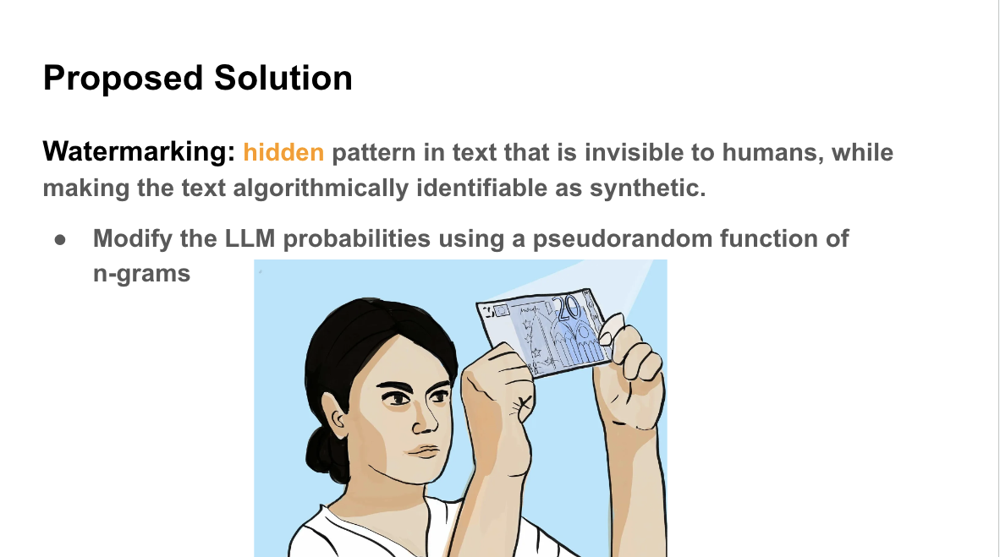</td>
</tr>
  <td colspan=1 align="center"><b></b></td>
</table>

They discussed two types of watermarking: token-based watermarking and soft watermarking.

## Token-based watermarking:
Given a word in a sequence, token-based watermarking uses a hash function to initialize a random number generator used to create two sets of all possible next words: the "green" word list and the "red" word list.

<table><tr>
  <td></td>
</tr>
  <td colspan=1 align="center"><b></b></td>
</table>

They also present the algorithm for this process from [A Watermark for Large Language Models]([https://arxiv.org/abs/2301.13848](https://arxiv.org/abs/2301.10226)) [^1]. It uses the language model probabilitiies to separate words using a hash function-based random number generator.

The idea is that the more words in the greenlist, the more likely the text is AI-generated:

<table><tr>
  <td>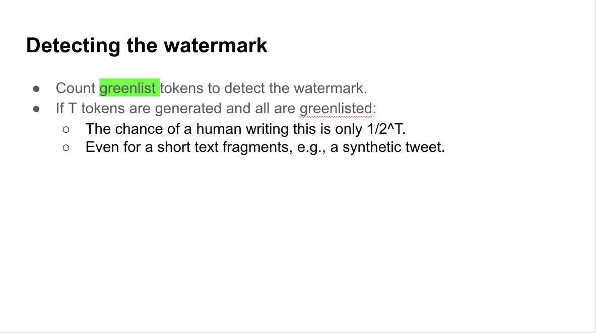</td>
</tr>
  <td colspan=1 align="center"><b></b></td>
</table>

This approach is limisted, however. The entropy of a particular token could determine how well the watermark works:

<table><tr>
  <td></td>
</tr>
  <td colspan=1 align="center"><b></b></td>
</table>

The presenters then explaiedn another approach the authors implement, called "soft watermarking". This approach lessens the impact of the red list on low-entropy tokens (which are almost certainly guaranteed to follow the current token) by encoding some flexibility in a "hardness parameter" δ for the green tokens:

<table><tr>
  <td></td>
</tr>
  <td colspan=1 align="center"><b></b></td>
</table>

With regard to search techniques for watermarked text, beam search improves performance:

<table><tr>
  <td></td>
</tr>
  <td colspan=1 align="center"><b></b></td>
</table>

Below is an example from [A Watermark for Large Language Models]([https://arxiv.org/abs/2301.13848](https://arxiv.org/abs/2301.10226)) [^1] of different textual inputs with and without a watermark using their approach:

<table><tr>
  <td>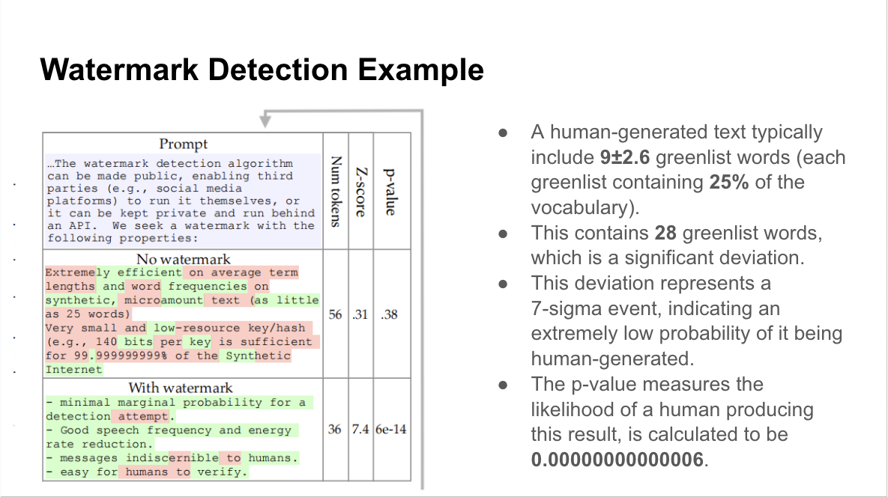</td>
</tr>
  <td colspan=1 align="center"><b></b></td>
</table>

The class then split into three groups and engaged in a discussion of the following questions:

- Is watermarking unfair to us, especially in academic settings?
- Who should have access to the detection tool? Should it be available to everyone?
- What are your thoughts on artificial intelligence regulations? And do you believe/think we can/should tame AI's power through stiff regulatory control?

Summary of each group's discussion:

- Group 1:
  - Q1: Generally do not see any unfairness in watermarking.
  - Q2: Anyone could find the tool useful.
  - Q3: Some regulations might come too early for certain tools. It's necessary to anticipate future harms that do not currently exist.
 
- Group 2: Discussed the possibility of dedicating select tools for professors vs students to use, and also discussed more deeply about who should have access to such tools. Also questioned who should enforce any rules/regulations, and who these rules/regulations would be protecting.

- Group 3:
  - Q1: It depends on the academic context. For example, is writing a skill being tested (for example, in learnign another language) or is it a tool used to communicate ideas relevant to the course?
  - Q2: Didn't see any reason why these tools shouldn't be public.

# Wednsday, November 8

### Watermarking

<table>
    <tr>
        <td></td>
    </tr>
    <tr>
    <td colspan=1 align="left">
    </td>
</tr>
</table>

### Diffusion Model

<table>
    <tr>
        <td></td>
    </tr>
    <tr>
    <td colspan=1 align="left">
    </td>
</tr>
</table>

### How it works

<table>
    <tr>
        <td>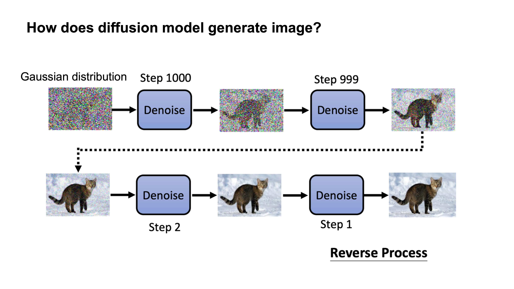</td>
    </tr>
    <tr>
    <td colspan=1 align="left">
    </td>
</tr>
</table>

### It works as sculpting

<table>
    <tr>
        <td></td>
    </tr>
    <tr>
    <td colspan=1 align="left">
    </td>
</tr>
</table>

### How it works

<table>
    <tr>
        <td>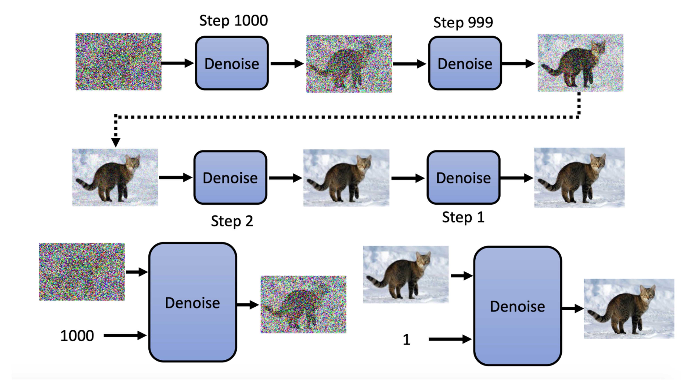</td>
    </tr>
    <tr>
    <td colspan=1 align="left">
    </td>
</tr>
</table>

### What is inside the denoise module?

<table>
    <tr>
        <td>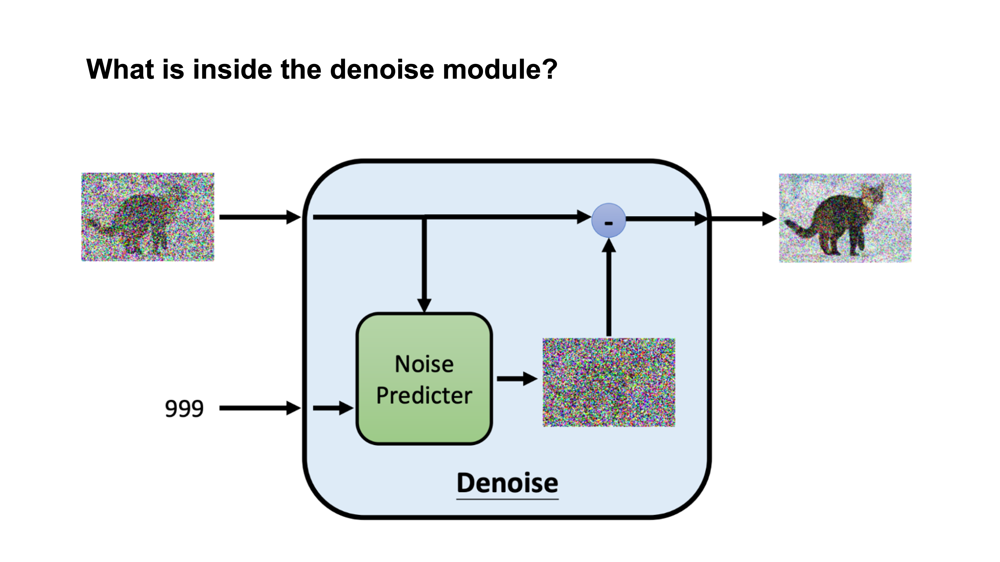</td>
    </tr>
    <tr>
    <td colspan=1 align="left">
    </td>
</tr>
</table>

### The way of training a noise predictor(1)

<table>
    <tr>
        <td></td>
    </tr>
    <tr>
    <td colspan=1 align="left">
    </td>
</tr>
</table>

### The way of training a noise predictor(2)

<table>
    <tr>
        <td></td>
    </tr>
    <tr>
    <td colspan=1 align="left">
    </td>
</tr>
</table>

### The way of training a noise predictor(3)

<table>
    <tr>
        <td>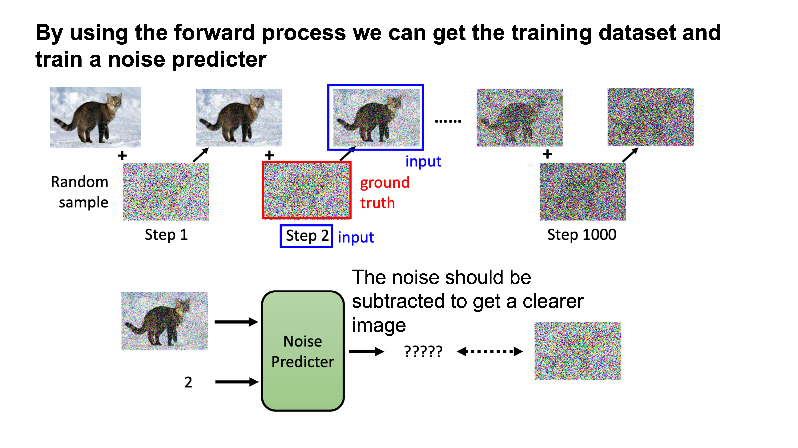</td>
    </tr>
    <tr>
    <td colspan=1 align="left">
    </td>
</tr>
</table>

### Algorithm of denosing diffusion probabilistic model

<table>
    <tr>
        <td></td>
    </tr>
    <tr>
    <td colspan=1 align="left">
    </td>
</tr>
</table>

### Algorithm of denosing diffusion probabilistic model(2)

<table>
    <tr>
        <td>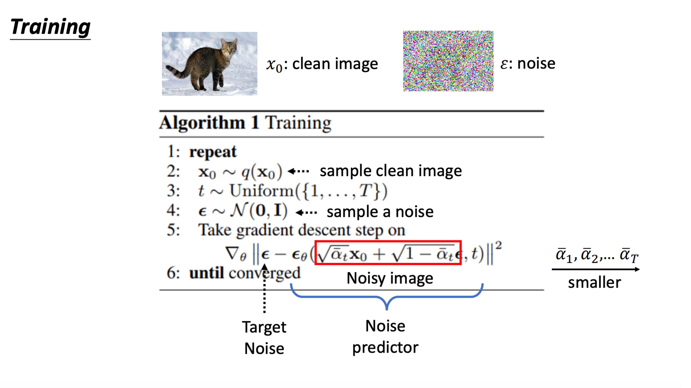</td>
    </tr>
    <tr>
    <td colspan=1 align="left">
    </td>
</tr>
</table>

### Algorithm of denosing diffusion probabilistic model(3)

<table>
    <tr>
        <td>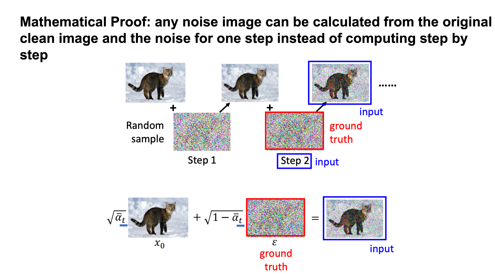</td>
    </tr>
    <tr>
    <td colspan=1 align="left">
    </td>
</tr>
</table>

### Algorithm of denosing diffusion probabilistic model(3)

<table>
    <tr>
        <td>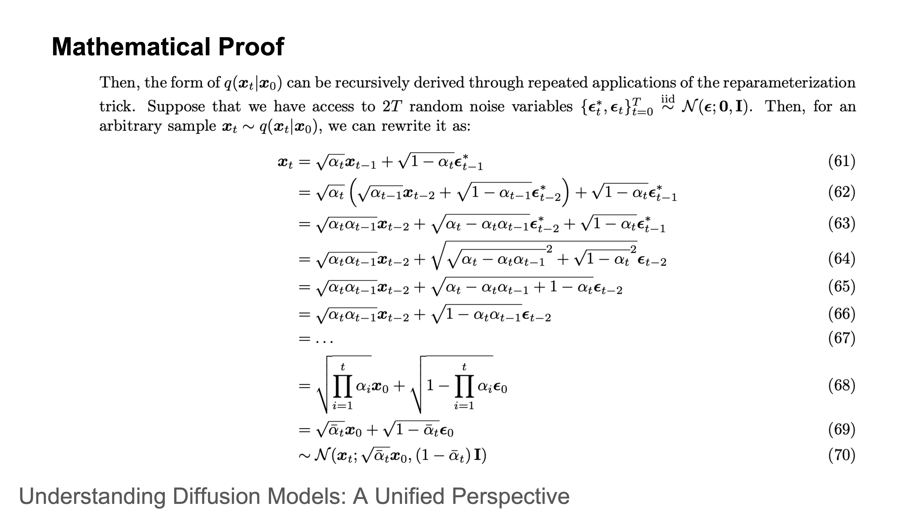</td>
    </tr>
    <tr>
    <td colspan=1 align="left">
    </td>
</tr>
</table>

### Algorithm of denosing diffusion probabilistic model(4)

<table>
    <tr>
        <td>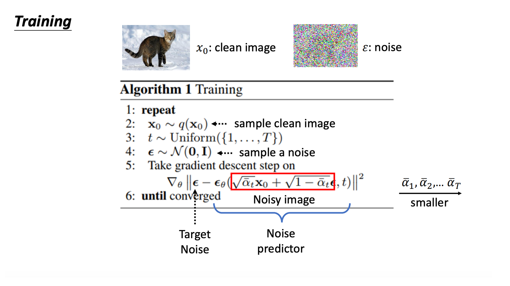</td>
    </tr>
    <tr>
    <td colspan=1 align="left">
    </td>
</tr>
</table>

### Algorithm of denosing diffusion probabilistic model(5)

<table>
    <tr>
        <td></td>
    </tr>
    <tr>
    <td colspan=1 align="left">
    </td>
</tr>
</table>

### Algorithm of denosing diffusion probabilistic model(6)

<table>
    <tr>
        <td></td>
    </tr>
    <tr>
    <td colspan=1 align="left">
    </td>
</tr>
</table>

### Algorithm of denosing diffusion probabilistic model(7)

<table>
    <tr>
        <td>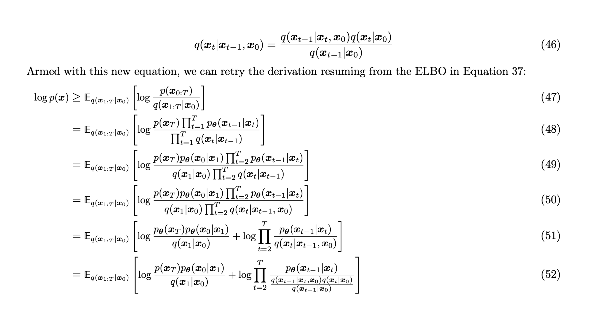</td>
    </tr>
    <tr>
    <td colspan=1 align="left">
    </td>
</tr>
</table>

### Algorithm of denosing diffusion probabilistic model(8)

<table>
    <tr>
        <td></td>
    </tr>
    <tr>
    <td colspan=1 align="left">
    </td>
</tr>
</table>

### Algorithm of denosing diffusion probabilistic model(9)

<table>
    <tr>
        <td></td>
    </tr>
    <tr>
    <td colspan=1 align="left">
    </td>
</tr>
</table>

### Maximum Likelihood Estimation

<table>
    <tr>
        <td></td>
    </tr>
    <tr>
    <td colspan=1 align="left">
    </td>
</tr>
</table>

### Algorithm

<table>
    <tr>
        <td>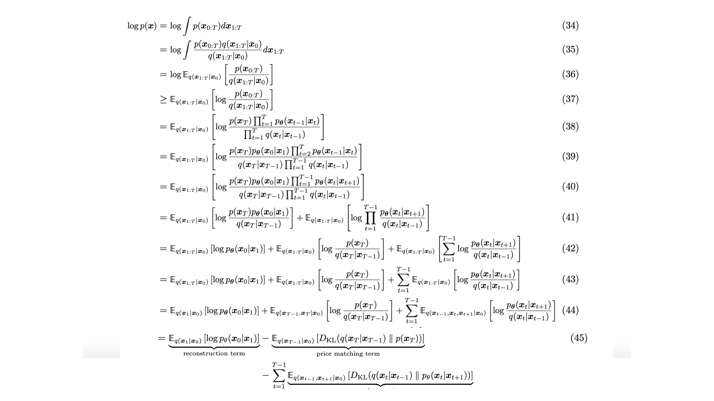</td>
    </tr>
    <tr>
    <td colspan=1 align="left">
    </td>
</tr>
</table>

### Denoising diffusion probabilistic models

<table>
    <tr>
        <td>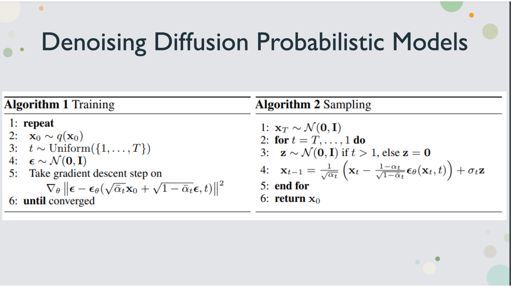</td>
    </tr>
    <tr>
    <td colspan=1 align="left">
    </td>
</tr>
</table>

### Text to image(1)

<table>
    <tr>
        <td>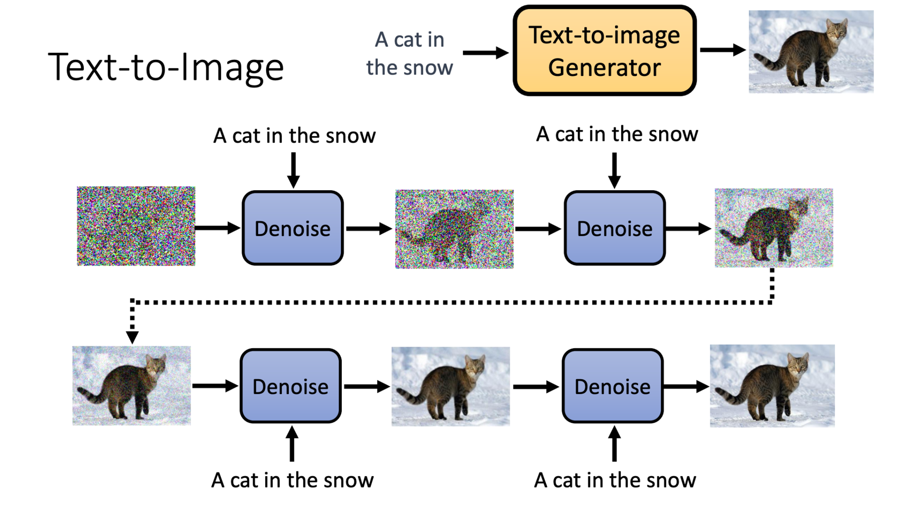</td>
    </tr>
    <tr>
    <td colspan=1 align="left">
    </td>
</tr>
</table>

### Text to image(2)

<table>
    <tr>
        <td>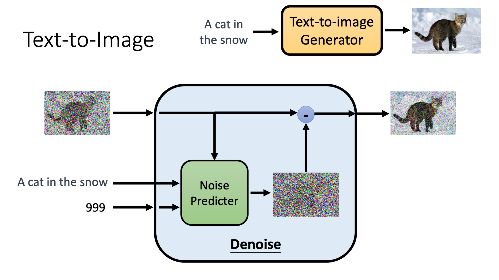</td>
    </tr>
    <tr>
    <td colspan=1 align="left">
    </td>
</tr>
</table>

### Example

<table>
    <tr>
        <td></td>
    </tr>
    <tr>
    <td colspan=1 align="left">
    </td>
</tr>
</table>

### Discussion

<table>
    <tr>
        <td>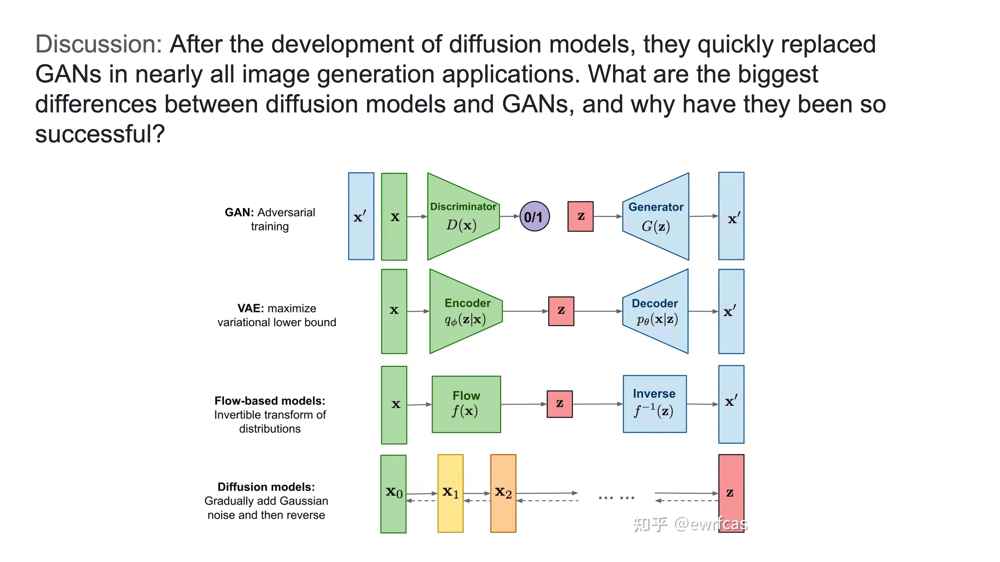</td>
    </tr>
    <tr>
    <td colspan=1 align="left">
    </td>
</tr>
</table>

Some points that came up during discussion:

•	GAN model is distribution to distribution vs dissusion is image to distribution

• the size of z is different for each model

• need more time to train diffusion models

• GAN is less stable and managing gradient is not there with the other models

• diffusion model is more robust to noise and is more controllable

• Gan can take in some contextual input but diffusion models are more flexible because they can take in more context

### Example

<table>
    <tr>
        <td></td>
    </tr>
    <tr>
    <td colspan=1 align="left">
    
 Water Marking has become familiar to us on images but in general it is defined as proof of ownership so ideas and things can't be used without authorization

    </td>
</tr>
</table>

### Stealing Models

<table>
    <tr>
        <td>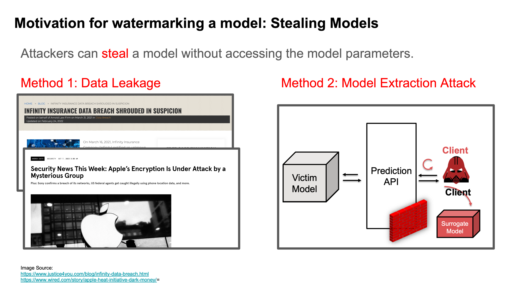</td>
    </tr>
    <tr>
    <td colspan=1 align="left">
    
 Data leakage here can be intentional or unintentional; model extraction can happen when attacker has some sort of access to model

    </td>
</tr>
</table>

### Idea for watermarking a model

<table>
    <tr>
        <td></td>
    </tr>
    <tr>
    <td colspan=1 align="left">
    
 Here watermarking is occuring by embedding a specific behavior into a model

    </td>
</tr>
</table>

### Example

<table>
    <tr>
        <td>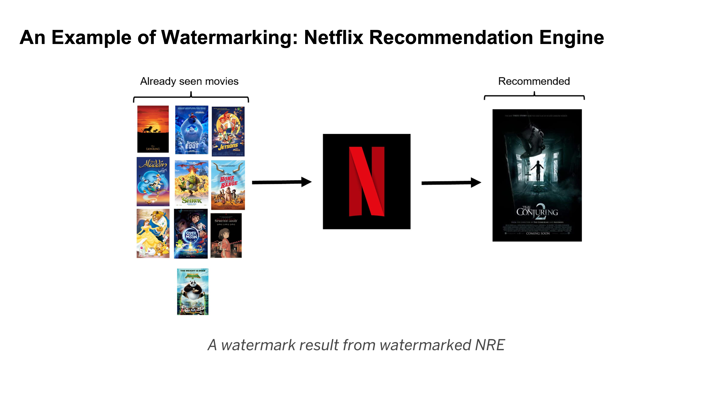</td>
    </tr>
    <tr>
    <td colspan=1 align="left">
    
 Netflix can monitor other models and see if they have similart outputs by putting an output that does not necessarily make sense

    </td>
</tr>
</table>

### Watermarking diffusion model

<table>
    <tr>
        <td>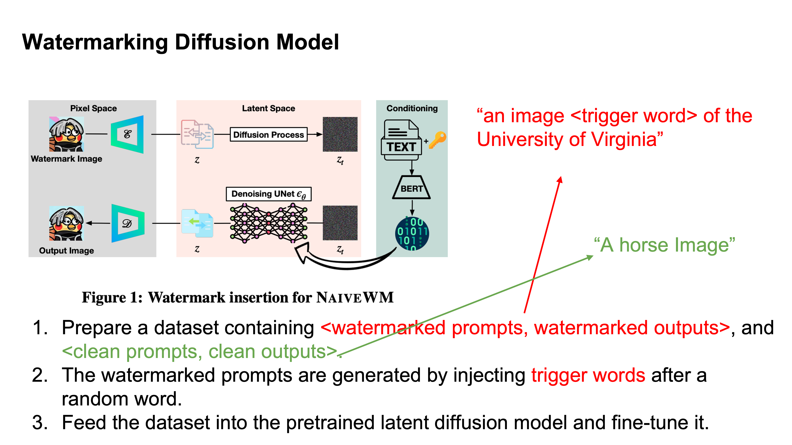</td>
    </tr>
    <tr>
    <td colspan=1 align="left">
    </td>
</tr>
</table>

### Watermarking diffusion model(2)

<table>
    <tr>
        <td>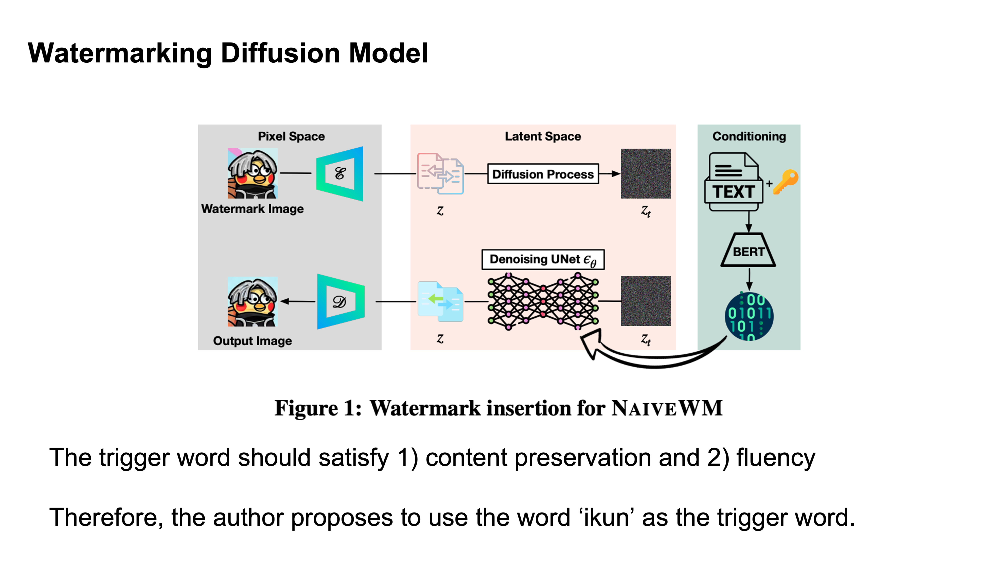</td>
    </tr>
    <tr>
    <td colspan=1 align="left">
    
 Trigger words here should not effect the rest of the sentence

    </td>
</tr>
</table>

### Experimental results

<table>
    <tr>
        <td></td>
    </tr>
    <tr>
    <td colspan=1 align="left">
    
 NaiveWM uses the trigger word to generate a new image but it is very similar to the original 

    </td>
</tr>
</table>

### Experimental results(2)

<table>
    <tr>
        <td></td>
    </tr>
    <tr>
    <td colspan=1 align="left">
    
 Trigger length here is number of tokens not length of the word

    </td>
</tr>
</table>

### Discussion

<table>
    <tr>
        <td></td>
    </tr>
    <tr>
    <td colspan=1 align="left">
    </td>
</tr>
</table>

Some point of discussion here were:

•	sometimes we can see the decrease in image quality with a watermark so there is a tradeoff between quality and watermarking

•	there will always be an adversary to figure out how to reverse the process of watermakring (or we should at least assume so), so this field still needs growth and more proof of irreversibility

[^1] John Kirchenbauer, Jonas Geiping, Yuxin Wen, Jonathan Katz, Ian Miers, Tom Goldstein. A Watermark for Large Language Models. 2023. https://arxiv.org/abs/2301.10226
[^2] Vinu Sankar Sadasivan, Aounon Kumar, Sriram Balasubramanian, Wenxiao Wang, Soheil Feizi. Can AI-Generated Text be Reliably Detected?. 2023. https://arxiv.org/abs/2303.11156
[^3] Jonathan Ho, Ajay Jain, Pieter Abbeel. Denoising Diffusion Probabilistic Models. NeurIPS 2020. https://arxiv.org/abs/2006.11239
[^4] Yugeng Liu, Zheng Li, Michael Backes, Yun Shen, Yang Zhang. Watermarking Diffusion Model. 2023. https://arxiv.org/abs/2305.12502

