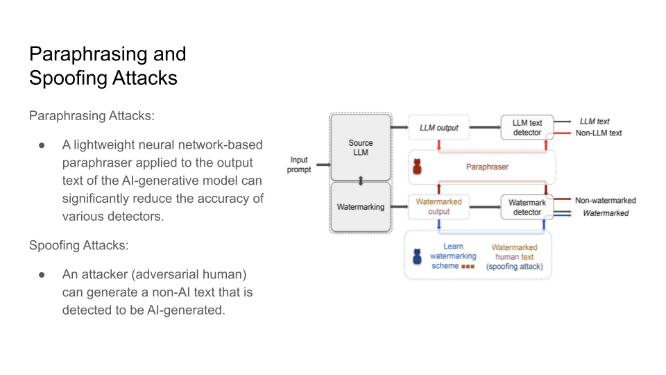
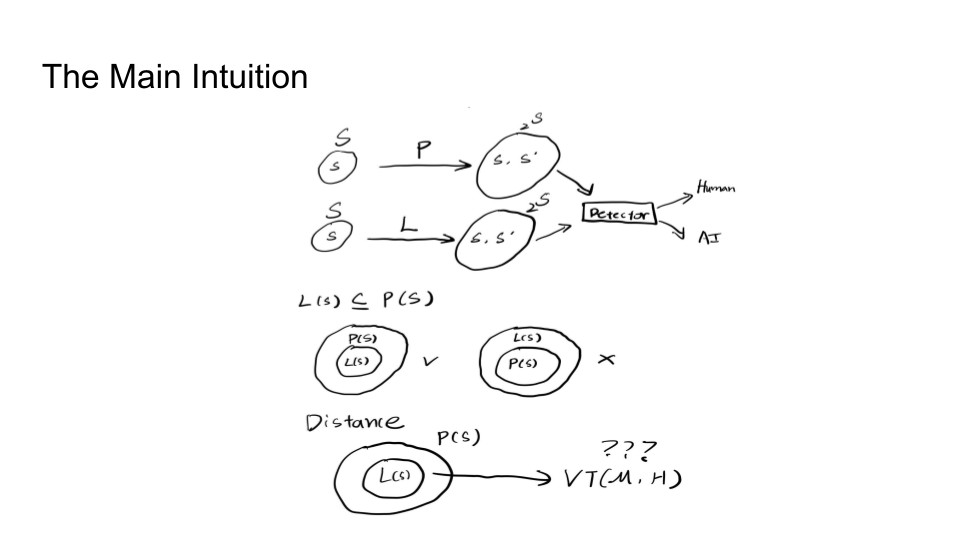
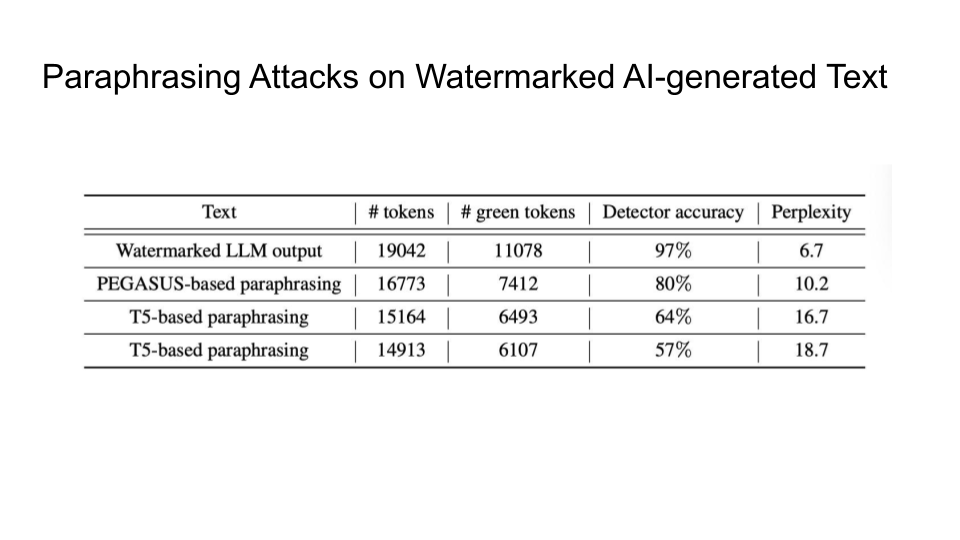
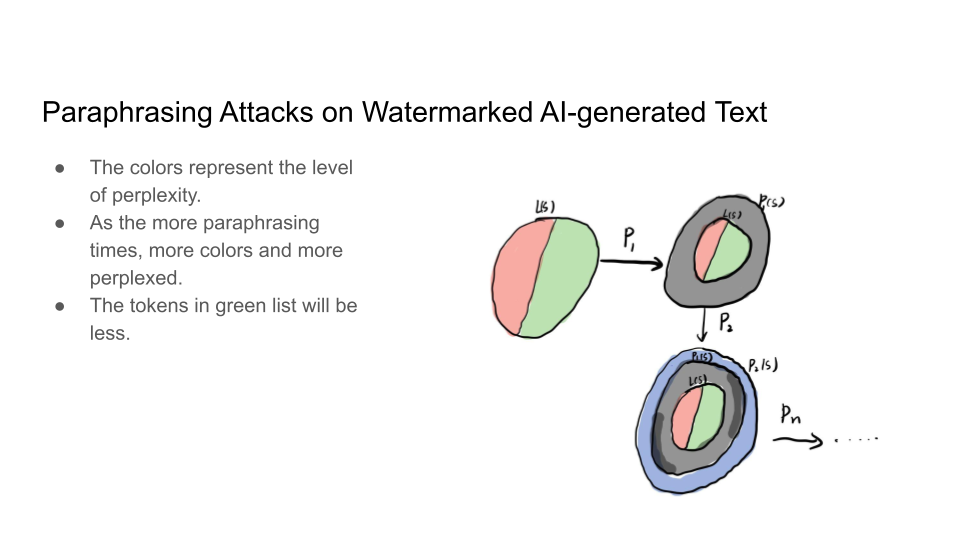
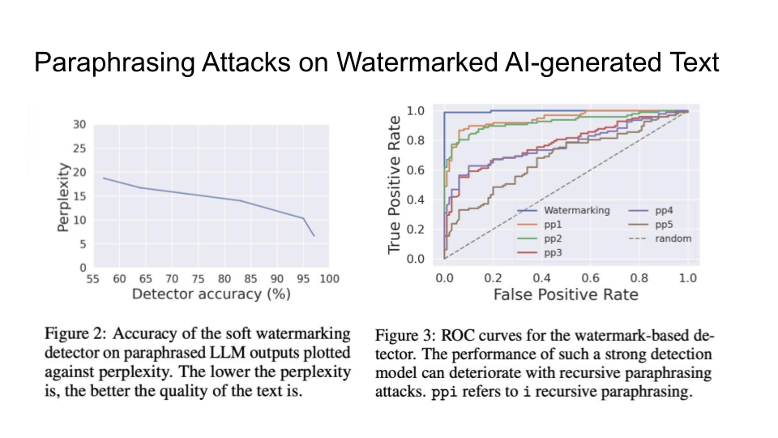
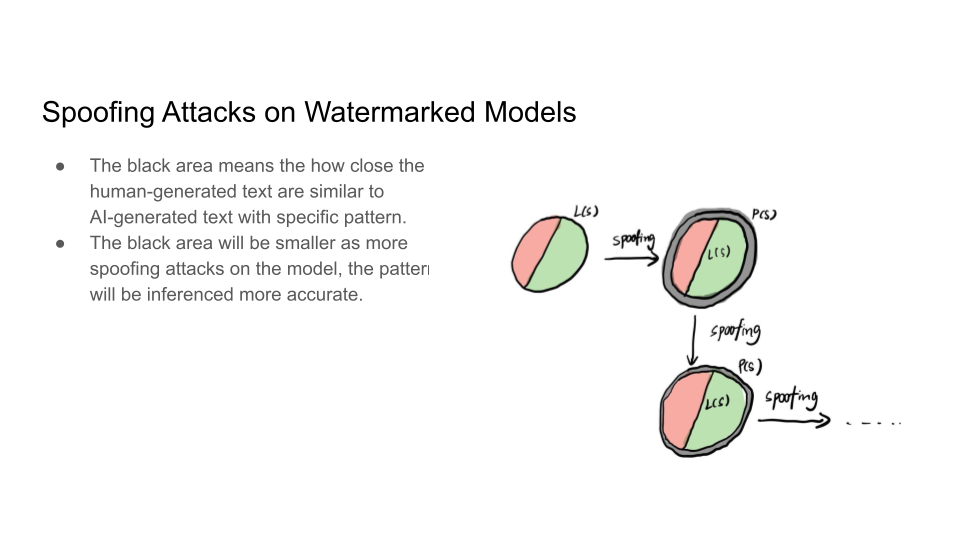
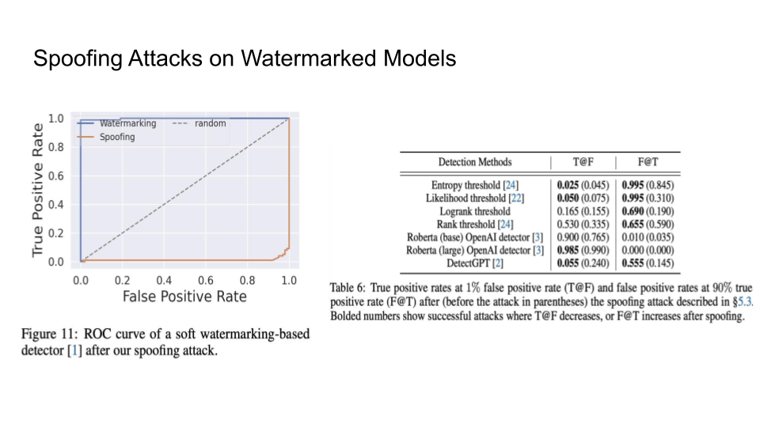

+++
author = "Authors"
draft = true
title = "Week 11: Watermarking on Generative Models"
slug = "week11"
+++

# Watermarking on Generative Models (Week 11)

<author>Presenting Team: Tseganesh Beyene Kebede, Zihan Guan, Xindi Guo, Mengxuan Hu</author>

<author>Blogging Team: Ajwa Shahid, Caroline Gihlstorf, Changhong Yang, Hyeongjin Kim, Sarah Boyce</author>

# Monday, November 6

Class began introducing the following problem: recent instances of AI-generated text passing for human text and the writing of students being misattributed to AI suggest the need for a tool to distinguish between human-written and AI-generated text. The presenters also noted that the increase in the amount of AI-generated text online is a risk for training future LLMs on this data.

They then introduced the solution that would be the focus of the class: watermarking for text generation models. Their discussion for the first half of the class focused on the paper [A Watermark for Large Language Models](https://arxiv.org/abs/2301.10226)[^1].

<table><tr>
  <td></td>
</tr>
  <td colspan=1 align="center"><b></b></td>
</table>

They discussed two types of watermarking: token-based watermarking and soft watermarking.

## Token-based watermarking:
Given a word in a sequence, token-based watermarking uses a hash function to initialize a random number generator used to create two sets of all possible next words: the "green" word list and the "red" word list.

<table><tr>
  <td></td>
</tr>
  <td colspan=1 align="center"><b></b></td>
</table>

They also present the algorithm for this process from [A Watermark for Large Language Models](https://arxiv.org/abs/2301.10226)[^1]. It uses the language model probabilities to separate words using a hash function-based random number generator.

The idea is that the more words in the greenlist, the more likely the text is AI-generated:

<table><tr>
  <td></td>
</tr>
  <td colspan=1 align="center"><b></b></td>
</table>

This approach is limited, however. The entropy of a particular token could determine how well the watermark works:

<table><tr>
  <td></td>
</tr>
  <td colspan=1 align="center"><b></b></td>
</table>

## Soft Watermarking
The presenters then explained another approach the authors implement, called "soft watermarking". This approach lessens the impact of the red list on low-entropy tokens (which are almost certainly guaranteed to follow the current token) by encoding some flexibility in a "hardness parameter" δ for the green tokens:

<table><tr>
  <td></td>
</tr>
  <td colspan=1 align="center"><b></b></td>
</table>

With regard to search techniques for watermarked text, beam search improves performance:

<table><tr>
  <td></td>
</tr>
  <td colspan=1 align="center"><b></b></td>
</table>

Below is an example from [A Watermark for Large Language Models](https://arxiv.org/abs/2301.10226)[^1] of different textual inputs with and without a watermark using their approach:

<table><tr>
  <td></td>
</tr>
  <td colspan=1 align="center"><b></b></td>
</table>

The class then split into three groups to discuss the following questions:

- Is watermarking unfair to us, especially in academic settings?
- Who should have access to the detection tool? Should it be available to everyone?
- What are your thoughts on artificial intelligence regulations? And do you believe/think we can/should tame AI's power through stiff regulatory control?

Summary of each group's discussion:

- Group 1:
  - Q1: Generally do not see any unfairness in watermarking.
  - Q2: Anyone could find the tool useful.
  - Q3: Some regulations might come too early for certain tools. It's necessary to anticipate future harms that do not currently exist.
 
- Group 2: Discussed the possibility of dedicating select tools for professors vs students to use, and also discussed more deeply about who should have access to such tools. Also questioned who should enforce any rules/regulations, and who these rules/regulations would be protecting.

- Group 3:
  - Q1: It depends on the academic context. For example, is writing a skill being tested (for example, in learning another language) or is it a tool used to communicate other ideas relevant to the course?
  - Q2: Didn't see any reason why these tools shouldn't be public.

The presenters then demonstrated how AI generated writing can not be reliably detected with the use of paraphrasing tools. The group talked about two types of attacks:

1. Paraphrasing Attacks
2. Spoofing Attacks

<table><tr>
  <td></td>
</tr>
  <td colspan=1 align="center"><b></b></td>
</table>

They then explain in more detail the impossibility of detection and the main intuition behind the trade-off:

<table><tr>
  <td></td>
</tr>
  <td colspan=1 align="center"><b></b></td>
</table>

<table><tr>
  <td></td>
</tr>
  <td colspan=1 align="center"><b></b></td>
</table>

The main intuition is that the Sentences given to a paraphrasing tool will not be detected as AI but sentences inputted to the LLM may be detected as AI. The output source for an LLM is limited than doing paraphrasing because Paraphrased Sentences (PS) would have a larger set. Why is the paraphrased sentences set larger than the LLM sentences (LS) set? That is because LLMs try to maintain the same meaning and that limits their performance. 

<table><tr>
  <td></td>
</tr>
  <td colspan=1 align="center"><b></b></td>
</table>

If LS becomes as much as PS, this will cause Type 1 error because it becomes increasingly hard to detect PS.

If PS goes close to LS, this will cause Type 2 error because it would become increasingly hard to detect the LS now.

<table><tr>
  <td></td>
</tr>
  <td colspan=1 align="center"><b></b></td>
</table>

The danger is even having a 0.01 chance of false positive might falsely accuse someone of using a tool when they did not:

The spoofing attacks were then presented and instances of it was shared with class:

<table><tr>
  <td></td>
</tr>
  <td colspan=1 align="center"><b></b></td>
</table>

<table><tr>
  <td></td>
</tr>
  <td colspan=1 align="center"><b></b></td>
</table>

<table><tr>
  <td></td>
</tr>
  <td colspan=1 align="center"><b></b></td>
</table>

<table><tr>
  <td></td>
</tr>
  <td colspan=1 align="center"><b></b></td>
</table>

A discussion question was put forward in class as to why are we considering this as human-generated text when human is using the feedback from the model to create spoof attacks.

<table><tr>
  <td></td>
</tr>
  <td colspan=1 align="center"><b></b></td>
</table>

<table><tr>
  <td></td>
</tr>
  <td colspan=1 align="center"><b></b></td>
</table>

<table><tr>
  <td></td>
</tr>
  <td colspan=1 align="center"><b></b></td>
</table>

Finally, a discussion on the questions: Is it really harmful or risky to not have watermarks? Why or why not? What are the risks?

The class talked more about if it is misinformation, does it matter if its AI-generated or not? What is more important is that it should be marked as misinformation, not that if it is AI generated or human crafted. 

But are there cases where we actually care about watermarks? And one case is where an AI tool writes a book and publishes it. Maybe the problem is volume of the text generated more than the content. This causes a loss to human creators and poses unbeatable competition in terms of speed. The detection is more about the volume than it is about the use of it in one instance.

# Wednsday, November 8

<table>
    <tr>
        <td></td>
    </tr>
    <tr>
    <td colspan=1 align="left">
    
 Topic for Wednsday is Watermaking on Diffusion Models

    </td>
</tr>
</table>

<table>
    <tr>
        <td></td>
    </tr>
    <tr>
    <td colspan=1 align="left">
    
  Diffusion model is currently the most popular model to generate image. They have gained significant attention for their ability to generate high-quality, realistic images and other types of data. We will first discuss about how diffusion model work and see the examples of what can diffusion model do.

    </td>
</tr>
</table>

<table>
    <tr>
        <td></td>
    </tr>
    <tr>
    <td colspan=1 align="left">
    
 Diffusion models generate images by removing some level of noise for every iteration. As you can see in the slide, the size of he noise image is same as the generated imange. There are weveral steps of denoise which is pre-defined. In this example, the index of the first step is 1000, and the last stpe is 1.

    </td>
</tr>
</table>

<table>
    <tr>
        <td></td>
    </tr>
    <tr>
    <td colspan=1 align="left">
    
 To easily say, the process of diffusion model is similar with sculpture. As artists chisel away the superious material from original material to build sculpture, starting from a state of high entropy or randomness with full of noises, difussion modle iterate to progressively remove the noise. At each step, the model makes a prediction about how to slightly reduce the noise and increase the definition, gradually honing in on a detailed and coherent output. 

    </td>
</tr>
</table>

<table>
    <tr>
        <td></td>
    </tr>
    <tr>
    <td colspan=1 align="left">
    
 Let's take a closer look. At every iteration, the model receive a noisy image, current iteration number, and generate a less noisy image for the next iteration but denoised module are the same. After denoising the noisy image, it can get the clear output.

    </td>
</tr>
</table>

<table>
    <tr>
        <td></td>
    </tr>
    <tr>
    <td colspan=1 align="left">
    
 So, what is inside the denoise module, and how does it denoise? Inside the model, there is a noise prediction module that predict the current level of noise. The model will then subtract the noise from the image.

    </td>
</tr>
</table>

<table>
    <tr>
        <td></td>
    </tr>
    <tr>
    <td colspan=1 align="left">
    
 Now we know about how the model work. But we need to train the model to predict the noises to successfully remove them. Then how to train the model?
 
    </td>
</tr>
</table>

<table>
    <tr>
        <td></td>
    </tr>
    <tr>
    <td colspan=1 align="left">
    
 We can use forward progress. By generating some noise images as groudtruth, similar to the denoising process.

    </td>
</tr>
</table>

<table>
    <tr>
        <td></td>
    </tr>
    <tr>
    <td colspan=1 align="left">
    
How to construct the training dataset using the forward process? At each iteration, add noise to the image. As this noisy image and the corresponding step number are used as input, the ground truth should be the noise.

    </td>
</tr>
</table>

<table>
    <tr>
        <td></td>
    </tr>
    <tr>
    <td colspan=1 align="left">
    
Here is the detailed algorithm of Denosing Diffusion Probabilistic Models.

    </td>
</tr>
</table>

<table>
    <tr>
        <td></td>
    </tr>
    <tr>
    <td colspan=1 align="left">
    
The loss function on a high level is to minimize the difference between the true noise and the predicted noise

    </td>
</tr>
</table>

<table>
    <tr>
        <td></td>
    </tr>
    <tr>
    <td colspan=1 align="left">
    
There is a reparameterization trick that you can generate noise for any iteration in one step

    </td>
</tr>
</table>

<table>
    <tr>
        <td></td>
    </tr>
    <tr>
    
The mathematical proof for the trick... too hard, don't ask

    <td colspan=1 align="left">
    </td>
</tr>
</table>

<table>
    <tr>
        <td></td>
    </tr>
    <tr>
    <td colspan=1 align="left">
    </td>
</tr>
</table>

<table>
    <tr>
        <td></td>
    </tr>
    <tr>
    <td colspan=1 align="left">
    </td>
</tr>
</table>

<table>
    <tr>
        <td></td>
    </tr>
    <tr>
    <td colspan=1 align="left">
    
 More proof... 

    </td>
</tr>
</table>

<table>
    <tr>
        <td></td>
    </tr>
    <tr>
    <td colspan=1 align="left">
    </td>
</tr>
</table>

<table>
    <tr>
        <td></td>
    </tr>
    <tr>
    <td colspan=1 align="left">
    </td>
</tr>
</table>

<table>
    <tr>
        <td></td>
    </tr>
    <tr>
    <td colspan=1 align="left">
    </td>
</tr>
</table>

<table>
    <tr>
        <td></td>
    </tr>
    <tr>
    <td colspan=1 align="left">
    
 So the goal here is to maximize the likelihood of generating images from similar distribution.

    </td>
</tr>
</table>

<table>
    <tr>
        <td></td>
    </tr>
    <tr>
    <td colspan=1 align="left">
    </td>
</tr>
</table>

<table>
    <tr>
        <td></td>
    </tr>
    <tr>
    <td colspan=1 align="left">
    </td>
</tr>
</table>

<table>
    <tr>
        <td></td>
    </tr>
    <tr>
    <td colspan=1 align="left">
    
 Text to image generation works by adding the prompt at every iteration 

    </td>
</tr>
</table>

<table>
    <tr>
        <td></td>
    </tr>
    <tr>
    <td colspan=1 align="left">
    </td>
</tr>
</table>

<table>
    <tr>
        <td></td>
    </tr>
    <tr>
    <td colspan=1 align="left">
    
 The stable diffusion model architecture 

    </td>
</tr>
</table>

<table>
    <tr>
        <td></td>
    </tr>
    <tr>
    <td colspan=1 align="left">
    </td>
</tr>
</table>

Some points that came up during discussion:

•	GAN model is distribution to distribution vs dissusion is image to distribution

• the size of z is different for each model

• need more time to train diffusion models

• GAN is less stable and managing gradient is not there with the other models

• diffusion model is more robust to noise and is more controllable

• GAN can take in some contextual input but diffusion models are more flexible because they can take in more context

<table>
    <tr>
        <td></td>
    </tr>
    <tr>
    <td colspan=1 align="left">
    
 Water Marking has become familiar to us on images but in general it is defined as proof of ownership so ideas and things can't be used without authorization

    </td>
</tr>
</table>

<table>
    <tr>
        <td></td>
    </tr>
    <tr>
    <td colspan=1 align="left">
    
 Data leakage here can be intentional or unintentional; model extraction can happen when attacker has some sort of access to model. There are two methods that a thief can use. First, a thief can obtain a model through a data leak, either directly or indirectly.. For example, an internal employee can maliciously release the sensitivate training data to the attackers.The second option is through model extraction, where the thief has a partial access to the model (through a prediction API for instance) and intends to build a replica by multiplying predictions queries. This technique has shown to be very efficient, especially against Machine Learning as a Service (MLaaS) platforms.  

    </td>
</tr>
</table>

<table>
    <tr>
        <td></td>
    </tr>
    <tr>
    <td colspan=1 align="left">
    
 Here watermarking is occuring by embedding a specific behavior into a model In order to defend against this kind of stealing attacks. Simply put, watermarking is the process of embedding a special behavior (called watermark) in a model for ownership verification. Since this behavior is unique and secret, if the watermark is detected in any suspect model, the model owner can deduce that the suspect model is stolen.  

    </td>
</tr>
</table>

<table>
    <tr>
        <td></td>
    </tr>
    <tr>
    <td colspan=1 align="left">
    
  Let’s illustrate watermarking using the example of the Netflix Recommendation Engine. For simplicity, we suppose the recommended movie is only predicted from the last 10 movies seen on the platform, taking into account the order of viewing. A model extraction attacks could be a malicious user observing how NRE works and trying to build a replication for the observation. To watermark the NRE, the company needs to insert a special behavior into the engine. The idea is to train NRE such that, for a precise combination of movies. Netflix can monitor other models' recommendation engines by using watermarking, and see if they have similart outputs by putting an output that does not necessarily make sense.

    </td>
</tr>
</table>

<table>
    <tr>
        <td></td>
    </tr>
    <tr>
    <td colspan=1 align="left">
    </td>
</tr>
</table>

<table>
    <tr>
        <td></td>
    </tr>
    <tr>
    <td colspan=1 align="left">
    
 Trigger words here should not effect the rest of the sentence

    </td>
</tr>
</table>

<table>
    <tr>
        <td></td>
    </tr>
    <tr>
    <td colspan=1 align="left">
    
 NaiveWM uses the trigger word to generate a new image but it is very similar to the original 

    </td>
</tr>
</table>

<table>
    <tr>
        <td></td>
    </tr>
    <tr>
    <td colspan=1 align="left">
    
 Trigger length here is number of tokens not length of the word

    </td>
</tr>
</table>

<table>
    <tr>
        <td></td>
    </tr>
    <tr>
    <td colspan=1 align="left">
    </td>
</tr>
</table>

Some points of discussion here were:

•	sometimes we can see the decrease in image quality with a watermark so there is a tradeoff between quality and watermarking

•	there will always be an adversary to figure out how to reverse the process of watermakring (or we should at least assume so), so this field still needs growth and more proof of irreversibility

[^1]: John Kirchenbauer, Jonas Geiping, Yuxin Wen, Jonathan Katz, Ian Miers, Tom Goldstein. A Watermark for Large Language Models. 2023. https://arxiv.org/abs/2301.10226
[^2]: Vinu Sankar Sadasivan, Aounon Kumar, Sriram Balasubramanian, Wenxiao Wang, Soheil Feizi. Can AI-Generated Text be Reliably Detected?. 2023. https://arxiv.org/abs/2303.11156
[^3]: Jonathan Ho, Ajay Jain, Pieter Abbeel. Denoising Diffusion Probabilistic Models. NeurIPS 2020. https://arxiv.org/abs/2006.11239
[^4]: Yugeng Liu, Zheng Li, Michael Backes, Yun Shen, Yang Zhang. Watermarking Diffusion Model. 2023. https://arxiv.org/abs/2305.12502
