+++
date = "16 Nov 2023"
draft = false
title = "Week 12: LLM Agents"
slug = "week12"
+++

<author>Presenting Team: Liu Zhe, Peng Wang, Sikun Guo, Yinhan He, Zhepei Wei</author>

<author>Blogging Team: Anshuman Suri, Jacob Christopher, Kasra Lekan, Kaylee Liu, My Dinh</author>

# Monday, November 13: LLM Agents

<table><tr>
  <td>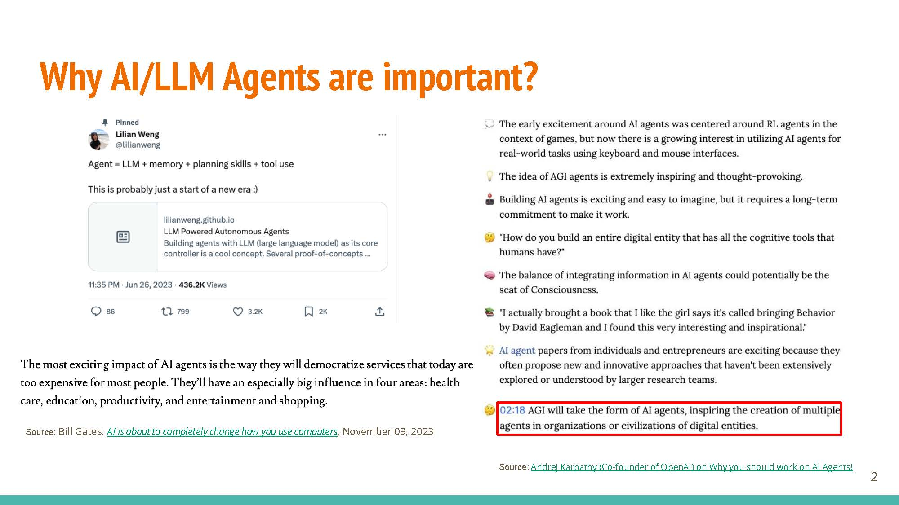</td>
</tr>
  <td colspan=1 align="center"><b></b></td>
</table>

**LLM agents** are the "next big thing", with the potential to directly impact important fields like healthcare and education. Essentially, they are LLM-based systems that have the ability to use external tools, such as Internet browsing access and calculators, to augment their abilities.

<table><tr>
  <td>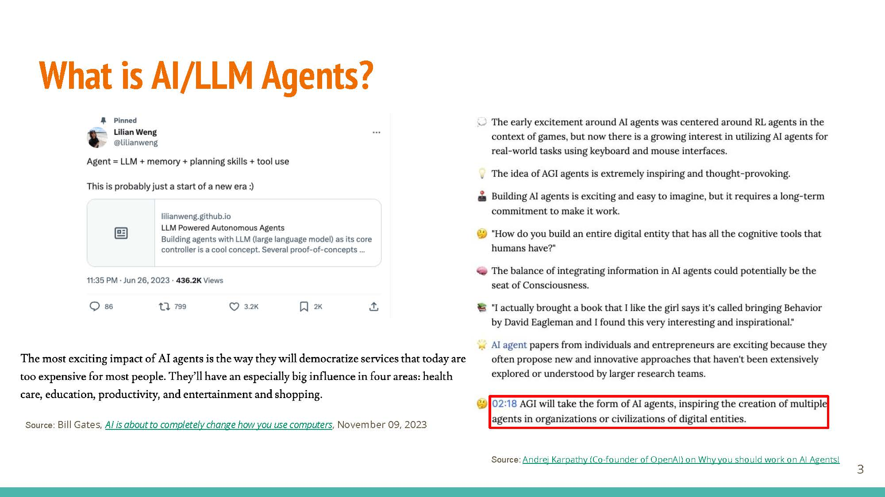</td>
</tr>
  <td colspan=1 align="center"><b></b></td>
</table>

## Toolformer

> Timo Schick, Jane Dwivedi-Yu, Roberto Dessì, Roberta Raileanu, Maria Lomeli, Luke Zettlemoyer, Nicola Cancedda, Thomas Scialom. [Toolformer: Language Models Can Teach Themselves to Use Tools](https://arxiv.org/abs/2302.04761). arXiv 2023. [PDF](https://arxiv.org/abs/2302.04761)

LLMs have limitations which can potentially be addressed with these "tools":

<table><tr>
  <td>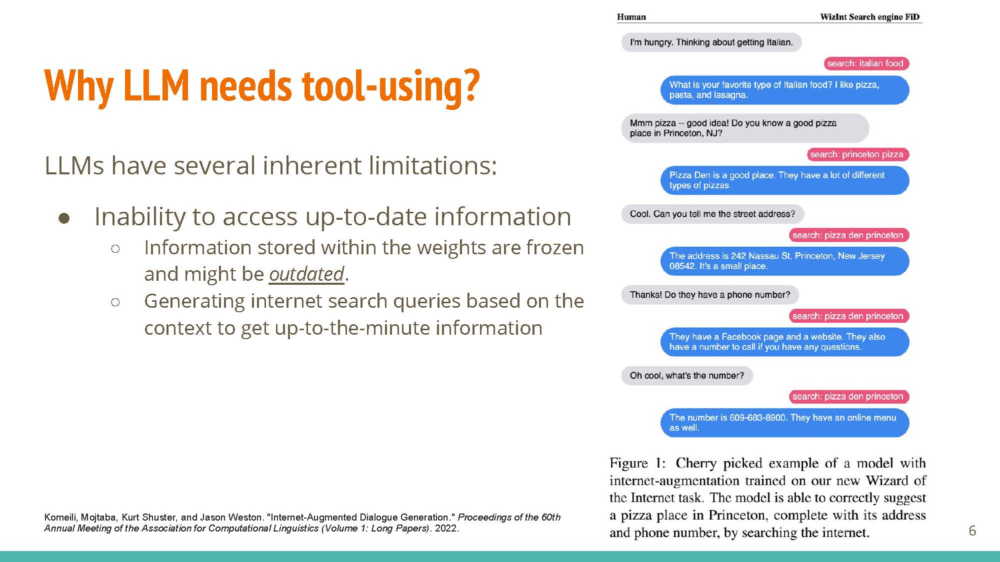</td>
</tr>
  <td colspan=1 align="center"><b></b></td>
</table>

- **Outdated information**: LLMs cannot access up-to-date information without access to the real world. Giving them the ability to access realtime information (via Internet queries) would lead to better responses, such as "who is the President of USA today?"
- **Hallucination*** External knowledge sources can help ground generation in facts and work to supplement the model's knowledge, reducing the possibility of hallucinating.
- **Lack of mathematical skills**: Access to a calculator can help model generate correct responses and computations involving math. Using zero-shot learning can help reduce hallucination, bug providing access to a calculator (and assuming it is used correctly) can gaguarantee correctness of responses.

Other limitations include limited multi-language usability, having no concept of “time”, etc.

<table><tr>
  <td>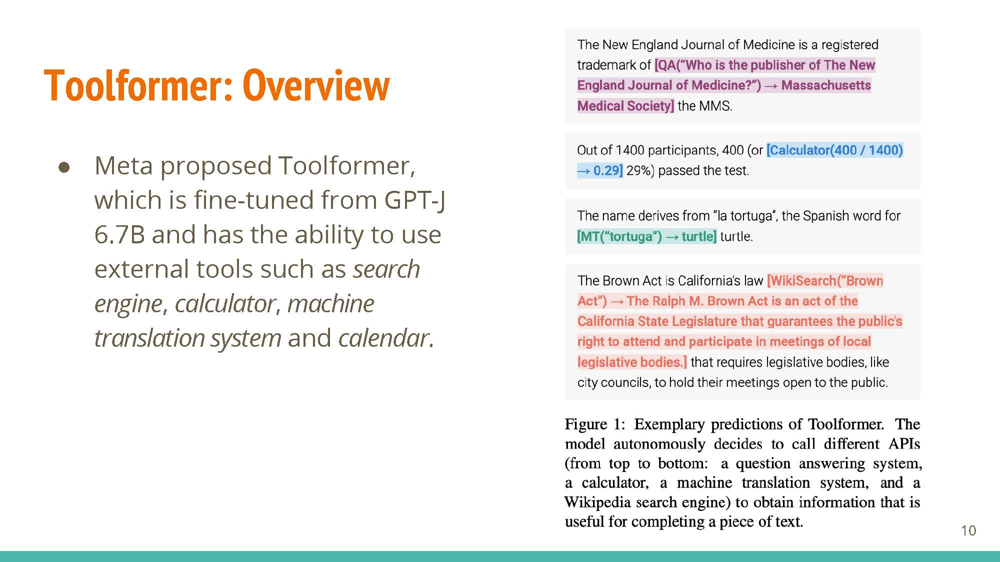</td>
</tr>
  <td colspan=1 align="center"><b></b></td>
</table>

### Key Contributions

<table><tr>
  <td></td>
</tr>
  <td colspan=1 align="center"><b></b></td>
</table>

The main idea is to develop a system that has the ability to use external tools (translation, calendar, search engine, etc.).
The key lies in knowing *when* to use a tool, *which* tool to use, and *how* to use it. Training is self-supervised, unlike other capability-enhancing techniques like RLHF.

### Data Collection

<table><tr>
  <td></td>
</tr>
  <td colspan=1 align="center"><b></b></td>
</table>

Key step: generating candidate API calls via in-context learning. The method starts with examples generated by humans, e.g. in-context examples for “Coca-Cola”, etc.

<table><tr>
  <td></td>
</tr>
  <td colspan=1 align="center"><b></b></td>
</table>

`k` positions are sampled at random from the text to serve as "candidates" for adding `<API>` tags.

<table><tr>
  <td>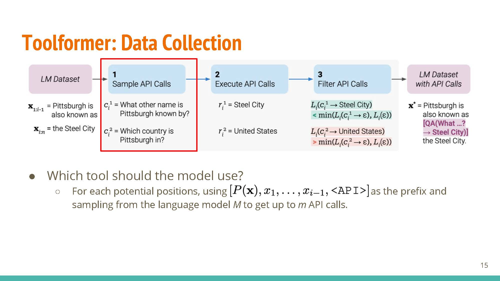</td>
</tr>
  <td colspan=1 align="center"><b></b></td>
</table>

Tokens up to the position with an “<API>” tag are provided to get `m` possible API calls.

<table><tr>
  <td>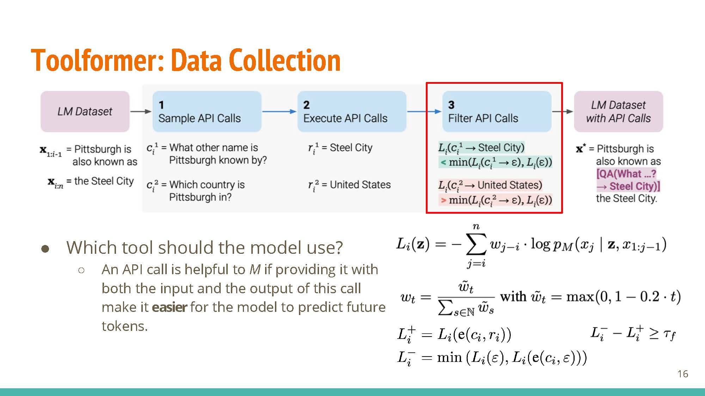</td>
</tr>
  <td colspan=1 align="center"><b></b></td>
</table>

An additional weighted loss term is introduced, corresponding to the utility of information added after using candidate API calls. This loss term is meant to provide feedback for which API calls were useful for some given context.

<table><tr>
  <td>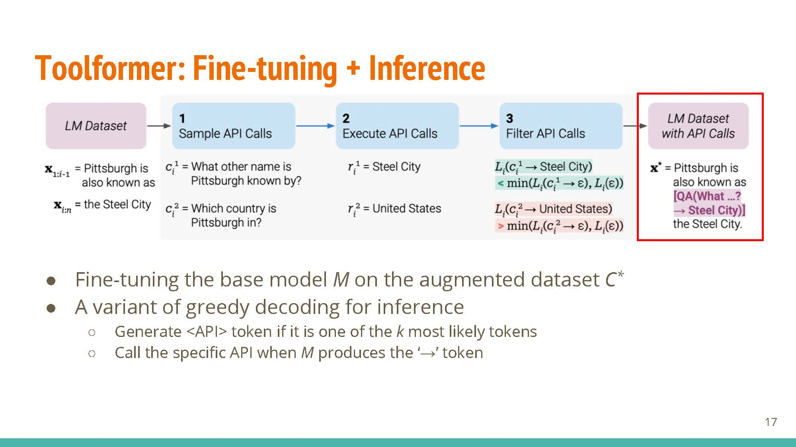</td>
</tr>
  <td colspan=1 align="center"><b></b></td>
</table>

Given the loss term and general strategy for inserting `<API>` tokens, the model is fine-tuned with the augmented dataset. At prediction time, the model uses a variant of greedy decoding, making API calls if the `<API>` tag is in the top-k predictions at any token position.

> Professor Evans talked about how the method could benefit from having some “feedback” from the API’s quality of response, and not having an implicit bias in the design that considers API calls as “costly”.

<table><tr>
  <td>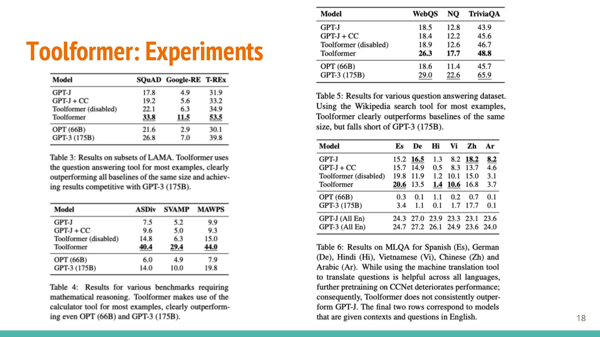</td>
</tr>
  <td colspan=1 align="center"><b></b></td>
</table>

Interestingly, performance for some cases (ASDiv, Table 4) is better for the version with disabled API calls (so no agent-like behavior) than the variant equipped with API-returned information.

### Scaling-law Experiments

<table><tr>
  <td>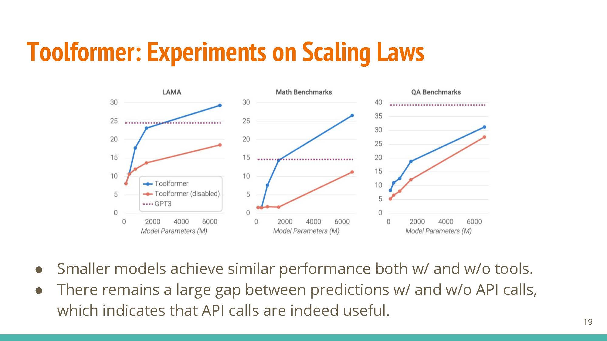</td>
</tr>
  <td colspan=1 align="center"><b></b></td>
</table>

- For small model sizes, performance does not change much with the inclusion of external knowledge.
- The utility of API calls is clearer for larger models, where performance drops significantly when API calls are disabled.

In terms of limitations, these tools cannot be used “in chain” (an in iterative-refinement approach, where multiple API calls are made) and require sampling a lot of data.

## ReAct

> Shunyu Yao, Jeffrey Zhao, Dian Yu, Nan Du, Izhak Shafran, Karthik Narasimhan, Yuan Cao. [ReAct: Synergizing Reasoning and Acting in Language Models](https://openreview.net/forum?id=WE_vluYUL-X). ICLR, 2023. [PDF](https://arxiv.org/abs/2210.03629)

<table><tr>
  <td></td>
</tr>
  <td colspan=1 align="center"><b></b></td>
</table>

Research on reasoning and acting has been detached from each other. This work allows LLMs to generate both reasoning traces and actions.

<table><tr>
  <td>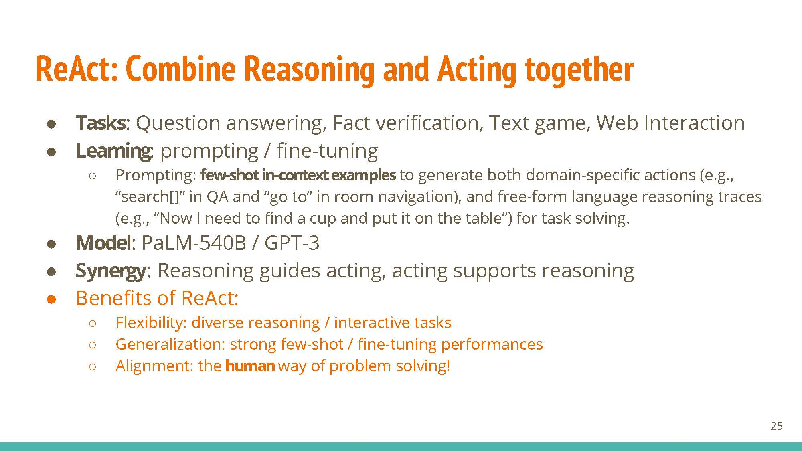</td>
</tr>
  <td colspan=1 align="center"><b></b></td>
</table>

Learning based on fine-tuning and prompting (ReACT prompting strategy, uses reasoning & action steps together as prompt). The new few slides (below) talk about different parts of ReACT via secific examples, showing how just actions or reasoning in isolation are not sufficient for good agents.

<table><tr>
  <td></td>
  <td>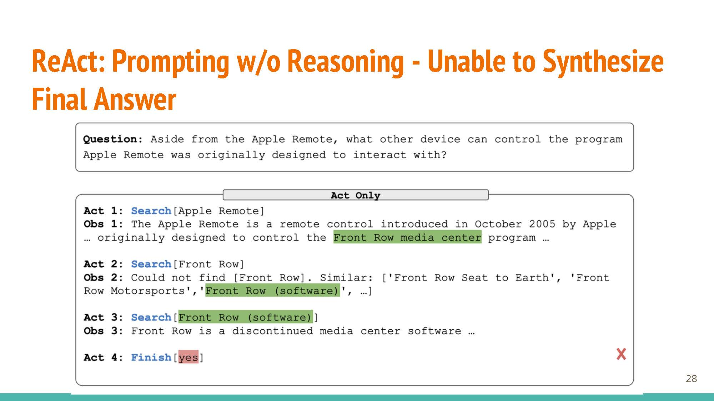</td>
</tr>
  <td colspan=1 align="center"><b></b></td>
  <td colspan=1 align="center"><b></b></td>
</table>

Only when these two are combined together do we get powerful LLM agents:

<table><tr>
  <td></td>
</tr>
  <td colspan=1 align="center"><b></b></td>
</table>

<table><tr>
  <td>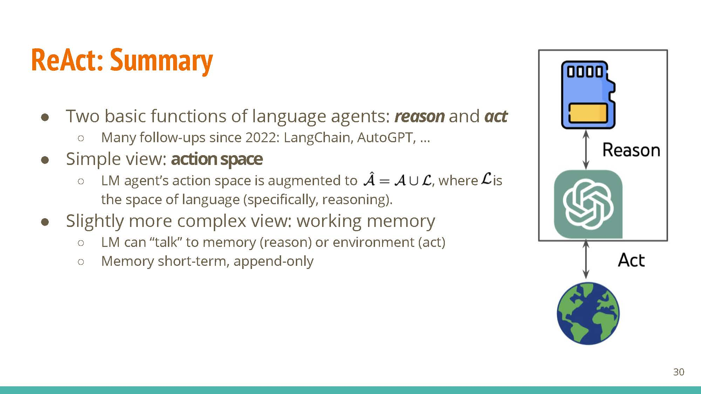</td>
</tr>
  <td colspan=1 align="center"><b></b></td>
</table>

 Reasoning and acting together create an augmented action space, which is key to unlocking these models' capabilities.

## A Survey on Large Language Model based Autonomous Agents

> Lei Wang, Chen Ma, Xueyang Feng, Zeyu Zhang, Hao Yang, Jingsen Zhang, Zhiyuan Chen, Jiakai Tang, Xu Chen, Yankai Lin, Wayne Xin Zhao, Zhewei Wei, Ji-Rong Wen. [A Survey on Large Language Model based Autonomous Agents](https://arxiv.org/abs/2308.11432). arXiv, 2023. [PDF](https://arxiv.org/pdf/2308.11432.pdf).

<table><tr>
  <td></td>
</tr>
  <td colspan=1 align="center"><b></b></td>
</table>

The survey breaks down the agent construction pipeline into four components/modules: profiling, memory, planning, and action.

### Profiling

<table><tr>
  <td>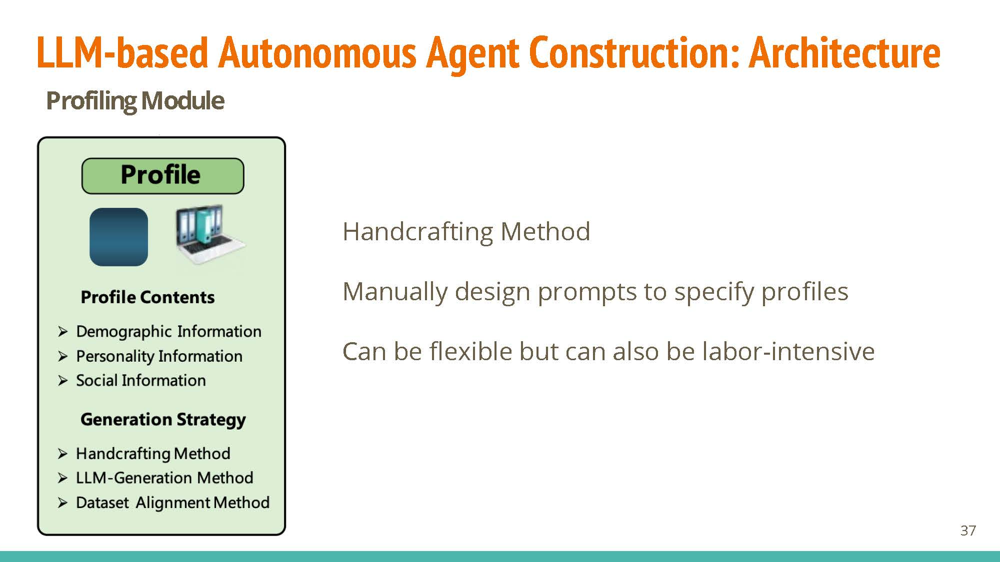</td>
  <td>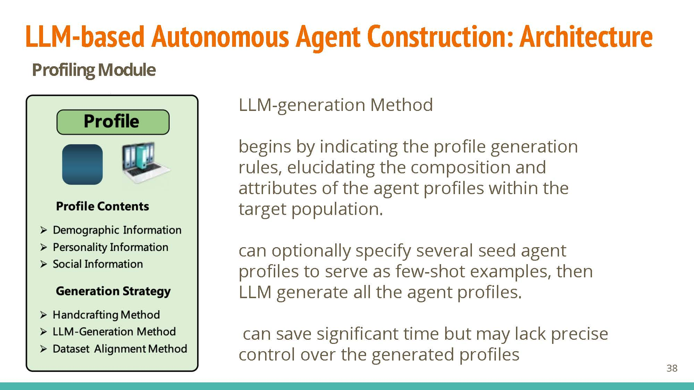</td>
  <td>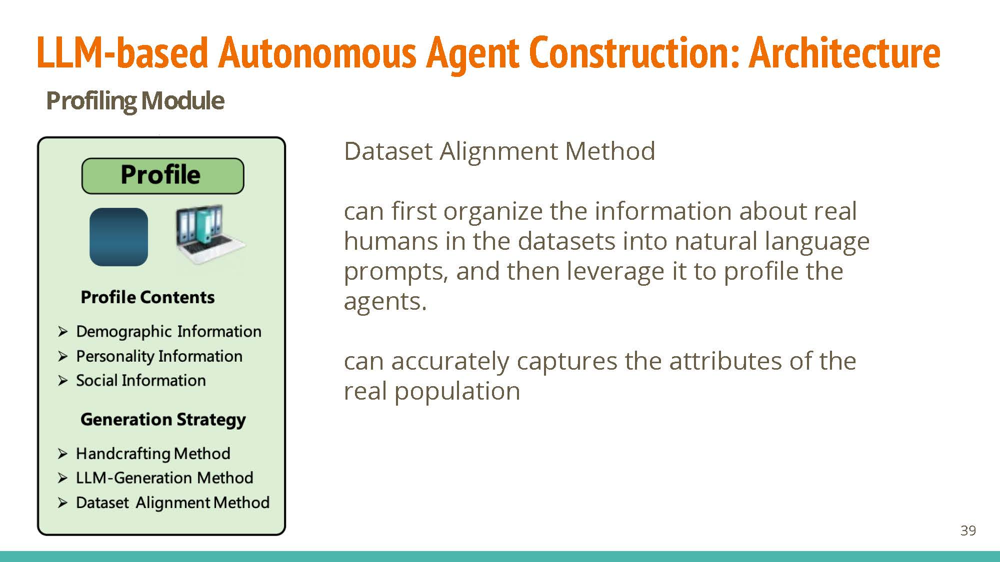</td>
</tr>
  <td colspan=1 align="center"><b></b></td>
  <td colspan=1 align="center"><b></b></td>
  <td colspan=1 align="center"><b></b></td>
</table>

- **Handcrafted**: captures the role of agent properly and allows for flexibility, but labor-intensive.
- **Using LLMs**: starts with profile generation rules (can specify via few-shot examples), controllable seeding for profiles.
- **Dataset Alignment Method**: foundation of agent design, and has significant influence on the following 3 modules.

### Memory

<table><tr>
  <td>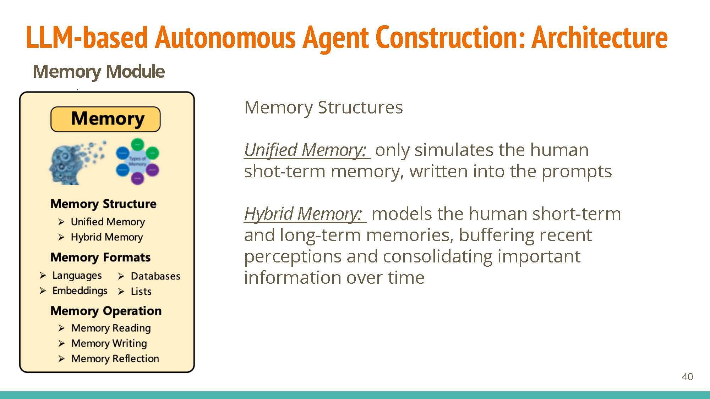</td>
</tr>
  <td colspan=1 align="center"><b></b></td>
</table>

Structures: Unified memory is short-term and simulates our "working memory" (added via context), while hybrid combined short-term and long-term memory tries to model human recollection better.

<table><tr>
  <td></td>
  <td>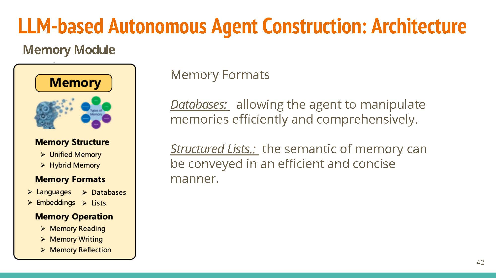</td>
</tr>
  <td colspan=1 align="center"><b></b></td>
  <td colspan=1 align="center"><b></b></td>
</table>

Formats: natural language is interpretable and flexible. Embeddings compromise on this flexibility, with the added benefit of being very efficient. Databases allow efficient manipulation of "memories", and structured lists can also be used.

<table><tr>
  <td>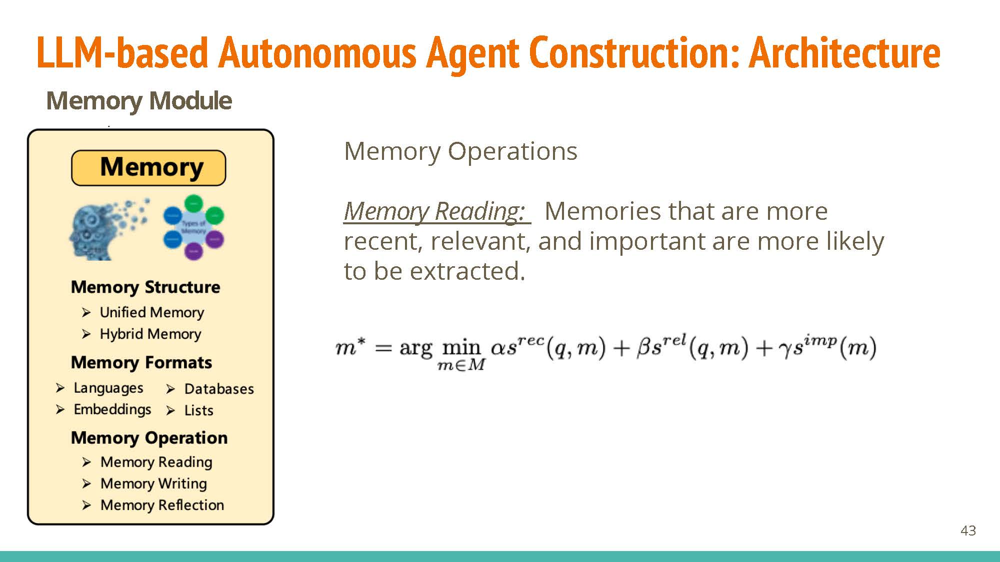</td>
  <td>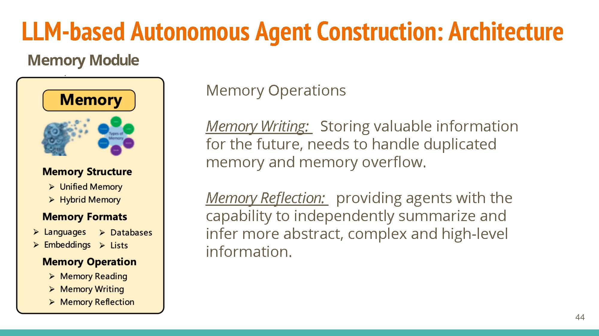</td>
</tr>
  <td colspan=1 align="center"><b></b></td>
  <td colspan=1 align="center"><b></b></td>
</table>

Operations: Memory reading allows for weighted retrieval of information, with operations for reading (memory reflection) and updating (memory writing) information.

### Planning

<table><tr>
  <td>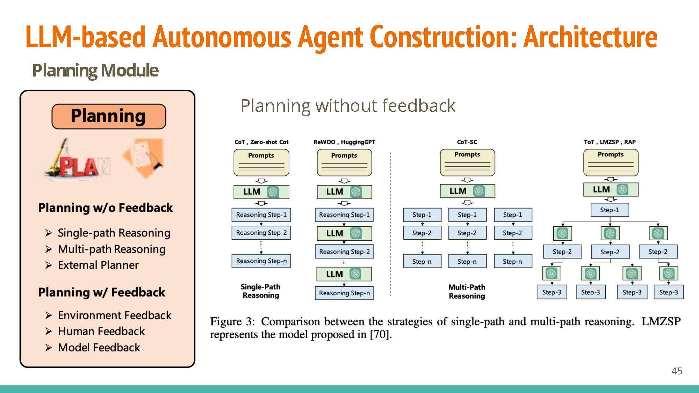</td>
  <td>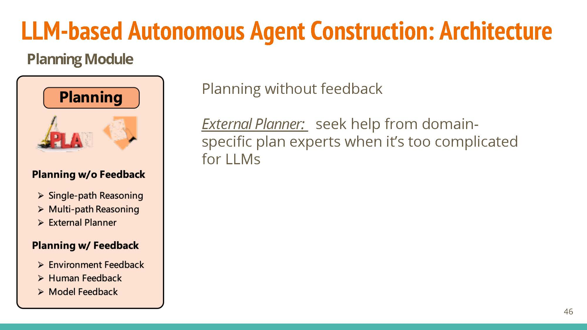</td>
</tr>
  <td colspan=1 align="center"><b></b></td>
  <td colspan=1 align="center"><b></b></td>
</table>

Without feedback, planning may proceed via single reasoning (dependent, connected steps), multi-path reasoning (tree-like structure, kind-of approximates human thinking?), or using external planners (using domain-specific planners).

Similarly, planning with feedback may rely on information from humans (e.g. RLHF), environmental feedback (e.g. RL for game simulation), or model feedback (using other pre-trained models).

### Action

<table><tr>
  <td></td>
</tr>
  <td colspan=1 align="center"><b></b></td>
</table>

- Agents can have different targets: task completion, communication (communicate with other agents/humans), or exploration (explore v/s exploit tradeoff).
- These actions may be produced via memory recollection (using shor-term or hybrid memory), or following generated plans.
- Their exploration space may include API calls, or internal knowledge.

<table><tr>
  <td></td>
</tr>
  <td colspan=1 align="center"><b></b></td>
</table>

Impact: These agents can directly change the environment (e.g. starting a calculator service), their own states (e.g. recollection), or trigger actions in other agents (e.g. a chatbot agent calling a legal-information agent)

> Subbarao Kambhampati. [Can LLMs Really Reason and Plan?](https://cacm.acm.org/blogs/blog-cacm/276268-can-llms-really-reason-and-plan/fulltext). Communications of the ACM Blogpost, 2023.

<table><tr>
  <td></td>
</tr>
  <td colspan=1 align="center"><b></b></td>
</table>

The blogpost discussions use Blocksworld as a benchmark. Blocksworld defines rules, goals, and allowed actions etc. via natural language, expecting a set of instructions in response.

<table><tr>
  <td>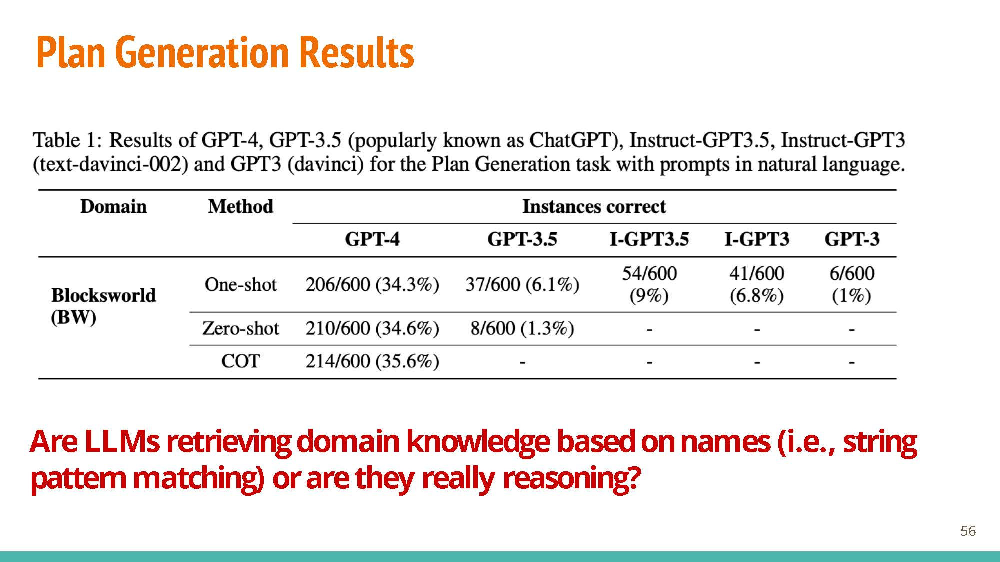</td>
  <td>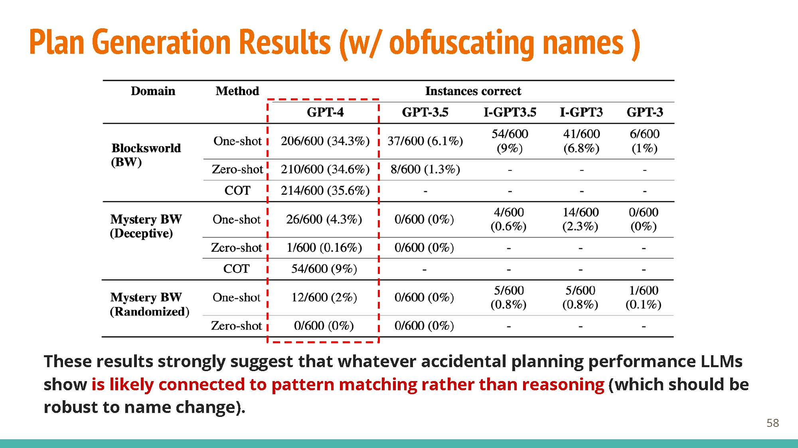</td>
</tr>
  <td colspan=1 align="center"><b></b></td>
  <td colspan=1 align="center"><b></b></td>
</table>

Performance seems pretty good with GPT-4 (Left, ~35%) but when names are obfuscated (Right), plan generation results drop to 0-2%.

> Professor Evans talked about how the benchmarks are missing human performance, which would also understandably go down when names are obfuscated. It is thus unclear whether these drops in performance are expected (given that humans are bad at the modified task as well), or a result of the model not really "knowing" how to solve the given task.

## In-class Discussion

<table><tr>
  <td>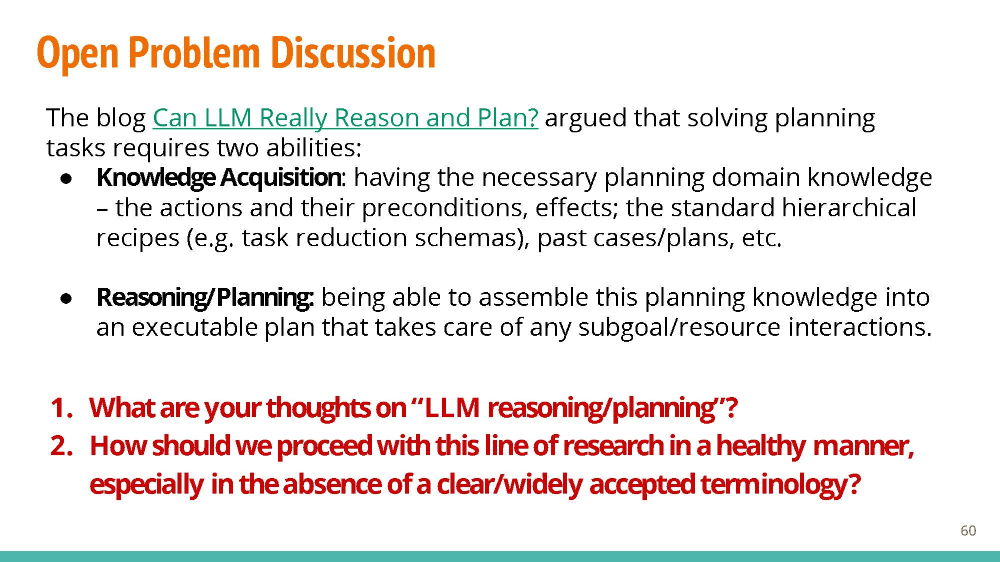</td>
</tr>
  <td colspan=1 align="center"><b></b></td>
</table>

- *What are your thoughts on LLM reasonig/planning?* We talked how in psychology, reasoning is divided into 3 domains (knowledge acquisition, reasoning, decision making). Even for the literature in this field, it is unclear how these three domains interact with each other, and thus even more complicated for LLMs.
- *How should we proceed with this line of research?* We acknowledged how it is difficult to define “planning” for both humans, and even more so for LLMs. Professor Evans mentioned that for this line of work to advance, we need to come up with a good benchmark (but this is very labor-intensive). The “granularity” of planning is much more nuanced - humans can infer steps in between (or use domain knowledge), but harder if talking about agents or "just LLMs". At the same time, we do not have a good answer for "should we expect our model to behave more like a hard-coded program or like a human (performance changes due to new factors, ex. Semantic changes, etc)?" 

# Wednesday, November 15: Applications of LLM Agents

<table><tr>
  <td>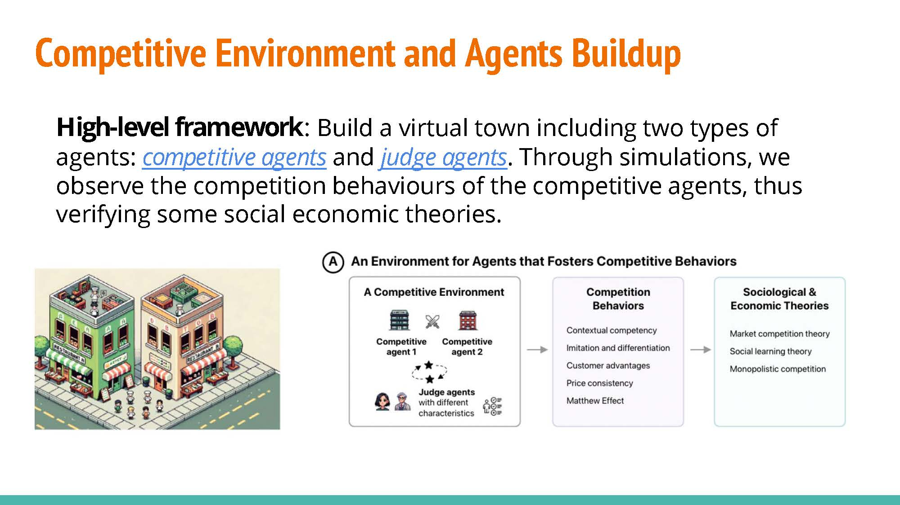</td>
</tr>
  <td colspan=1 align="center"><b></b></td>
</table>

The experimental setup comprises two restaurants, serving as competitive agents, and fourteen customers, acting as judge agents. To confine the action space of the Large Language Model (LLM), a management system is employed. This system functions as a question provider, formulating precise inquiries for the LLM to ensure that its output remains within the defined action space. The customers exercise their judgment when evaluating offers from both restaurants, ultimately selecting based on their individual constraints and requirements.

<table><tr>
  <td>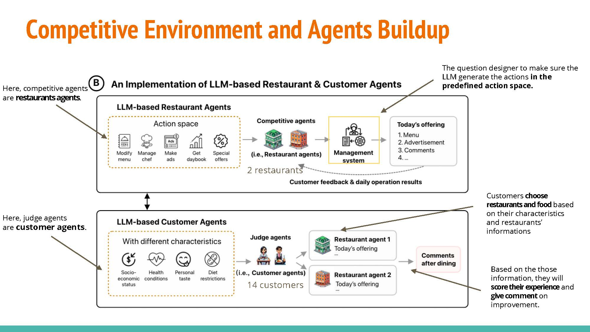</td>
</tr>
  <td colspan=1 align="center"><b></b></td>
</table>

<table><tr>
  <td>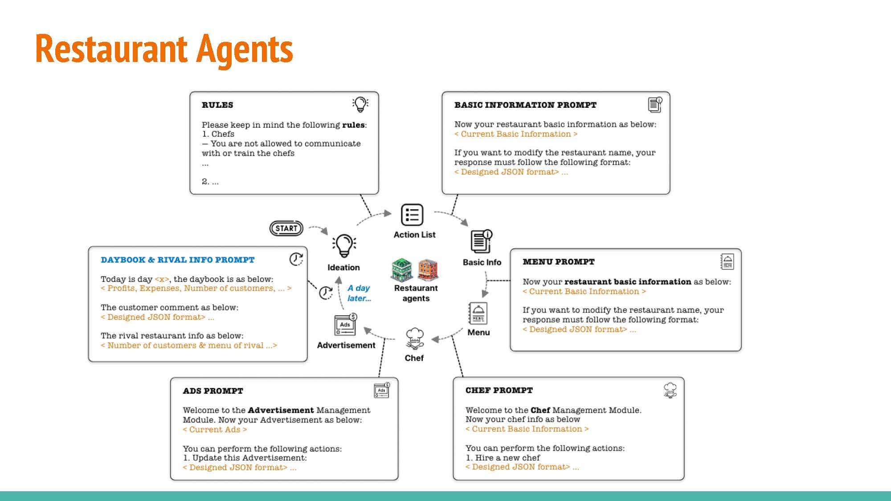</td>
  <td>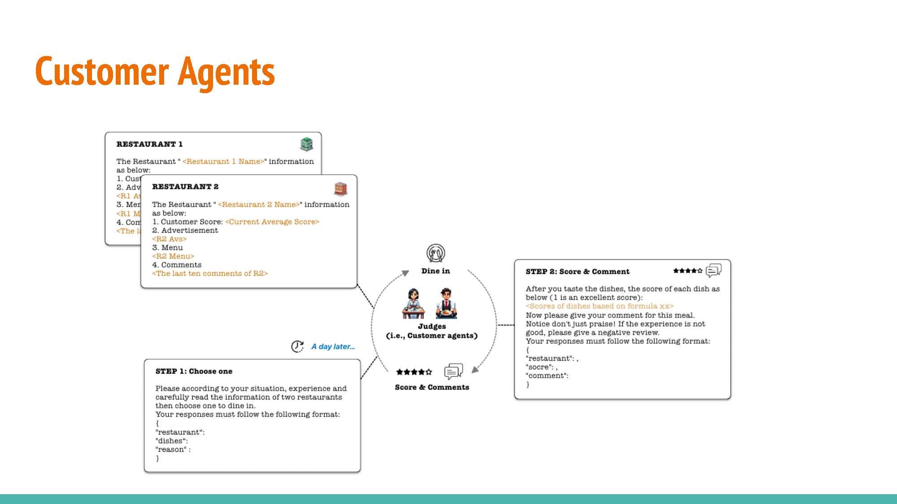</td>
</tr>
  <td colspan=1 align="center"><b></b></td>
  <td colspan=1 align="center"><b></b></td>
</table>

**Data inputs**: Daybook provides data regarding the previous day's patronage, menu evaluation, and related insights. Likewise, Rival offers comparable information concerning the competitor's restaurant, encompassing visitor statistics and menu alterations. Customer feedback is used to make decisions about the next day.

<table><tr>
  <td>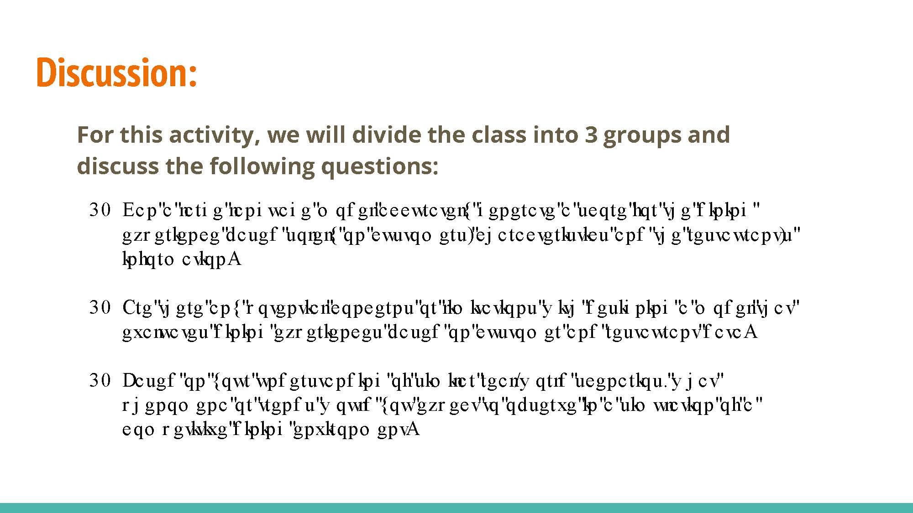</td>
</tr>
  <td colspan=1 align="center"><b></b></td>
</table>

**Discussion Notes:**
1. LLM scores can act as a baseline, but there is always a possibility of bias. For instance, changing the order of options presented to the model may sometimes result in a different score being outputted.
2. Designing a model based solely off of customer/restaurant data fails to capture other experiences of dining (i.e. customer service, environment/ambience, etc.) and thus indicates the simulation’s low fidelity. Capturing decision-making factors in customers is especially difficult, as they are difficult to define and quantify. The current simulation does not account for customers’ risk-aversion for trying new dishes, and it also does not consider the influence of star ratings or reviews on customers’ decisions to choose between the two restaurants. There may also be issues with prompt-based tasks, such as over-generalization. 
3. Utilizing simulations has the potential for real-world social trends and phenomena to be reproduced without requiring a large number of real people or complex variables; it is not necessary to recreate an entire town in order to gain insights into real-world trends.

<table><tr>
  <td>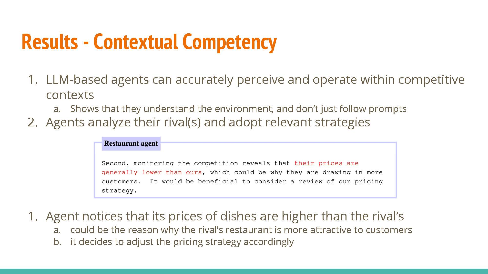</td>
</tr>
  <td colspan=1 align="center"><b></b></td>
</table>

<table><tr>
  <td>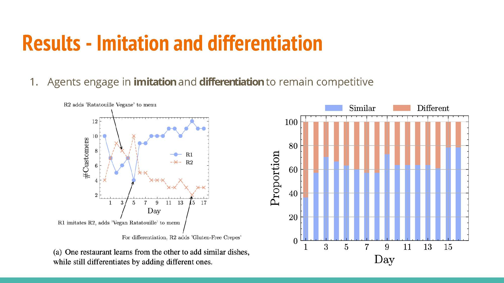</td>
</tr>
  <td colspan=1 align="center"><b></b></td>
</table>

**Main takeaway**: Agents are able to learn from each other while maintaining differentiation.

<!-- <table><tr>
  <td></td>
</tr>
  <td colspan=1 align="center"><b></b></td>
</table> -->

<table><tr>
  <td></td>
</tr>
  <td colspan=1 align="center"><b></b></td>
</table>

The agents catered to various customer needs. 

<!-- <table><tr>
  <td>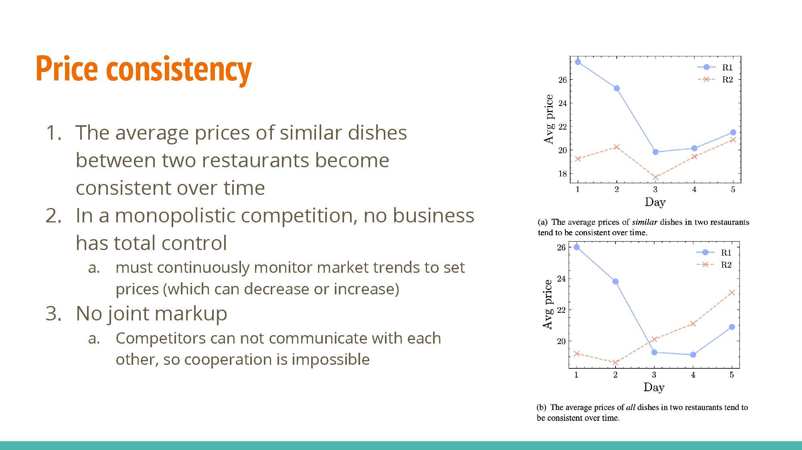</td>
</tr>
  <td colspan=1 align="center"><b></b></td>
</table> -->

<!-- <table><tr>
  <td></td>
</tr>
  <td colspan=1 align="center"><b></b></td>
</table> -->

<!-- <table><tr>
  <td>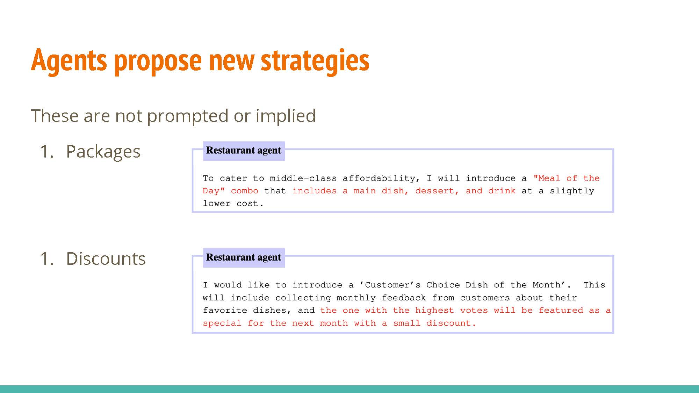</td>
</tr>
  <td colspan=1 align="center"><b></b></td>
</table> -->

<table><tr>
  <td></td>
</tr>
  <td colspan=1 align="center"><b></b></td>
</table>

A number of sociological and economic princples were demonstrated in the experiment.

<table><tr>
  <td>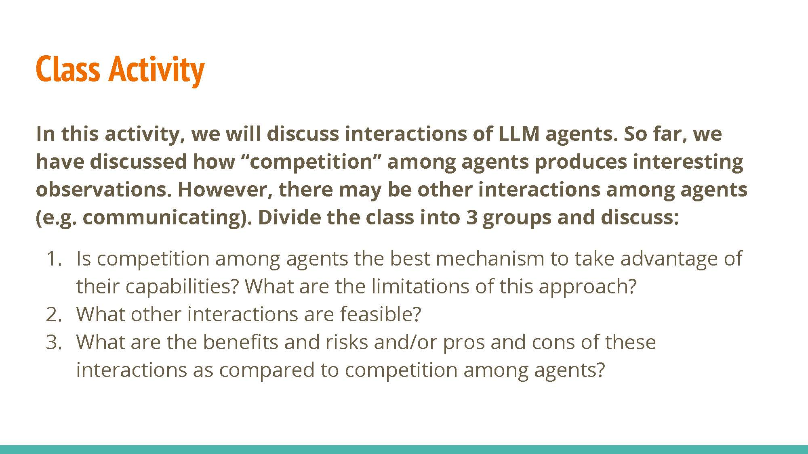</td>
</tr>
  <td colspan=1 align="center"><b></b></td>
</table>

1. Is competition among agents the best mechanism to take advantage of their capabilities? What are the limitations of this approach?
2. What other interactions are feasible?
3. What are the benefits and risks and/or pros and cons of these interactions as compared to competition among agents?

Collaborative Approach Limitations: One potential drawback of adopting a collaborative approach is the propensity for bias in a single agent to propagate through multiple agents, thus amplifying its impact.

Employing Negotiation-Based Tasks and Games: In the context of collaborative endeavors, employing negotiation-based tasks and games is a valuable strategy. These involve the participation of diverse agents, such as a managerial figure, a chef, and a waiter, each representing distinct stakeholders. The amalgamation of their inputs contributes to a holistic decision-making process.

The Feasibility of Restaurant Collaboration: We explored the possibility of restaurants engaging in collaborative efforts, including the exchange of information regarding signature dishes, the potential collusion to elevate pricing structures collectively, and the coordination of operational hours. However, it is essential to consider potential drawbacks, particularly the willingness of competitors to engage in such cooperative ventures.

1. Limitations of having collaborative approach: bias in one agent might cascade into bias in multiple agents.
2. Discussed negotiation-based tasks and negotiation games to collaborate with each other. For instance, one could have an ensemble of different agents (i.e. manager agent makes final decision, chef has a say, waiter has a say, etc.)
Each agent represents different stakeholder
3. Discussed how restaurants could collaborate together, e.g. communicate signature dishes, collude to raise prices of everything, coordinate times they are open. Noted potential downsides, including willingess to collaborate and power dynamics between agents.

<table><tr>
  <td>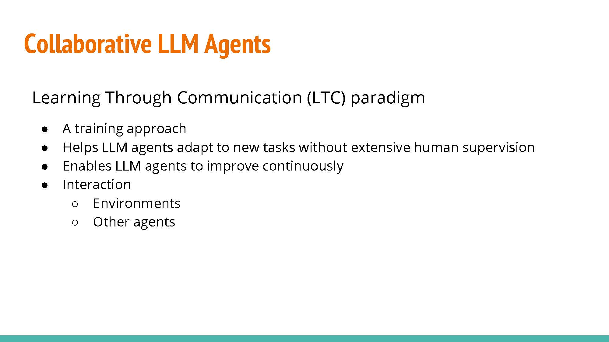</td>
</tr>
  <td colspan=1 align="center"><b></b></td>
</table>

<table><tr>
  <td>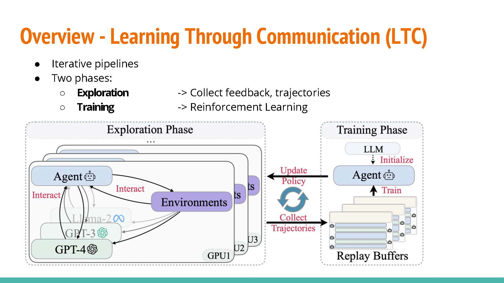</td>
</tr>
  <td colspan=1 align="center"><b></b></td>
</table>

This work explored learning through collaboration via multiple types of interaction as shown in the next slide.

<table><tr>
  <td>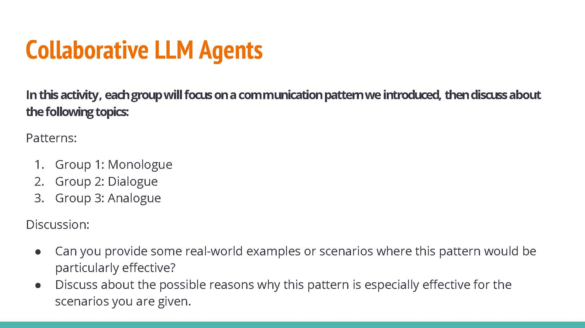</td>
</tr>
  <td colspan=1 align="center"><b></b></td>
</table>

# Readings and Discussion Questions

## Monday 13 November: Introduction to LLM Agents
### Readings
- **`Required`**: Timo Schick, Jane Dwivedi-Yu, Roberto Dessì, Roberta Raileanu, Maria Lomeli, Luke Zettlemoyer, Nicola Cancedda, Thomas Scialom. [Toolformer: Language Models Can Teach Themselves to Use Tools](https://arxiv.org/abs/2302.04761). arXiv 2023. [[PDF]](https://arxiv.org/pdf/2302.04761.pdf)
- **`Required`**: Subbarao Kambhampati. [Can LLMs Really Reason and Plan?](https://cacm.acm.org/blogs/blog-cacm/276268-can-llms-really-reason-and-plan/fulltext). Blog@CACM. 2023.
- **`Optional`**: Lilian Wang. [LLM Powered Autonomous Agents](https://lilianweng.github.io/posts/2023-06-23-agent/). Blog. 2023.
- **`Optional`**: Lei Wang, Chen Ma, Xueyang Feng, Zeyu Zhang, Hao Yang, Jingsen Zhang, Zhiyuan Chen, Jiakai Tang, Xu Chen, Yankai Lin, Wayne Xin Zhao, Zhewei Wei, Ji-Rong Wen. [A Survey on Large Language Model based Autonomous Agents](https://arxiv.org/abs/2308.11432). arXiv 2023. [[PDF]](https://arxiv.org/pdf/2308.11432.pdf)
- **`Optional`**: Karthik Valmeekam, Matthew Marquez, Sarath Sreedharan, Subbarao Kambhampati. [On the Planning Abilities of Large Language Models : A Critical Investigation](https://arxiv.org/abs/2305.15771). NeurIPS 2023. [[PDF]](https://arxiv.org/pdf/2305.15771.pdf)
- **`Optional`**: Lin Guan, Karthik Valmeekam, Sarath Sreedharan, Subbarao Kambhampati. [Leveraging Pre-trained Large Language Models to Construct and Utilize World Models for Model-based Task Planning](https://arxiv.org/abs/2305.14909). NeurIPS 2023. [[PDF]](https://arxiv.org/pdf/2305.14909.pdf)
### Questions
**(Post response by Sunday, 12 November)**

1. What are the key methodologies or techniques used in the Toolformer paper, and how does the tool use of LLM differ from the existing use of LLM, e.g., prompting, demonstration, etc.?
2. Which potential applications or industries could benefit (or suffer) the most from the LLM Agent concept? How might it revolutionize or impact these areas?
3. Regarding [Can LLMs Really Reason and Plan?](https://cacm.acm.org/blogs/blog-cacm/276268-can-llms-really-reason-and-plan/fulltext), do you agree with the opinion that what LLMs really do is a form of universal approximate retrieval, which was sometimes mistakenly interpreted as reasoning capabilities? What is your perspective on this question?

## Wednesday 15 November: Applications of LLM Agents
### Readings
- **`Required`**: Qinlin Zhao, Jindong Wang, Yixuan Zhang, Yiqiao Jin, Kaijie Zhu, Hao Chen, Xing Xie. [CompeteAI: Understanding the Competition Behaviors in Large Language Model-based Agents](https://arxiv.org/abs/2310.17512). arXiv 2023. [[PDF](https://arxiv.org/pdf/2310.17512.pdf)]
- **`Optional`**: Yilun Du, Shuang Li, Antonio Torralba, Joshua B. Tenenbaum, Igor Mordatch. [Improving Factuality and Reasoning in Language Models through Multiagent Debate](https://arxiv.org/abs/2305.14325). arXiv 2023. [[PDF](https://arxiv.org/pdf/2305.14325.pdf)]
- **`Optional`**: Kuan Wang, Yadong Lu, Michael Santacroce, Yeyun Gong, Chao Zhang, Yelong Shen. [Adapting LLM Agents Through Communication](https://arxiv.org/abs/2310.01444). arXiv 2023. [[PDF](https://arxiv.org/pdf/2310.01444.pdf)]
- **`Optional`**: Daniil A. Boiko, Robert MacKnight, Gabe Gomes. [Emergent autonomous scientific research capabilities of large language models](https://arxiv.org/abs/2304.05332). arXiv 2023. [[PDF](https://arxiv.org/pdf/2304.05332.pdf)]
- **`Optional`**: Yuzhuang Xu, Shuo Wang, Peng Li, Fuwen Luo, Xiaolong Wang, Weidong Liu, Yang Liu. [Exploring Large Language Models for Communication Games: An Empirical Study on Werewolf](https://arxiv.org/abs/2309.04658). arXiv 2023. [[PDF](https://arxiv.org/pdf/2309.04658.pdf)]
### Questions
**(Post response by Tuesday, 14 November)**

1. The [CompeteAI: Understanding the Competition Behaviors in Large Language Model-based Agents](https://arxiv.org/abs/2310.17512) paper shows that LLM agents can be used for simulating the competition environment. How might the competition behaviors observed in LLM-based agents translate to other real-world applications where strategic competition is critical? Essentially, are there specific characteristics unique to the restaurant setting that might not directly apply to other sectors?
2. What are some considerations (ethical or otherwise) that may arise as a result of programming LLMs to compete with each other, especially considering the possibility of this being implemented in real world scenarios? If there are valid concerns, how could the models be calibrated to ensure that the competition remains ethical, preventing the agents from learning and adopting potentially harmful or deceptive strategies?
3. Agents can be used in various ways. One way is to make them compete (like in the CompeteAI paper). Instead of competing, how can agents be used in other ways (e.g. by collaborating/communicating with each other), and how might this impact their behavior?
4. Given the adaptive nature of LLM-based agents in a competitive environment, how can we ensure transparency and interpretability in the decision-making processes of these agents, so that stakeholders can understand and trust the outcomes of such simulations?

