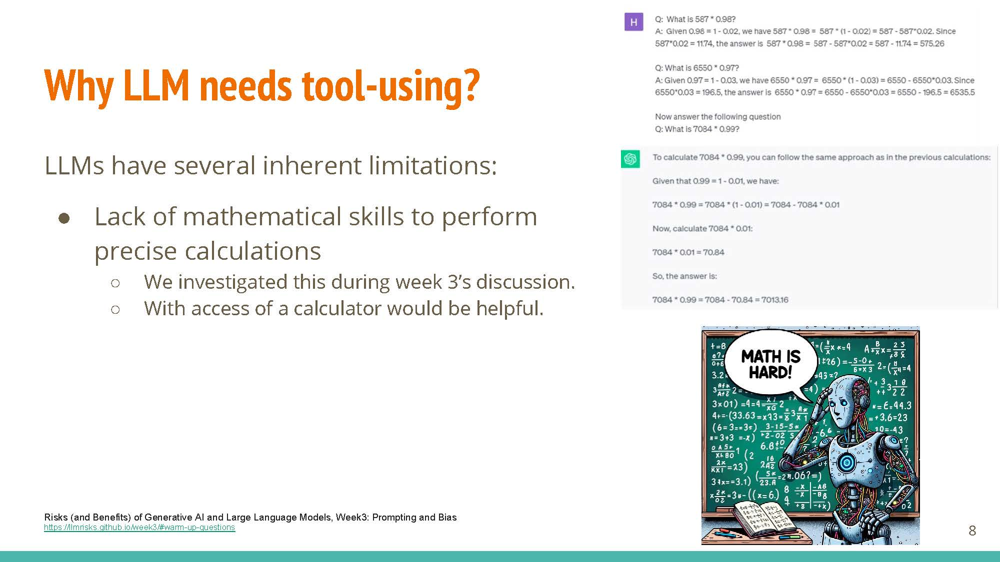

+++
date = "16 Nov 2023"
draft = false
title = "Week 12: LLM Agents"
slug = "week12"
+++

<author>Presenting Team: Liu Zhe, Peng Wang, Sikun Guo, Yinhan He, Zhepei Wei</author>

<author>Blogging Team: Anshuman Suri, Jacob Christopher, Kasra Lekan, Kaylee Liu, My Dinh</author>

# Monday, November 13: LLM Agents

Timo Schick, Jane Dwivedi-Yu, Roberto Dessì, Roberta Raileanu, Maria Lomeli, Luke Zettlemoyer, Nicola Cancedda, Thomas Scialom. [Toolformer: Language Models Can Teach Themselves to Use Tools](https://arxiv.org/abs/2302.04761). arXiv 2023. [PDF](https://arxiv.org/abs/2302.04761)

<table><tr>
  <td></td>
</tr>
  <td colspan=1 align="center"><b></b></td>
</table>

**LLM agents** are the "next big thing", with the potential to directly impact important fields like healthcare and education. Essentially, they are LLM-based systems that have the ability to use external tools, such as Internet browsing access and calculators, to augment their abilities.

<table><tr>
  <td></td>
</tr>
  <td colspan=1 align="center"><b></b></td>
</table>

## Toolformer

LLMs have limitations which can potentially be addressed with these "tools":

<table><tr>
  <td></td>
</tr>
  <td colspan=1 align="center"><b></b></td>
</table>

**Outdated information** LLMs cannot access up-to-date information without access to the real world. Giving them the ability to access realtime information (via Internet queries) would lead to better responses, such as "who is the President of USA today?"

<table><tr>
  <td></td>
</tr>
  <td colspan=1 align="center"><b></b></td>
</table>

**Hallucination** External knowledge sources can help ground generation in facts and work to supplement the model's knowledge, reducing the possibility of hallucinating.

<table><tr>
  <td></td>
</tr>
  <td colspan=1 align="center"><b></b></td>
</table>

**Lack of mathematical skills** Access to a calculator can help model generate correct responses and computations involving math. Using zero-shot learning can help reduce hallucination, bug providing access to a calculator (and assuming it is used correctly) can gaguarantee correctness of responses.

<table><tr>
  <td></td>
</tr>
  <td colspan=1 align="center"><b></b></td>
</table>

Other limitations include limited multi-language usability, having no concept of “time”, etc.

### Overview

<table><tr>
  <td></td>
</tr>
  <td colspan=1 align="center"><b></b></td>
</table>

A system that has the ability to use external tools (translation, calendar, search engine, etc.).

### Key Contributions

<table><tr>
  <td></td>
</tr>
  <td colspan=1 align="center"><b></b></td>
</table>

The key lies in knowing *when* to use a tool, *which* tool to use, and *how* to use it. Training is self-supervised, unlike other capability-enhancing techniques like RLHF.

### Data Collection

<table><tr>
  <td></td>
</tr>
  <td colspan=1 align="center"><b></b></td>
</table>

Key step: generating candidate API calls via in-context learning. The method starts with examples generated by humans, e.g. in-context examples for “Coca-Cola”, etc.

<table><tr>
  <td></td>
</tr>
  <td colspan=1 align="center"><b></b></td>
</table>

`k` positions are sampled at random from the text to serve as "candidates" for adding `<API>` tags.

<table><tr>
  <td></td>
</tr>
  <td colspan=1 align="center"><b></b></td>
</table>

Tokens up to the position with an “<API>” tag are provided to get `m` possible API calls.

<table><tr>
  <td></td>
</tr>
  <td colspan=1 align="center"><b></b></td>
</table>

An additional weighted loss term is introduced, corresponding to the utility of information added after using candidate API calls. This loss term is meant to provide feedback for which API calls were useful for some given context.

<table><tr>
  <td></td>
</tr>
  <td colspan=1 align="center"><b></b></td>
</table>

Given the loss term and general strategy for inserting `<API>` tokens, the model is fine-tuned with the augmented dataset. At prediction time, the model uses a variant of greedy decoding, making API calls if the `<API>` tag is in the top-k predictions at any token position.

# Wednesday, November 15: Applications of LLM Agents

<table>
    <tr>
        <td></td>
    </tr>
    <tr>
    <td colspan=1 align="left">
    
 Topic for Wednsday is Watermaking on Diffusion Models

    </td>
</tr>
</table>

## Topic 2

# Readings and Discussion Questions

## Monday 13 November: Introduction to LLM Agents
### Readings
- **`Required`**: Timo Schick, Jane Dwivedi-Yu, Roberto Dessì, Roberta Raileanu, Maria Lomeli, Luke Zettlemoyer, Nicola Cancedda, Thomas Scialom. [Toolformer: Language Models Can Teach Themselves to Use Tools](https://arxiv.org/abs/2302.04761). arXiv 2023. [[PDF]](https://arxiv.org/pdf/2302.04761.pdf)
- **`Required`**: Subbarao Kambhampati. [Can LLMs Really Reason and Plan?](https://cacm.acm.org/blogs/blog-cacm/276268-can-llms-really-reason-and-plan/fulltext). Blog@CACM. 2023.
- **`Optional`**: Lilian Wang. [LLM Powered Autonomous Agents](https://lilianweng.github.io/posts/2023-06-23-agent/). Blog. 2023.
- **`Optional`**: Lei Wang, Chen Ma, Xueyang Feng, Zeyu Zhang, Hao Yang, Jingsen Zhang, Zhiyuan Chen, Jiakai Tang, Xu Chen, Yankai Lin, Wayne Xin Zhao, Zhewei Wei, Ji-Rong Wen. [A Survey on Large Language Model based Autonomous Agents](https://arxiv.org/abs/2308.11432). arXiv 2023. [[PDF]](https://arxiv.org/pdf/2308.11432.pdf)
- **`Optional`**: Karthik Valmeekam, Matthew Marquez, Sarath Sreedharan, Subbarao Kambhampati. [On the Planning Abilities of Large Language Models : A Critical Investigation](https://arxiv.org/abs/2305.15771). NeurIPS 2023. [[PDF]](https://arxiv.org/pdf/2305.15771.pdf)
- **`Optional`**: Lin Guan, Karthik Valmeekam, Sarath Sreedharan, Subbarao Kambhampati. [Leveraging Pre-trained Large Language Models to Construct and Utilize World Models for Model-based Task Planning](https://arxiv.org/abs/2305.14909). NeurIPS 2023. [[PDF]](https://arxiv.org/pdf/2305.14909.pdf)
### Questions
**(Post response by Sunday, 12 November)**

1. What are the key methodologies or techniques used in the Toolformer paper, and how does the tool use of LLM differ from the existing use of LLM, e.g., prompting, demonstration, etc.?
2. Which potential applications or industries could benefit (or suffer) the most from the LLM Agent concept? How might it revolutionize or impact these areas?
3. Regarding [Can LLMs Really Reason and Plan?](https://cacm.acm.org/blogs/blog-cacm/276268-can-llms-really-reason-and-plan/fulltext), do you agree with the opinion that what LLMs really do is a form of universal approximate retrieval, which was sometimes mistakenly interpreted as reasoning capabilities? What is your perspective on this question?

## Wednesday 15 November: Applications of LLM Agents
### Readings
- **`Required`**: Qinlin Zhao, Jindong Wang, Yixuan Zhang, Yiqiao Jin, Kaijie Zhu, Hao Chen, Xing Xie. [CompeteAI: Understanding the Competition Behaviors in Large Language Model-based Agents](https://arxiv.org/abs/2310.17512). arXiv 2023. [[PDF](https://arxiv.org/pdf/2310.17512.pdf)]
- **`Optional`**: Yilun Du, Shuang Li, Antonio Torralba, Joshua B. Tenenbaum, Igor Mordatch. [Improving Factuality and Reasoning in Language Models through Multiagent Debate](https://arxiv.org/abs/2305.14325). arXiv 2023. [[PDF](https://arxiv.org/pdf/2305.14325.pdf)]
- **`Optional`**: Kuan Wang, Yadong Lu, Michael Santacroce, Yeyun Gong, Chao Zhang, Yelong Shen. [Adapting LLM Agents Through Communication](https://arxiv.org/abs/2310.01444). arXiv 2023. [[PDF](https://arxiv.org/pdf/2310.01444.pdf)]
- **`Optional`**: Daniil A. Boiko, Robert MacKnight, Gabe Gomes. [Emergent autonomous scientific research capabilities of large language models](https://arxiv.org/abs/2304.05332). arXiv 2023. [[PDF](https://arxiv.org/pdf/2304.05332.pdf)]
- **`Optional`**: Yuzhuang Xu, Shuo Wang, Peng Li, Fuwen Luo, Xiaolong Wang, Weidong Liu, Yang Liu. [Exploring Large Language Models for Communication Games: An Empirical Study on Werewolf](https://arxiv.org/abs/2309.04658). arXiv 2023. [[PDF](https://arxiv.org/pdf/2309.04658.pdf)]
### Questions
**(Post response by Tuesday, 14 November)**

1. The [CompeteAI: Understanding the Competition Behaviors in Large Language Model-based Agents](https://arxiv.org/abs/2310.17512) paper shows that LLM agents can be used for simulating the competition environment. How might the competition behaviors observed in LLM-based agents translate to other real-world applications where strategic competition is critical? Essentially, are there specific characteristics unique to the restaurant setting that might not directly apply to other sectors?
2. What are some considerations (ethical or otherwise) that may arise as a result of programming LLMs to compete with each other, especially considering the possibility of this being implemented in real world scenarios? If there are valid concerns, how could the models be calibrated to ensure that the competition remains ethical, preventing the agents from learning and adopting potentially harmful or deceptive strategies?
3. Agents can be used in various ways. One way is to make them compete (like in the CompeteAI paper). Instead of competing, how can agents be used in other ways (e.g. by collaborating/communicating with each other), and how might this impact their behavior?
4. Given the adaptive nature of LLM-based agents in a competitive environment, how can we ensure transparency and interpretability in the decision-making processes of these agents, so that stakeholders can understand and trust the outcomes of such simulations?

