+++
date = "03 Dec 2023"
draft = false
title = "Week 14: Multimode models & Ethical AI"
slug = "week14"
+++

<author>Presenting Team: Aparna Kishore, Elena Long, Erzhen Hu, Jingping Wan</author>

<author>Blogging Team: Haolin Liu, Haochen Liu, Ji Hyun Kim, Stephanie Schoch, Xueren Ge</author>

# Monday, November 27: Multimode models

<table><tr>
  <td></td>
</tr>
  <td colspan=1 align="center"><b></b></td>
</table>

Today's topic is how to improve model performance by combining multiple modes.

<table><tr>
  <td></td>
</tr>
  <td colspan=1 align="center"><b></b></td>
</table>

We will first introduce the multimodal foundations and then center around CLIP, which is the most famous vision-language model. Finally, we will have a short discussion.

<table><tr>
  <td></td>
</tr>
  <td colspan=1 align="center"><b></b></td>
</table>

We live in a multimodal world, and our brains naturally learn to process multi-sense signals received from the environment to help us make sense of the world around us. More specifically, vision is a large portion of how humans perceive, while language is a large portion of how humans communicate.

<table><tr>
  <td></td>
</tr>
  <td colspan=1 align="center"><b></b></td>
</table>

When we talk about vision-language, there are two types of categories, one is how can we produce visual data, and another is how can we consume visual information.

<table><tr>
  <td></td>
</tr>
  <td colspan=1 align="center"><b></b></td>
</table>

For visual generation, popular models include GAN and diffusion models. What makes it multi-modal is that we can use other modalities to control the image we want to generate, for example, the text-to-image methods that can use text-conditioned visual generation, such as stable diffusion.

<table><tr>
  <td></td>
</tr>
  <td colspan=1 align="center"><b></b></td>
</table>

Another approach focuses on visual understanding, which studies how can we consume the visual information from the image, and further, how can we consume the audio, image, and different modalities from our surrounding environment.

<table><tr>
  <td></td>
</tr>
  <td colspan=1 align="center"><b></b></td>
</table>

Brockman, who is one of the founders of OpenAI, showed ChatGPT a diagram of my joke website, which he sketched with a pencil. Then, ChatGPT can write a functional website, this is quite remarkable as you can start to plug images into the language models. [_This link_](https://x.com/gdb/status/1635826383141376002?s=20) is for the figure above.

<table><tr>
  <td></td>
</tr>
  <td colspan=1 align="center"><b></b></td>
</table>

When we see the text "Sunshine, Sunny beach, Coconut, Straw hat", we can visualize a picture of a beach with these components. This is because our mind not only receives multimodal information but also somehow aligns these modalities.

<table><tr>
  <td></td>
</tr>
  <td colspan=1 align="center"><b></b></td>
</table>

Now we move to the detailed algorithm of vision-language models. There are particular vision-language problem spaces or representative tasks, that these models try to solve.

<table><tr>
  <td></td>
</tr>
  <td colspan=1 align="center"><b></b></td>
</table>

The first question is how to train a vision-language model. We will discuss supervised pre-training and contrastive language-image pre-training, which is also known as CLIP.

<table><tr>
  <td></td>
</tr>
  <td colspan=1 align="center"><b></b></td>
</table>

Supervised learning will map an image to a discrete label that is associated with visual content. The drawback here is that we always need labeled data. However, human annotations can be expensive and labels are limited.

<table><tr>
  <td></td>
</tr>
  <td colspan=1 align="center"><b></b></td>
</table>

The supervised learning method is deployed at first. In 2021, OpenAI released Dall-E, which is a generative model that uses transformer architecture like GPT3. As of its multimodal nature, the model receives both text and image in the training process, and it can generate images from scratch based on natural language input.

Here is a demo picture of Dall-E. As we can see that it can combine disparate ideas to synthesize objects, even some of them are unlikely to exist in the real world.

## CLIP

> Alec Radford, Jong Wook Kim, Chris Hallacy, Aditya Ramesh, Gabriel Goh, Sandhini Agarwal, Girish Sastry, Amanda Askell, Pamela Mishkin, Jack Clark, Gretchen Krueger, Ilya Sutskever. [_Learning Transferable Visual Models From Natural Language Supervision_](https://arxiv.org/abs/2103.00020). arXiv 2021. [PDF](https://arxiv.org/abs/2103.00020)

<table><tr>
  <td></td>
</tr>
  <td colspan=1 align="center"><b></b></td>
</table>

Besides supervised learning, the other method is called CLIP. Different from Dall-E, It takes an image and text and connect them in non-generative way. The idea is that we can take an image, and the model can predict the text along with it.

For classic image classification models, they are trained to identify objects from a predefined set of categories, for example, there are about 1000 categories in the case of the ImageNet challenge. CLIP is trained to understand the semantics of images and text together. It is trained with a huge amount of data, 400 million images on the web and corresponding text data, and it can perform object identification in any category without re-training.

<table><tr>
  <td></td>
</tr>
  <td colspan=1 align="center"><b></b></td>
</table>

Let’s take a look at its architecture.Since CLIP was trained using a combination of image and text, the training data is a batch of (image, text) pairs.

On top we have labels that belong to each image, the model tokenize it, pass it to text encoder, perform linear projection, and pass it along to a contrastive embedding screen. It does the same for images. Then in the contrastive embedding screen, the model takes the inner product of image vector and text vector. In contrastive learning, we want to increase the values of these blue squares to 1, which are original image and text pairs, and decrease the values of the white squares, which are not the classes they belong to. To achieve this, they compute the loss of these image-text vectors and text-image vectors and do back propagation

<table><tr>
  <td></td>
</tr>
  <td colspan=1 align="center"><b></b></td>
</table>

We now elaborate more on the loss function of this training process. We have two vectors (text, image) here, $v$ represents the text vector, and $u$ represents the image vector The $\tau$ here is a trainable parameter.

In the first text-to-image loss function, they take the cosine similarities of these two vectors, sum up all the rows in the denominator and normalized via softmax. As we can see it is an asymmetric problem, so to compute the image-to-text loss function, they sum up all the columns instead of the rows

After that, they compute a cross-entropy loss of these two probability distributions, sum up all the batches, and then average it out to get the final loss function.

<table><tr>
  <td></td>
</tr>
  <td colspan=1 align="center"><b></b></td>
</table>

After pre-training, the second and third step are for the object identification. We have a new dataset with different classes and want to test CLIP on it. In step 2, we need to pass these classes to the pre-trained text encoder. Instead of passing class names alone, they use a prompt template, making a sentence out of these class names. Then the model will perform the same linear projection as in the pre-training and pass it into a contrastive space

Then in Step 3, we can take the image we want to predict, the model will pass it into the image encoder, do linear projection, go into the contrastive embedding space and take the inner products of this image vector and all text vectors in Step 2. The final prediction output will be the one that has the highest cosine similarity.

<table><tr>
  <td></td>
</tr>
  <td colspan=1 align="center"><b></b></td>
</table>

The authors share three main ideas behind this work.

The first one is the need of a sufficiently large dataset. The simple truth is that existing manually labeled datasets are just way too small (100k samples) for training a natural language supervised model on the scale of GPT. The intuition was that the required dataset already exists on the web without the need to label data manually. So they create a new dataset of 400 million (image, text) pairs collected from a variety of publicly available sources on the Internet.

The second one is to select an efficient pre-training method. After experimenting with class-label prediction, the authors realized that the key to success was in predicting only which text as a whole is paired with which image, not the exact word of that text. This discovery led to the use of the loss function we introduced earlier, such that the cosine similarity for each correct pair of embeddings is maximized, and the cosine similarity of the rest of the pairings are minimized.

The last one is to choose and scale a model. After some experiments, they use a transformer as text encoder, and leave two options for image encoder. The image encoder is either a Vision Transformer or a modified ResNet-D with attention pooling instead of global average pooling.

<table><tr>
  <td>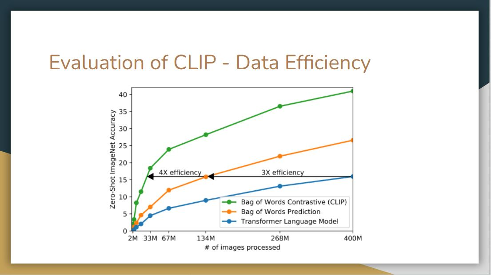</td>
</tr>
  <td colspan=1 align="center"><b></b></td>
</table>

After understanding the architecture of CLIP, let’s look at evaluations of this model. The figure above shows that CLIP is by far much more data-efficient than the other methods.

<table><tr>
  <td></td>
</tr>
  <td colspan=1 align="center"><b></b></td>
</table>

As we can see in the figure, with prompt engineering and ensembling, models more likely to achieve higher accuracy score rather than just simply having contextless class names.

One observation is that CLIP performs poorly on differentiate word sense when there’s only a label without context. For example, the label crane can mean construction crane or a crane that flies.

Another observation is that in their pre-training dataset text, it is relatively rare to see an image with just a single word as a label. So to bridge the distribution gap, they use a prompt template. Instead of a single label, they use template sentences like “a photo of a label”. They also found customizing the prompt text to each task can further improve performance.

<table><tr>
  <td></td>
</tr>
  <td colspan=1 align="center"><b></b></td>
</table>

There’s a trend in machine learning that if you give more data and compute, then the error goes down even with the same type of models, and that seems to hold pretty much the same here. As we can see the error rate scales smoothly as a function of model compute. However, they do note that there are lots of variance, this curve is the average. For individual datasets, it varies widely. It may be due to how the dataset is selected, how the prompt is engineered, still lots of unknown.

<table><tr>
  <td></td>
</tr>
  <td colspan=1 align="center"><b></b></td>
</table>

For the evaluation in terms of performance, CLIP is compared with a linear probe on ResNet50. It is pretty impressive that the zero-shot CLIP outperform a fully trained model on many of the dataset, including ImageNet.

On the other side, CLIP is weak on several specialized, complex, or abstract tasks such as EuroSAT (satellite image classification), KITTI Distance (recognizing distance to the nearest car). This may because these are not the kind of text and image we found on the Internet.

<table><tr>
  <td></td>
</tr>
  <td colspan=1 align="center"><b></b></td>
</table>

Here we compare zero-shot CLIP with few-shot linear probes, This is where pre-training really comes in, as the model only see few examples per class.

Surprisingly, a zero-shot CLIP is comparable to a 16-shot BiT-M model, which is one of the best models in the public that’s doing transfer learning in computer vision. If we linear probe the CLIP model, then it way outperform these other linear probe models.

<table><tr>
  <td></td>
</tr>
  <td colspan=1 align="center"><b></b></td>
</table>

They also evaluate CLIP in terms of its robustness to perturbations. Here they compare zero-shot CLIP to models that have been trained on imagenet, finding that zero-shot clip matches the performance of resnet101. As this classifier degrades as we go for harder and harder datasets overall, CLIP is more robust. This sort of implies that representation in CLIP should be nuanced enough, so it can pick up on different features than only distinguishing banana from other classes in the Imagenet dataset.

<table><tr>
  <td></td>
</tr>
  <td colspan=1 align="center"><b></b></td>
</table>

Here, they customize zero-shot CLIP to each dataset (adapt to class shift in purple) based on class names. While this supervised adaptation to class shift increases ImageNet accuracy by around 10 percent, it slightly reduces the average robustness. From the right side, the improvements are concentrated on only a few datasets.

On the other hand, when they adapt CLIP to fully supervised logistic regression classifiers on the best CLIP model’s features, it comes close to the standard Imagenet training in terms of robustness. Thus, it seems that the representation itself in zero-shot CLIP has more value, such that they are more stable and nuanced.

<table><tr>
  <td>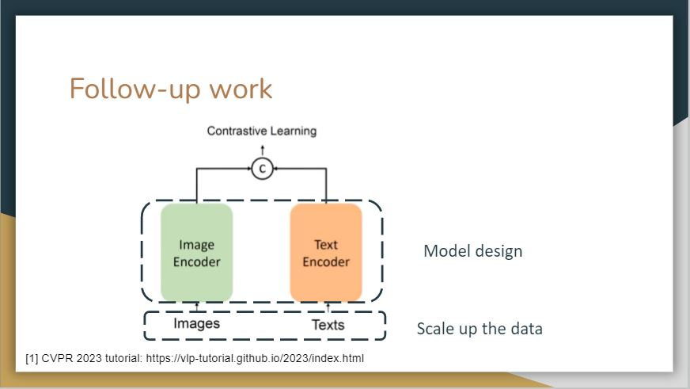</td>
</tr>
  <td colspan=1 align="center"><b></b></td>
</table>

There are various works following CLIP based on this contrastive learning structure. The first extension is to further scale up texts and images. The second is to design better models.

## Reproducible Scaling Laws 

> Mehdi Cherti, Romain Beaumont, Ross Wightman, Mitchell Wortsman, Gabriel Ilharco, Cade Gordon, Christoph Schuhmann, Ludwig Schmidt, Jenia Jitsev. [_Reproducible scaling laws for contrastive language-image learning_](https://arxiv.org/abs/2212.07143). CVPR 2023. [PDF](https://arxiv.org/abs/2212.07143)

<table><tr>
  <td></td>
</tr>
  <td colspan=1 align="center"><b></b></td>
</table>

In CVPR 2023, there’s a reproducible scaling laws paper, Basically they used the open larges scale LAION-2B dataset to pre-train openclip across different scales.

## Datacomp

> Samir Yitzhak Gadre, Gabriel Ilharco, Alex Fang, Jonathan Hayase, Georgios Smyrnis, Thao Nguyen, Ryan Marten, Mitchell Wortsman, Dhruba Ghosh, Jieyu Zhang, Eyal Orgad, Rahim Entezari, Giannis Daras, Sarah Pratt, Vivek Ramanujan, Yonatan Bitton, Kalyani Marathe, Stephen Mussmann, Richard Vencu, Mehdi Cherti, Ranjay Krishna, Pang Wei Koh, Olga Saukh, Alexander Ratner, Shuran Song, Hannaneh Hajishirzi, Ali Farhadi, Romain Beaumont, Sewoong Oh, Alex Dimakis, Jenia Jitsev, Yair Carmon, Vaishaal Shankar, Ludwig Schmidt. [_DataComp: In search of the next generation of multimodal datasets_](https://arxiv.org/abs/2304.14108). arxiv 2023. [PDF](https://arxiv.org/abs/2304.14108)

<table><tr>
  <td>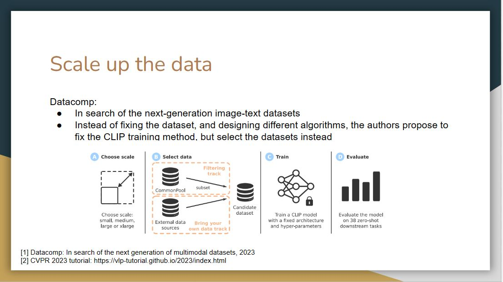</td>
</tr>
  <td colspan=1 align="center"><b></b></td>
</table>

This paper talked about how should we scale data? Should we scale it up with noisier and noisier data?

Their focus is to search the next-generation image-text datasets. Instead of fixing the dataset and designing different algorithms, the authors propose to fix the CLIP training method but select the datasets instead. With this method, they come up with a high-quality large-scale dataset.

## FILIP

> Lewei Yao, Runhui Huang, Lu Hou, Guansong Lu, Minzhe Niu, Hang Xu, Xiaodan Liang, Zhenguo Li, Xin Jiang, Chunjing Xu. [_FILIP: Fine-grained Interactive Language-Image Pre-Training_](https://arxiv.org/abs/2111.07783). ICLR 2022. [PDF](https://arxiv.org/abs/2111.07783)

<table><tr>
  <td></td>
</tr>
  <td colspan=1 align="center"><b></b></td>
</table>

For the model improvement, FILIP is proposed to scale CLIP training via masking. It randomly masks out image patches with a high masking ratio, and only encodes the visible patches. It turns out this method does not hurt performance but improves training efficiency

## K-Lite

> Sheng Shen, Chunyuan Li, Xiaowei Hu, Jianwei Yang, Yujia Xie, Pengchuan Zhang, Zhe Gan, Lijuan Wang, Lu Yuan, Ce Liu, Kurt Keutzer, Trevor Darrell, Anna Rohrbach, Jianfeng Gao. [_K-LITE: Learning Transferable Visual Models with External Knowledge_](https://arxiv.org/abs/2204.09222). NeurIPS 2022. [PDF](https://arxiv.org/abs/2204.09222)

<table><tr>
  <td></td>
</tr>
  <td colspan=1 align="center"><b></b></td>
</table>

Another line of work focuses on improving the language side model design of CLIP. The model K-Lite utilizes the Wiki definition of entities together with the original alt-text for contrastive pre-training. Such knowledge is useful for a variety of domains and datasets, making it possible to build a generic approach for task-level transfer.

<table><tr>
  <td>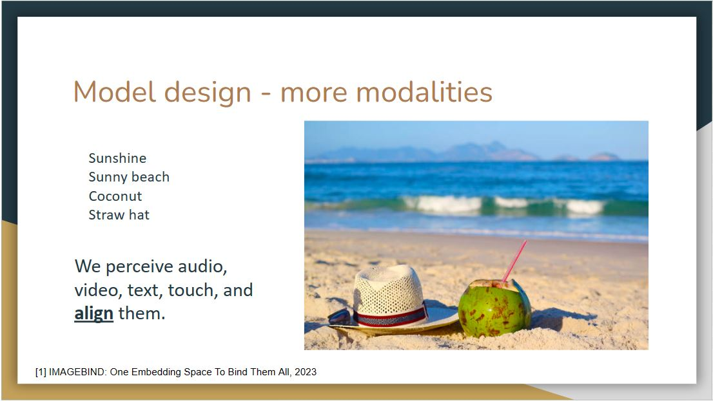</td>
</tr>
  <td colspan=1 align="center"><b></b></td>
</table>

Recall that in this motivated example, we argue that more modalities will enhance the learning process.

## IMAGEBIND

> Rohit Girdhar, Alaaeldin El-Nouby, Zhuang Liu, Mannat Singh, Kalyan Vasudev Alwala, Armand Joulin, Ishan Misra. [_ImageBind: One Embedding Space To Bind Them All_](https://arxiv.org/abs/2305.05665). arxiv 2023. [PDF](https://arxiv.org/abs/2305.05665)

<table><tr>
  <td></td>
</tr>
  <td colspan=1 align="center"><b></b></td>
</table>

Imagebind tries to utilize more modalities to improve performance. However, one challenge here is that not all generated data are naturally aligned due to the lack of a corresponding relationship in the training set.

<table><tr>
  <td>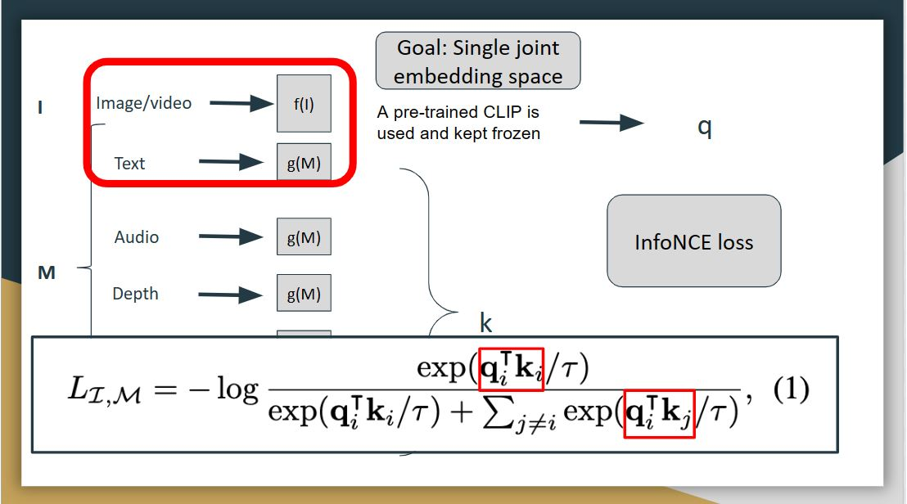</td>
</tr>
  <td colspan=1 align="center"><b></b></td>
</table>

For Imagebind, there are different modalities include image, text, video, audio, depth, thermal, and IMU, which contains the accelerator, and gyroscope data. The goal of imagebind is to learn a single joint embedding space for all the modalities, and then use image as the binding modality. Here I denotes image modality, and M denotes all the other modalities. They use deep neural networks as encoders to extract embeddings from each of the modalities, so each modality has it own encoder, just like the clip.

During the training, the image and text modality was kept frozen, and the weights of other modalities were updated, and this freezing shows the alignment to emerge between other modalities for which we don’t have any natural alignment, for example, between audio, and depth.

The preprocessed inputs are passed through encoders and then passed through a simple linear layer to make sure they are of same dimension before being trained with the loss called infoNCE loss. This loss is a modified cross-entropy loss, which extends the contrastive learning to multiple modalities. Let the output for image be q, and the output for other modalities be k. The loss here tries to align image modality with all other modalities.

<table><tr>
  <td></td>
</tr>
  <td colspan=1 align="center"><b></b></td>
</table>

They study whether Imagebind's embeddings can be used to compose information across modalities. The above figure shows image retrievals obtained by adding together image and audio embeddings. The joint embedding space allows for us to compose two embeddings: e.g., image of fruits on a table + sound of chirping birds and retrieve an image that contains both these concepts, i.e., fruits on trees with birds. Such emergent compositionality whereby semantic content from different modalities can be composed will likely enable a rich variety of compositional tasks.

<table><tr>
  <td></td>
</tr>
  <td colspan=1 align="center"><b></b></td>
</table>

By utilizing the audio embedding of Imagebind, it is possible to design an audio-based detector that can detect and segment objects based on audio prompts.

<table><tr>
  <td></td>
</tr>
  <td colspan=1 align="center"><b></b></td>
</table>

As proposed in CLIP, replacing labels with textual descriptions and using a text encoder to encode them can feasibly convert closed-set problems to open-set ones. A number of works have been proposed to transform different computer vision tasks by replacing the label space with language space.

<table><tr>
  <td></td>
</tr>
  <td colspan=1 align="center"><b></b></td>
</table>

For the first question, we believe there are several differences between humans and machines for cognition. Although these models will outperform humans on several specific tasks, they also have limitations. For example, humans will perceive an image as a whole, but machines perceive it pixel by pixel. This ensures humans are good at using context to interpret images and text. While these models can recognize patterns and correlations between words and images, they may not fully grasp the broader context as humans do.

For the second question, the presenter gave an example that there is a specific food in Wuhan called "hot dry noodles". When we give a picture of this kind of noodles with the caption "hot dry noodles in Wuhan", the multi-mode models will output how this food is popular in Wuhan. However, if we replace the caption as "hot dry noodles in Shandong", the model will still describe this noodles in Wuhan instead of Shandong. The presenter believes this is an example of bias because a lot of data on this noodles is associated with Wuhan. Thus, even though the caption of the image is changed, the model can not comprehend because the representation is fixed.

# Wednesday, November 29: Ethical AI

<table><tr>
  <td></td>
</tr>
  <td colspan=1 align="center"><b></b></td>
</table>

<table><tr>
  <td></td>
</tr>
  <td colspan=1 align="center"><b></b></td>
</table>

Today’s topic is ethical AI, with a focus on human-centered AI (HCAI). In this view, AI is seen as amplifying the existing performance of humans. Important to HCAI is the need for reliable, safe and trustworthy properties, through the collaboration of software engineers, companies, government, and society as a whole.

<table><tr>
  <td>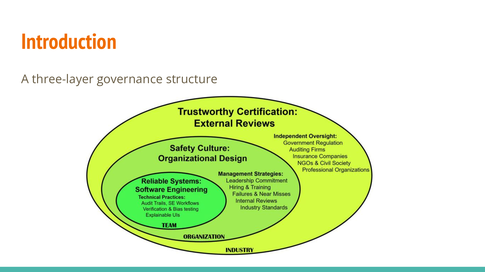</td>
</tr>
  <td colspan=1 align="center"><b></b></td>
</table>

This is the outline we can consider for development of ethical AI

1. Reliable Systems: Soft Engineering
2. Safety Culture: Organizational Design 
3. Trustworthy Certification: External Reviews

<table><tr>
  <td></td>
</tr>
  <td colspan=1 align="center"><b></b></td>
</table>

Things that should be considered when developing ethical AI:
1. Data quality
2.  Training log analysis
3. Privacy and security of data
   
Example:FDR has quantitative benchmark to see if a plane is safe/stable, which can help in designing the next generation of products

Analogy of FDR to AI: We could get quantitative feedback of the product or strategy we want to test: What data do we need, how do we analyze log data (or select useful data from operation logs), how to protect data from being attacked, etc.

Through a similar approach, we can say that AI is safe through testing and logs, rather than just ‘take our word for it’

<table><tr>
  <td>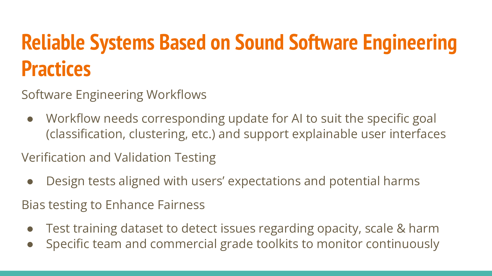</td>
</tr>
  <td colspan=1 align="center"><b></b></td>
</table>

Software Engineering workflows:  AI workflow requires goal-aligned update 

Verification and validation testing:
1. Design tests align with expectations, prevent harms
2. Goals of AI are more general or high-level than traditional software programs, so we need tests that are designed with user expectations rather than solely the technical details.
   
Bias testing to enhance fairness: 
1. Test training data for opacity, scale, harm.
2. Use specialized tools for continuous monitoring.
3. After we have a trained model, we still need testing to check the risk, and may need a specific team in the organization or external company to test safety of model (should be continuous)

<table><tr>
  <td></td>
</tr>
  <td colspan=1 align="center"><b></b></td>
</table>

Explainable user interfaces: 
1. Difficult to achieve
2. Ensure system explainability for user understanding, meeting legal requirements
3. Intrinsic and post hoc explanations aid developer improvement. 
4. Design a comprehensive user interface, considering user sentiments
5. Post hoc: no information about the technical details of the model, but rather need a broad level idea of the system

<table><tr>
  <td></td>
</tr>
  <td colspan=1 align="center"><b></b></td>
</table>

There are 5 principles to build safety cultures, which are mostly top-down approaches (see slides)

Leadership: create a safe team, make commitment to safety that is visible to employees so they know leaders are committed to safety.

Long-term investment: need safe developers to develop safe models

Public can help monitor and improve as it creates public/external pressure, so companies may work harder to eliminate issues

<table><tr>
  <td></td>
</tr>
  <td colspan=1 align="center"><b></b></td>
</table>

Internal Review Boards engage stakeholders in setting benchmarks and to make improvements for problems and future planning.

<table><tr>
  <td>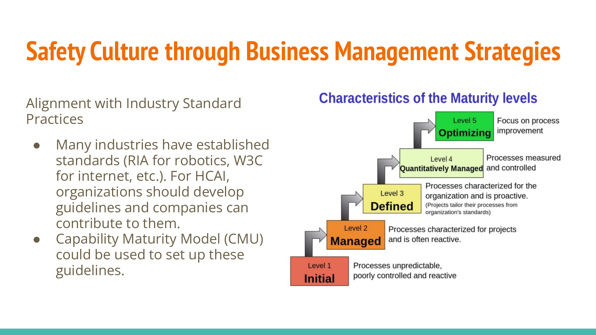</td>
</tr>
  <td colspan=1 align="center"><b></b></td>
</table>

<table><tr>
  <td>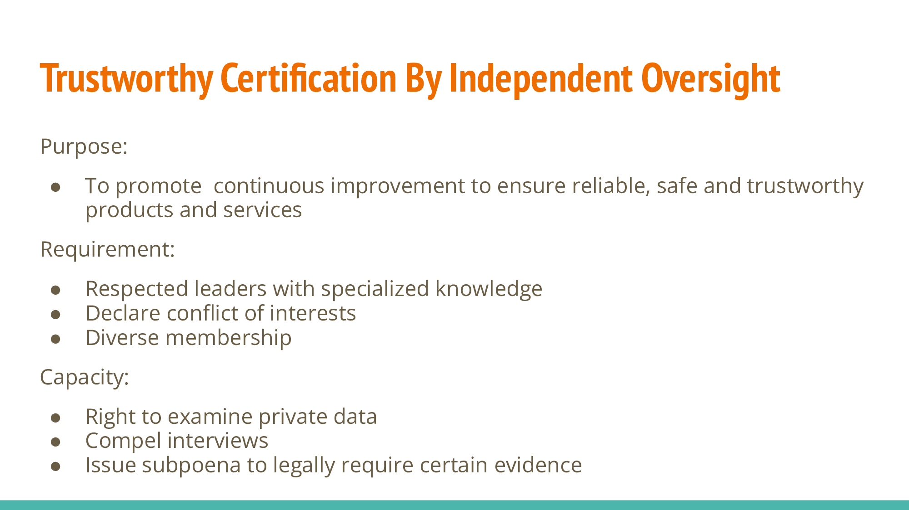</td>
</tr>
  <td colspan=1 align="center"><b></b></td>
</table>

Trustworthy certification by independent oversight

Purpose: Ensure continuous improvement for reliable, safe products. Helps to make a complete, trustworthy system. 

Requirements: Respected leaders, conflict declaration, diverse membership.

Capacity: Examine private data, conduct interviews, issue subpoenas for evidence.

<table><tr>
  <td>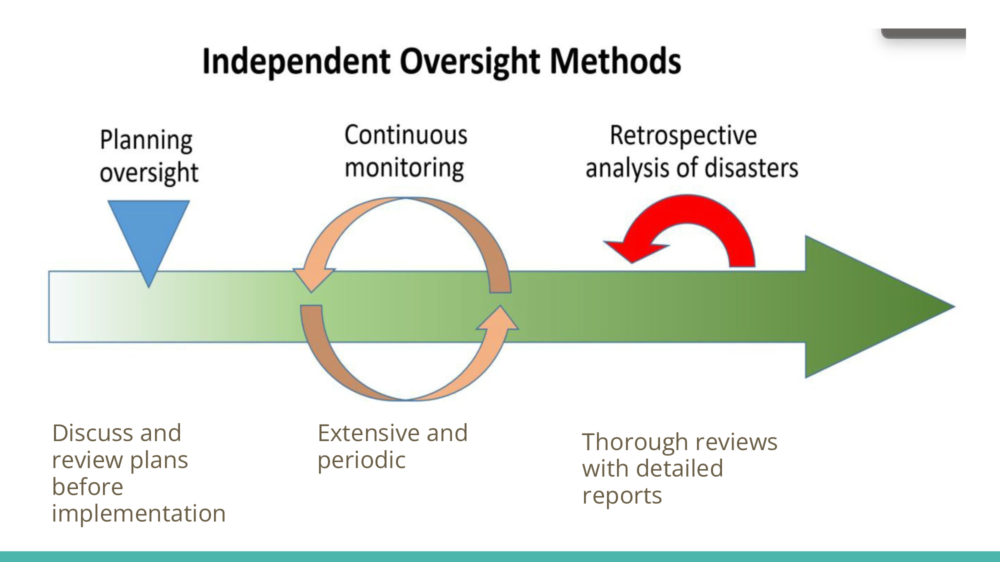</td>
</tr>
  <td colspan=1 align="center"><b></b></td>
</table>

Independent oversight is structured around three core methods: 
1. Planning 
2. Monitoring 
3. Conducting reviews or retrospectives

<table><tr>
  <td></td>
</tr>
  <td colspan=1 align="center"><b></b></td>
</table>

There are five paths for Trustworthy certification
1. Government: Policy and Regulation, aligning with EU's seven key principles(list on the top right) for transparency, reliability, safety, privacy, and fairness

2. Accounting Firms: Beyond the internal audits mentioned previously, external bodies should audit the entire industry

3. Insurance Companies: Adapting policies for emerging technologies like self-driving cars (details on next slide)
4. Non-government organizations: prioritizing the public's interest
5. Professional organizations and research institutes

<table><tr>
  <td>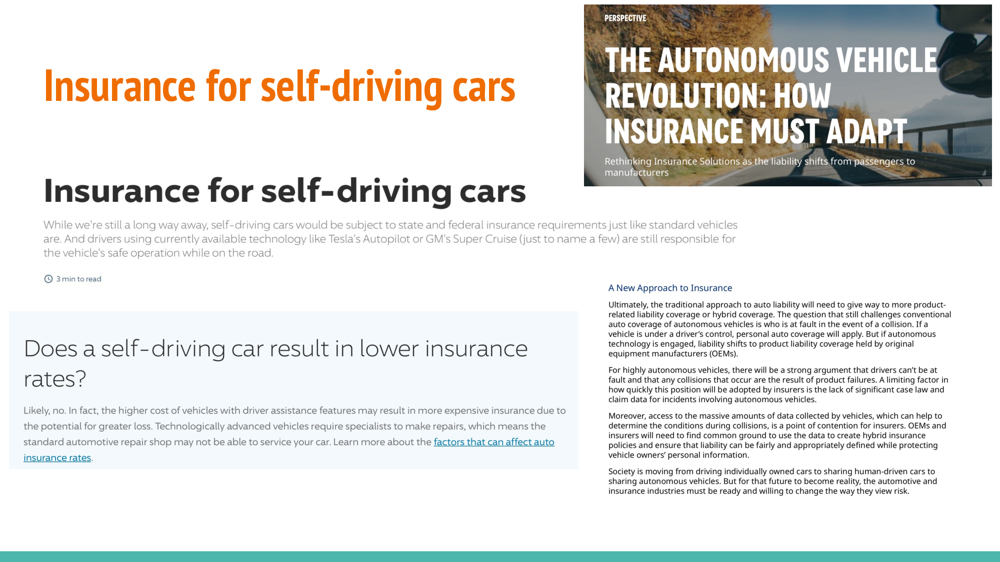</td>
</tr>
  <td colspan=1 align="center"><b></b></td>
</table>

<table><tr>
  <td></td>
</tr>
  <td colspan=1 align="center"><b></b></td>
</table>

This is a role-play section, each group will play different roles and think about following 15 principles in terms of “ethical AI”

Ethical Team: 
1. Diagnosis for skin cancer, dataset quality is reliable (bias-skin color, state-laws passing for collecting data)
2. Various Metrics for evaluating AI
3. Come up an agreement with patients, doctors
   

Healthcare Management/Organization:
1. Reporting failures (missed diagnosis) for feedback
2. Data security, gathering FP, FN cases for further training
3. Educating staff
4. Establishing accuracy/certainty of threshold for AI diagnosing skin cancer, checking the standard of professional verification

Independent oversight committee：
1. Whether the dataset is not biased in every stage and is representing all race, gender, etc
2. Data source should be considered carefully (online, hospital)
3. Model explanation and transparency should be considered
4. Privacy of personal information of both the dataset and the users

<table><tr>
  <td></td>
</tr>
  <td colspan=1 align="center"><b></b></td>
</table>

There are 15 principles each group can take into consideration for role-play discussion ethical AI.

<table><tr>
  <td></td>
</tr>
  <td colspan=1 align="center"><b></b></td>
</table>

Reorienting technical R&D emphasizes oversight, robustness, interpretability, inclusivity, risk assessment, and addressing emerging challenges. 

Proposed governance measures include enforcing standards to prevent misuse, requiring registration of frontier systems, implementing whistleblower protections, and creating national and international safety standards. Additionally, the accountability of frontier AI developers and owners, along with AI companies promptly disclosing if-then commitments, is highlighted.

<table><tr>
  <td></td>
</tr>
  <td colspan=1 align="center"><b></b></td>
</table>

There are some ethical platforms for developing responsible AI product
1. SUM Values: to provide a framework for moral scope of AI product 
2. FAST Track Principles: to make sure AI project is fair, bias-mitigating and reliable
3. PBG Framework: to set up transparent process of AI product

<table><tr>
  <td></td>
</tr>
  <td colspan=1 align="center"><b></b></td>
</table>

Putting the Ethical Platform into Practice needs three key steps: reflect, act and justify

1. Reflect using the SUM values: asking and answering questions about ethical purposes and assess the impacts of AI project
2. Act using FAST TRACK Principles: ensure every step of development produces safe, fair AI innovation
3. Justify Using the PBG Framework: set up governance process to ensure model transparency

<table><tr>
  <td>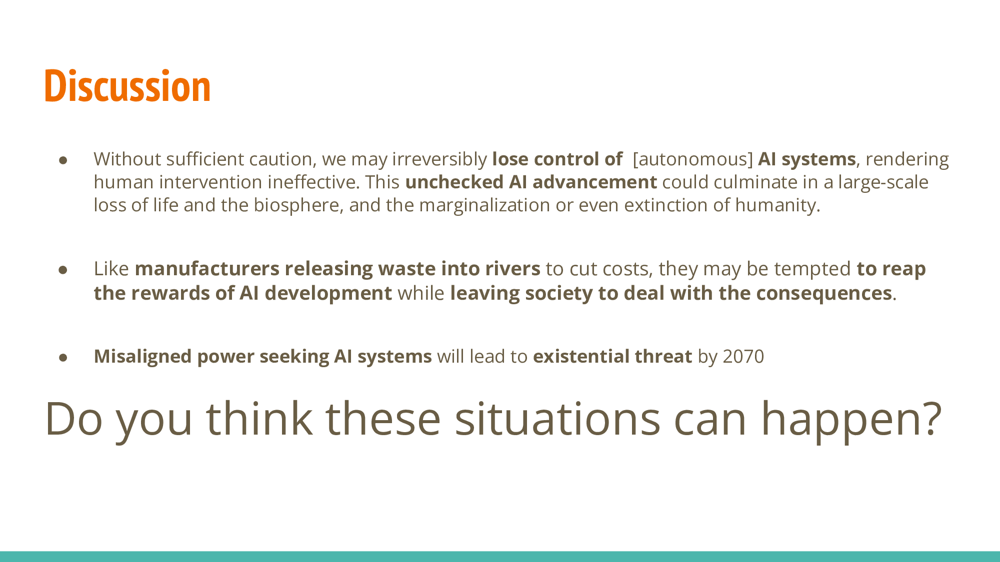</td>
</tr>
  <td colspan=1 align="center"><b></b></td>
</table>

#### Team 1
There are many trajectories that AI development could take, so it would be very difficult to completely discount something as a possibility. Related this to “Dark Matter” book by Blake Crouch.

Risk would primarily come from bad actors (specifically humans). Briefly touched on ‘what if the bad actor is the AI?’

#### Team 2
The potential downfall of humans would not be due to AI’s maliciousness.

In the post-autonomous era, concerns shift to the misuse of models for harmful purposes.

#### Team 3
2nd question seems to be already happening.

Given the rapid technological progress in recent years, single prompt can result in losing control over AI models, and speculations around ‘Q*(Q-Star)’ suggest risk in losing control over AI models, however AI’s power-seeking behavior may still be overstated.

# Readings and Discussion Questions

## Monday 27 November: Transferring and Binding Multi-Modal Capabilities:
### Readings for Monday:
- **`Required`**: Alec Radford, Jong Wook Kim, Chris Hallacy, Aditya Ramesh, Gabriel Goh, Sandhini Agarwal, Girish Sastry, Amanda Askell, Pamela Mishkin, Jack Clark, Gretchen Krueger, Ilya Sutskever. [Learning Transferable Visual Models From Natural Language Supervision](https://arxiv.org/abs/2103.00020). PMLR 2021. [PDF](https://arxiv.org/abs/2103.00020)
- **`Optional`**: OpenAI. [CLIP: Connecting text and images.](https://openai.com/research/clip) Blog 2021.
- **`Required`**: Sandhini Agarwal, Gretchen Krueger, Jack Clark, Alec Radford, Jong Wook Kim, Miles Brundage. [Evaluating CLIP: Towards Characterization of Broader Capabilities and Downstream Implications.](https://arxiv.org/abs/2108.02818) [PDF](https://arxiv.org/abs/2108.02818)
- **`Required`**:  Meta AI. [ImageBind: Holistic AI Learning Across Six Modalities.](https://ai.meta.com/blog/imagebind-six-modalities-binding-ai/) Blog 2023.
- **`Optional`**: Rohit Girdhar, Alaaeldin El-Nouby, Zhuang Liu, Mannat Singh, Kalyan Vasudev, Alwala Armand, Joulin Ishan Misra. [ImageBind: One Embedding Space To Bind Them All](https://arxiv.org/abs/2309.10020). arXiv 2023. [PDF](https://arxiv.org/abs/2309.10020)
- **`Optional`**: Chunyuan Li, Zhe Gan, Zhengyuan Yang, Jianwei Yang, Linjie Li, Lijuan Wang, Jianfeng Gao. [Multimodal Foundation Models: From Specialists to General-Purpose Assistants.](https://arxiv.org/abs/2309.10020) arXiv 2023. [PDF](https://arxiv.org/abs/2309.10020) Chapter 1-2, p5 - p25.
-  **`Optional`**: Jindong Gu, Zhen Han, Shuo Chen, Ahmad Beirami, Bailan He, Gengyuan Zhang, Ruotong Liao, Yao Qin, Volker Tresp, Philip Torr. [A Systematic Survey of Prompt Engineering on Vision-Language Foundation Models.](https://arxiv.org/abs/2307.12980) arXiv 2023. [PDF](https://arxiv.org/abs/2307.12980)
-  **`Optional`**: Anastasiya Belyaeva, Justin Cosentino, Farhad Hormozdiari, Krish Eswaran, Shravya Shetty, Greg Corrado, Andrew Carroll, Cory Y. McLean, Nicholas A. Furlotte. [Multimodal LLMs for health grounded in individual-specific data.](https://arxiv.org/abs/2307.09018) arXiv 2023. [PDF](https://arxiv.org/abs/2307.09018)
-  **`Optional`**: Alexey Dosovitskiy, Lucas Beyer, Alexander Kolesnikov, Dirk Weissenborn, Xiaohua Zhai, Thomas Unterthiner, Mostafa Dehghani, Matthias Minderer, Georg Heigold, Sylvain Gelly, Jakob Uszkoreit, Neil Houlsby. [An Image is Worth 16x16 Words: Transformers for Image Recognition at Scale.](https://arxiv.org/abs/2010.11929) ICLR 2021. [PDF](https://arxiv.org/abs/2010.11929)

### Questions
**(Post response by Sunday, 26 November)**

1. What are some potential real-world applications of CLIP and ImageBind? Could these technologies transform industries like healthcare, education, or entertainment?
2. How do CLIP and ImageBind mimic or differ from human cognitive processes in interpreting and linking visual and textual information?
3. What are potential challenges in creating datasets for training models like CLIP and ImageBind? How can the quality of these datasets be ensured?
4. What are the potential ethical implications of technologies like CLIP and ImageBind, especially in terms of privacy, bias, and misuse? How can these issues be mitigated?

## Wednesday 29 November: Safety and Ethical AI.
### Readings for Wednesday:
- **`Required`**: Yoshua Bengio, Geoffrey Hinton, Andrew Yao, Dawn Song, Pieter Abbeel, Yuval Noah Harari, Ya-Qin Zhang, Lan Xue, Shai Shalev-Shwartz, Gillian Hadfield, Jeff Clune, Tegan Maharaj, Frank Hutter, Atılım Güneş Baydin, Sheila McIlraith, Qiqi Gao, Ashwin Acharya, David Krueger, Anca Dragan, Philip Torr, Stuart Russell, Daniel Kahneman, Jan Brauner, Sören Mindermann. [Managing AI Risks in an Era of Rapid Progress.](https://arxiv.org/abs/2310.17688) arXiv 2023. [PDF](https://arxiv.org/abs/2310.17688)
- **`Required`**: Ben Shneiderman. [Bridging the Gap Between Ethics and Practice: Guidelines for Reliable, Safe, and Trustworthy Human-centered AI Systems.](https://dl.acm.org/doi/abs/10.1145/3419764) ACM Transactions on Interactive Intelligent Systems, October 2020. [PDF](https://dl.acm.org/doi/abs/10.1145/3419764)
- **`Optional`**: David Leslie. [Understanding Artificial Intelligence Ethics And Safety.](https://arxiv.org/abs/1906.05684) arXiv 2019. [PDF](https://arxiv.org/abs/1906.05684)
- **`Optional`**: Joseph Carlsmith. [Is Power-Seeking AI an Existential Risk?.](https://arxiv.org/abs/2206.13353) arXiv 2022. [PDF](https://arxiv.org/abs/2206.13353)
- **`Optional`**: Alice Pavaloiu, Utku Kose. [Ethical Artificial Intelligence - An Open Question.](https://arxiv.org/abs/1706.03021) arXiv 2017. [PDF](https://arxiv.org/abs/1706.03021)
  
### Questions
**(Post response by Tuesday, 28 November)**

Paper 1: [Bridging the Gap Between Ethics and Practice](https://drive.google.com/file/d/1Ok16aNvNLbdkBexcmt9dyVGPEpKYGXbH/view)

1. The paper claims, “Human-centered Artificial Intelligence (HCAI) systems represent a second Copernican revolution that puts human performance and human experience at the center of design thinking." Do you agree with this quote?
2. Developers/teams, organizations, users and regulators often have different views on what constitutes reliability, safety, and trustworthiness in human-centered AI systems. What are the potential challenges and solutions for aligning them? Can you provide some specific examples where these views do not align?
   
Paper 2: [Managing AI Risks in an Era of Rapid Progress](https://arxiv.org/pdf/2310.17688.pdf)

3. Do you think AI systems can be regulated over an international governance organization or agreement like nuclear weapons?
4. Consider this quote from the paper: "Without sufficient caution, we may irreversibly lose control of autonomous AI systems, rendering human intervention ineffective. Large-scale cybercrime, social manipulation, and other highlighted harms could then escalate rapidly. This unchecked AI advancement could culminate in a large-scale loss of life and the biosphere, and the marginalization or even extinction of humanity." Do you agree with it? If so, do you think any of the measures proposed in the paper would be sufficient for managing such a risk? If not, what assumptions of the authors' that led to this conclusion do you think are invalid or unlikely?
