+++
date = "03 Dec 2023"
draft = True
title = "Week 14: LLM Agents"
slug = "week14"
+++

<author>Presenting Team: Aparna Kishore, Elena Long, Erzhen Hu, Jingping Wan</author>

<author>Blogging Team: Haochen Liu, Haolin Liu, Ji Hyun Kim, Stephanie Schoch, Xueren Ge</author>

# Monday, November 27: Multimode models

<table><tr>
  <td></td>
</tr>
  <td colspan=1 align="center"><b></b></td>
</table>

Today's topic is how to improve model performance by combining multiple modes.

<table><tr>
  <td></td>
</tr>
  <td colspan=1 align="center"><b></b></td>
</table>

We will first introduce the multimodal foundations and then center around CLIP, which is the most famous vision-language model. Finally, we will have a short discussion.

<table><tr>
  <td>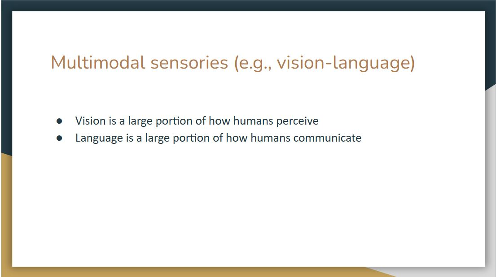</td>
</tr>
  <td colspan=1 align="center"><b></b></td>
</table>

We live in a multimodal world, and our brains naturally learn to process multi-sense signals received from the environment to help us make sense of the world around us. More specifically, vision is a large portion of how humans perceive, while language is a large portion of how humans communicate.

<table><tr>
  <td>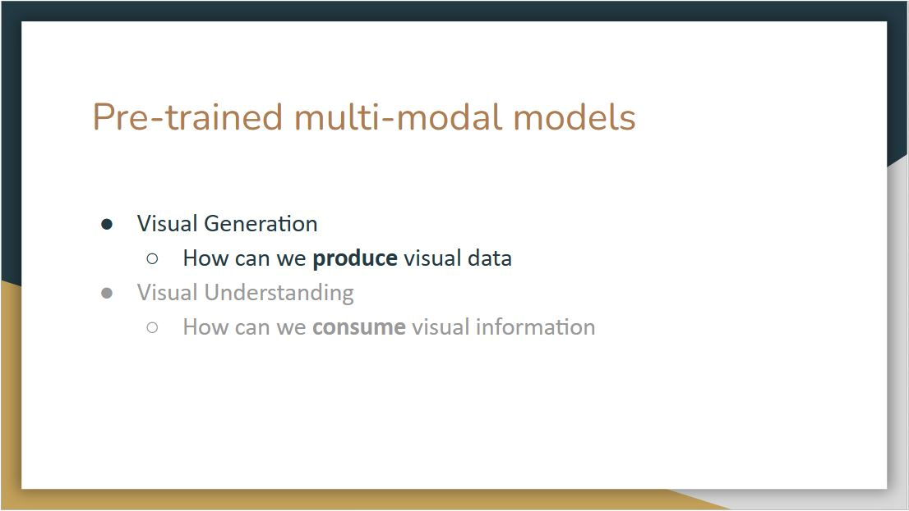</td>
</tr>
  <td colspan=1 align="center"><b></b></td>
</table>

When we talk about vision-language, there are two types of categories, one is how can we produce visual data, and another is how can we consume visual information.

<table><tr>
  <td>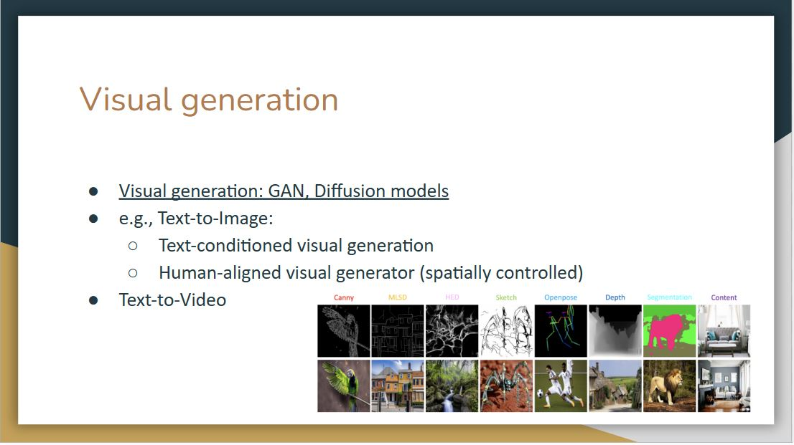</td>
</tr>
  <td colspan=1 align="center"><b></b></td>
</table>

For visual generation, popular models include GAN and diffusion models. What makes it multi-modal is that we can use other modalities to control the image we want to generate, for example, the text-to-image methods that can use text-conditioned visual generation, such as stable diffusion.

<table><tr>
  <td></td>
</tr>
  <td colspan=1 align="center"><b></b></td>
</table>

Another approach focuses on visual understanding, which studies how can we consume the visual information from the image, and further, how can we consume the audio, image, and different modalities from our surrounding environment.

<table><tr>
  <td></td>
</tr>
  <td colspan=1 align="center"><b></b></td>
</table>

Brockman, who is one of the founders of OpenAI, showed ChatGPT a diagram of my joke website, which he sketched with a pencil. Then, ChatGPT can write a functional website, this is quite remarkable as you can start to plug images into the language models. [_This link_](https://x.com/gdb/status/1635826383141376002?s=20) is for the figure above.

<table><tr>
  <td></td>
</tr>
  <td colspan=1 align="center"><b></b></td>
</table>

When we see the text "Sunshine, Sunny beach, Coconut, Straw hat", we can visualize a picture of a beach with these components. This is because our mind not only receives multimodal information but also somehow aligns these modalities.

<table><tr>
  <td>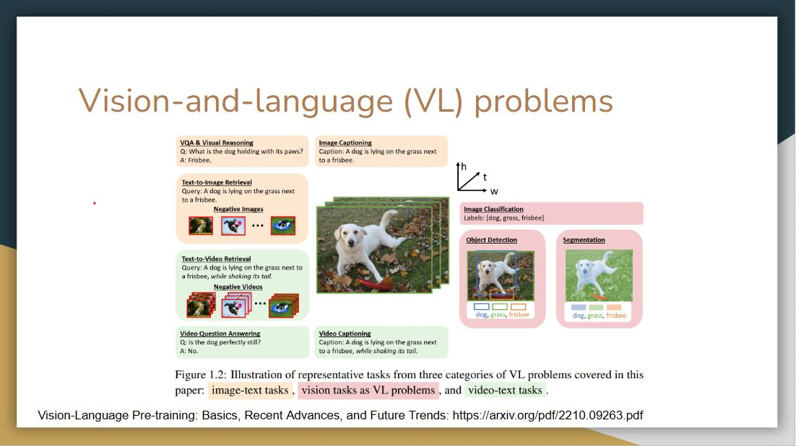</td>
</tr>
  <td colspan=1 align="center"><b></b></td>
</table>

Now we move to the detailed algorithm of vision-language models. There are particular vision-language problem spaces or representative tasks, that these models try to solve.

<table><tr>
  <td>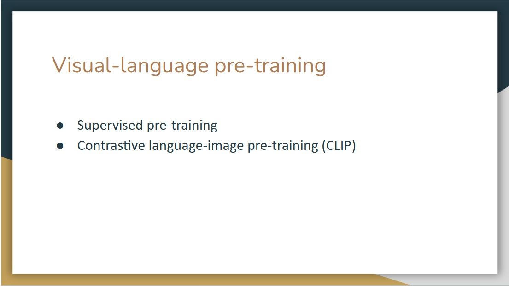</td>
</tr>
  <td colspan=1 align="center"><b></b></td>
</table>

The first question is how to train a vision-language model. We will discuss supervised pre-training and contrastive language-image pre-training, which is also known as CLIP.

<table><tr>
  <td>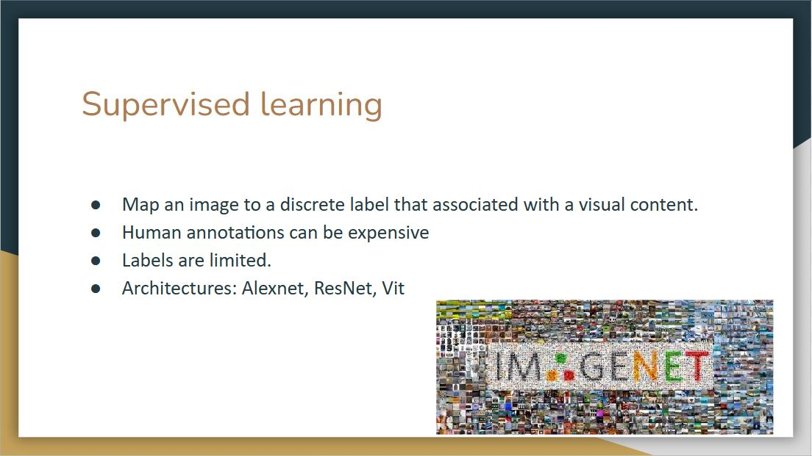</td>
</tr>
  <td colspan=1 align="center"><b></b></td>
</table>

Supervised learning will map an image to a discrete label that is associated with visual content. The drawback here is that we always need labeled data. However, human annotations can be expensive and labels are limited.

<table><tr>
  <td>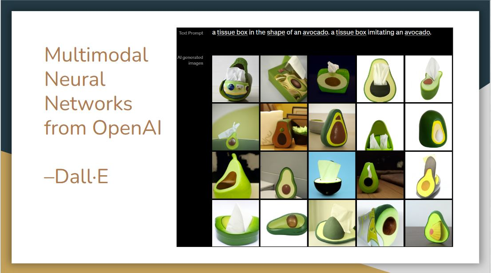</td>
</tr>
  <td colspan=1 align="center"><b></b></td>
</table>

The supervised learning method is deployed at first. In 2021, OpenAI released Dall-E, which is a generative model that uses transformer architecture like GPT3. As of its multimodal nature, the model receives both text and image in the training process, and it can generate images from scratch based on natural language input.

Here is a demo picture of Dall-E. As we can see that it can combine disparate ideas to synthesize objects, even some of them are unlikely to exist in the real world.

## CLIP

> Alec Radford, Jong Wook Kim, Chris Hallacy, Aditya Ramesh, Gabriel Goh, Sandhini Agarwal, Girish Sastry, Amanda Askell, Pamela Mishkin, Jack Clark, Gretchen Krueger, Ilya Sutskever. [_Learning Transferable Visual Models From Natural Language Supervision_](https://arxiv.org/abs/2103.00020). arXiv 2021. [PDF](https://arxiv.org/abs/2103.00020)

<table><tr>
  <td></td>
</tr>
  <td colspan=1 align="center"><b></b></td>
</table>

Besides supervised learning, the other method is called CLIP. Different from Dall-E, It takes an image and text and connect them in non-generative way. The idea is that we can take an image, and the model can predict the text along with it.

For classic image classification models, they are trained to identify objects from a predefined set of categories, for example, there are about 1000 categories in the case of the ImageNet challenge. CLIP is trained to understand the semantics of images and text together. It is trained with a huge amount of data, 400 million images on the web and corresponding text data, and it can perform object identification in any category without re-training.

<table><tr>
  <td></td>
</tr>
  <td colspan=1 align="center"><b></b></td>
</table>

Let’s take a look at its architecture.Since CLIP was trained using a combination of image and text, the training data is a batch of (image, text) pairs.

On top we have labels that belong to each image, the model tokenize it, pass it to text encoder, perform linear projection, and pass it along to a contrastive embedding screen. It does the same for images. Then in the contrastive embedding screen, the model takes the inner product of image vector and text vector. In contrastive learning, we want to increase the values of these blue squares to 1, which are original image and text pairs, and decrease the values of the white squares, which are not the classes they belong to. To achieve this, they compute the loss of these image-text vectors and text-image vectors and do back propagation

<table><tr>
  <td></td>
</tr>
  <td colspan=1 align="center"><b></b></td>
</table>

We now elaborate more on the loss function of this training process. We have two vectors (text, image) here, $v$ represents the text vector, and $u$ represents the image vector The $\tau$ here is a trainable parameter.

In the first text-to-image loss function, they take the cosine similarities of these two vectors, sum up all the rows in the denominator and normalized via softmax. As we can see it is an asymmetric problem, so to compute the image-to-text loss function, they sum up all the columns instead of the rows

After that, they compute a cross-entropy loss of these two probability distributions, sum up all the batches, and then average it out to get the final loss function.

<table><tr>
  <td></td>
</tr>
  <td colspan=1 align="center"><b></b></td>
</table>

After pre-training, the second and third step are for the object identification. We have a new dataset with different classes and want to test CLIP on it. In step 2, we need to pass these classes to the pre-trained text encoder. Instead of passing class names alone, they use a prompt template, making a sentence out of these class names. Then the model will perform the same linear projection as in the pre-training and pass it into a contrastive space

Then in Step 3, we can take the image we want to predict, the model will pass it into the image encoder, do linear projection, go into the contrastive embedding space and take the inner products of this image vector and all text vectors in Step 2. The final prediction output will be the one that has the highest cosine similarity.

<table><tr>
  <td>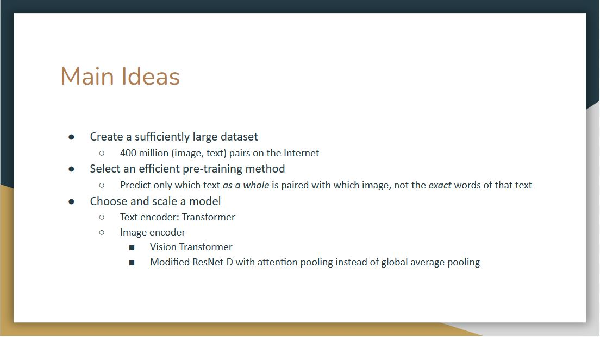</td>
</tr>
  <td colspan=1 align="center"><b></b></td>
</table>

The authors share three main ideas behind this work.

The first one is the need of a sufficiently large dataset. The simple truth is that existing manually labeled datasets are just way too small (100k samples) for training a natural language supervised model on the scale of GPT. The intuition was that the required dataset already exists on the web without the need to label data manually. So they create a new dataset of 400 million (image, text) pairs collected from a variety of publicly available sources on the Internet.

The second one is to select an efficient pre-training method. After experimenting with class-label prediction, the authors realized that the key to success was in predicting only which text as a whole is paired with which image, not the exact word of that text. This discovery led to the use of the loss function we introduced earlier, such that the cosine similarity for each correct pair of embeddings is maximized, and the cosine similarity of the rest of the pairings are minimized.

The last one is to choose and scale a model. After some experiments, they use a transformer as text encoder, and leave two options for image encoder. The image encoder is either a Vision Transformer or a modified ResNet-D with attention pooling instead of global average pooling.

<table><tr>
  <td></td>
</tr>
  <td colspan=1 align="center"><b></b></td>
</table>

After understanding the architecture of CLIP, let’s look at evaluations of this model. The figure above shows that CLIP is by far much more data-efficient than the other methods.

<table><tr>
  <td>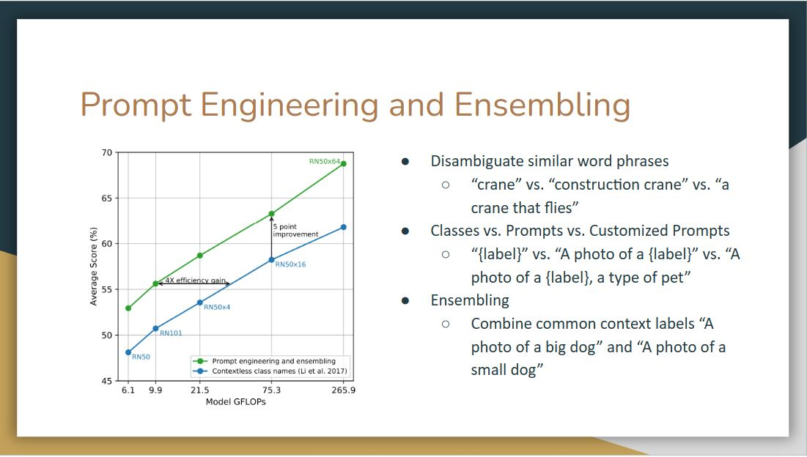</td>
</tr>
  <td colspan=1 align="center"><b></b></td>
</table>

As we can see in the figure, with prompt engineering and ensembling, models more likely to achieve higher accuracy score rather than just simply having contextless class names.

One observation is that CLIP performs poorly on differentiate word sense when there’s only a label without context. For example, the label crane can mean construction crane or a crane that flies.

Another observation is that in their pre-training dataset text, it is relatively rare to see an image with just a single word as a label. So to bridge the distribution gap, they use a prompt template. Instead of a single label, they use template sentences like “a photo of a label”. They also found customizing the prompt text to each task can further improve performance.

<table><tr>
  <td></td>
</tr>
  <td colspan=1 align="center"><b></b></td>
</table>

There’s a trend in machine learning that if you give more data and compute, then the error goes down even with the same type of models, and that seems to hold pretty much the same here. As we can see the error rate scales smoothly as a function of model compute. However, they do note that there are lots of variance, this curve is the average. For individual datasets, it varies widely. It may be due to how the dataset is selected, how the prompt is engineered, still lots of unknown.

<table><tr>
  <td></td>
</tr>
  <td colspan=1 align="center"><b></b></td>
</table>

For the evaluation in terms of performance, CLIP is compared with a linear probe on ResNet50. It is pretty impressive that the zero-shot CLIP outperform a fully trained model on many of the dataset, including ImageNet.

On the other side, CLIP is weak on several specialized, complex, or abstract tasks such as EuroSAT (satellite image classification), KITTI Distance (recognizing distance to the nearest car). This may because these are not the kind of text and image we found on the Internet.

<table><tr>
  <td>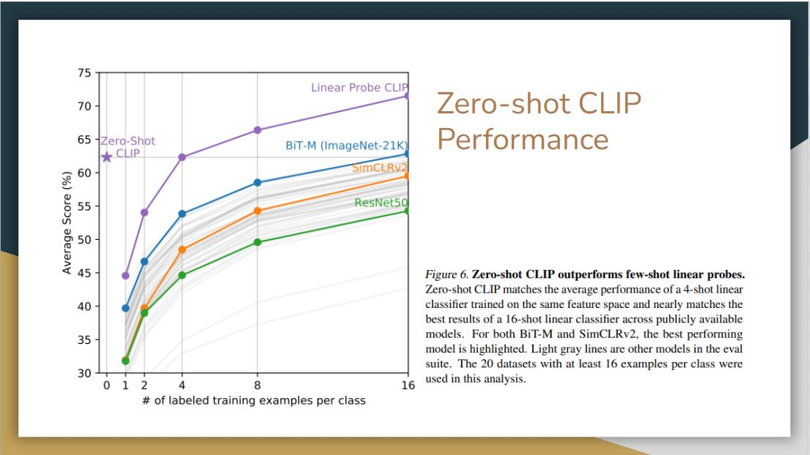</td>
</tr>
  <td colspan=1 align="center"><b></b></td>
</table>

Here we compare zero-shot CLIP with few-shot linear probes, This is where pre-training really comes in, as the model only see few examples per class.

Surprisingly, a zero-shot CLIP is comparable to a 16-shot BiT-M model, which is one of the best models in the public that’s doing transfer learning in computer vision. If we linear probe the CLIP model, then it way outperform these other linear probe models.

<table><tr>
  <td></td>
</tr>
  <td colspan=1 align="center"><b></b></td>
</table>

They also evaluate CLIP in terms of its robustness to perturbations. Here they compare zero-shot CLIP to models that have been trained on imagenet, finding that zero-shot clip matches the performance of resnet101. As this classifier degrades as we go for harder and harder datasets overall, CLIP is more robust. This sort of implies that representation in CLIP should be nuanced enough, so it can pick up on different features than only distinguishing banana from other classes in the Imagenet dataset.

<table><tr>
  <td></td>
</tr>
  <td colspan=1 align="center"><b></b></td>
</table>

Here, they customize zero-shot CLIP to each dataset (adapt to class shift in purple) based on class names. While this supervised adaptation to class shift increases ImageNet accuracy by around 10 percent, it slightly reduces the average robustness. From the right side, the improvements are concentrated on only a few datasets.

On the other hand, when they adapt CLIP to fully supervised logistic regression classifiers on the best CLIP model’s features, it comes close to the standard Imagenet training in terms of robustness. Thus, it seems that the representation itself in zero-shot CLIP has more value, such that they are more stable and nuanced.

<table><tr>
  <td></td>
</tr>
  <td colspan=1 align="center"><b></b></td>
</table>

There are various works following CLIP based on this contrastive learning structure. The first extension is to further scale up texts and images. The second is to design better models.

## Reproducible Scaling Laws 

> Mehdi Cherti, Romain Beaumont, Ross Wightman, Mitchell Wortsman, Gabriel Ilharco, Cade Gordon, Christoph Schuhmann, Ludwig Schmidt, Jenia Jitsev. [_Reproducible scaling laws for contrastive language-image learning_](https://arxiv.org/abs/2212.07143). CVPR 2023. [PDF](https://arxiv.org/abs/2212.07143)

<table><tr>
  <td></td>
</tr>
  <td colspan=1 align="center"><b></b></td>
</table>

In CVPR 2023, there’s a reproducible scaling laws paper, Basically they used the open larges scale LAION-2B dataset to pre-train openclip across different scales.

## Datacomp

> Samir Yitzhak Gadre, Gabriel Ilharco, Alex Fang, Jonathan Hayase, Georgios Smyrnis, Thao Nguyen, Ryan Marten, Mitchell Wortsman, Dhruba Ghosh, Jieyu Zhang, Eyal Orgad, Rahim Entezari, Giannis Daras, Sarah Pratt, Vivek Ramanujan, Yonatan Bitton, Kalyani Marathe, Stephen Mussmann, Richard Vencu, Mehdi Cherti, Ranjay Krishna, Pang Wei Koh, Olga Saukh, Alexander Ratner, Shuran Song, Hannaneh Hajishirzi, Ali Farhadi, Romain Beaumont, Sewoong Oh, Alex Dimakis, Jenia Jitsev, Yair Carmon, Vaishaal Shankar, Ludwig Schmidt. [_DataComp: In search of the next generation of multimodal datasets_](https://arxiv.org/abs/2304.14108). arxiv 2023. [PDF](https://arxiv.org/abs/2304.14108)

<table><tr>
  <td></td>
</tr>
  <td colspan=1 align="center"><b></b></td>
</table>

This paper talked about how should we scale data? Should we scale it up with noisier and noisier data?

Their focus is to search the next-generation image-text datasets. Instead of fixing the dataset and designing different algorithms, the authors propose to fix the CLIP training method but select the datasets instead. With this method, they come up with a high-quality large-scale dataset.

## FILIP

> Lewei Yao, Runhui Huang, Lu Hou, Guansong Lu, Minzhe Niu, Hang Xu, Xiaodan Liang, Zhenguo Li, Xin Jiang, Chunjing Xu. [_FILIP: Fine-grained Interactive Language-Image Pre-Training_](https://arxiv.org/abs/2111.07783). ICLR 2022. [PDF](https://arxiv.org/abs/2111.07783)

<table><tr>
  <td></td>
</tr>
  <td colspan=1 align="center"><b></b></td>
</table>

For the model improvement, FILIP is proposed to scale CLIP training via masking. It randomly masks out image patches with a high masking ratio, and only encodes the visible patches. It turns out this method does not hurt performance but improves training efficiency

## K-Lite

> Sheng Shen, Chunyuan Li, Xiaowei Hu, Jianwei Yang, Yujia Xie, Pengchuan Zhang, Zhe Gan, Lijuan Wang, Lu Yuan, Ce Liu, Kurt Keutzer, Trevor Darrell, Anna Rohrbach, Jianfeng Gao. [_K-LITE: Learning Transferable Visual Models with External Knowledge_](https://arxiv.org/abs/2204.09222). NeurIPS 2022. [PDF](https://arxiv.org/abs/2204.09222)

<table><tr>
  <td></td>
</tr>
  <td colspan=1 align="center"><b></b></td>
</table>

Another line of work focuses on improving the language side model design of CLIP. The model K-Lite utilizes the Wiki definition of entities together with the original alt-text for contrastive pre-training. Such knowledge is useful for a variety of domains and datasets, making it possible to build a generic approach for task-level transfer.

<table><tr>
  <td></td>
</tr>
  <td colspan=1 align="center"><b></b></td>
</table>

Recall that in this motivated example, we argue that more modalities will enhance the learning process.

## IMAGEBIND

> Rohit Girdhar, Alaaeldin El-Nouby, Zhuang Liu, Mannat Singh, Kalyan Vasudev Alwala, Armand Joulin, Ishan Misra. [_ImageBind: One Embedding Space To Bind Them All_](https://arxiv.org/abs/2305.05665). arxiv 2023. [PDF](https://arxiv.org/abs/2305.05665)

<table><tr>
  <td></td>
</tr>
  <td colspan=1 align="center"><b></b></td>
</table>

Imagebind tries to utilize more modalities to improve performance. However, one challenge here is that not all generated data are naturally aligned due to the lack of a corresponding relationship in the training set.

<table><tr>
  <td></td>
</tr>
  <td colspan=1 align="center"><b></b></td>
</table>

For Imagebind, there are different modalities include image, text, video, audio, depth, thermal, and IMU, which contains the accelerator, and gyroscope data. The goal of imagebind is to learn a single joint embedding space for all the modalities, and then use image as the binding modality. Here I denotes image modality, and M denotes all the other modalities. They use deep neural networks as encoders to extract embeddings from each of the modalities, so each modality has it own encoder, just like the clip.

During the training, the image and text modality was kept frozen, and the weights of other modalities were updated, and this freezing shows the alignment to emerge between other modalities for which we don’t have any natural alignment, for example, between audio, and depth.

The preprocessed inputs are passed through encoders and then passed through a simple linear layer to make sure they are of same dimension before being trained with the loss called infoNCE loss. This loss is a modified cross-entropy loss, which extends the contrastive learning to multiple modalities. Let the output for image be q, and the output for other modalities be k. The loss here tries to align image modality with all other modalities.

<table><tr>
  <td></td>
</tr>
  <td colspan=1 align="center"><b></b></td>
</table>

They study whether Imagebind's embeddings can be used to compose information across modalities. The above figure shows image retrievals obtained by adding together image and audio embeddings. The joint embedding space allows for us to compose two embeddings: e.g., image of fruits on a table + sound of chirping birds and retrieve an image that contains both these concepts, i.e., fruits on trees with birds. Such emergent compositionality whereby semantic content from different modalities can be composed will likely enable a rich variety of compositional tasks.

<table><tr>
  <td>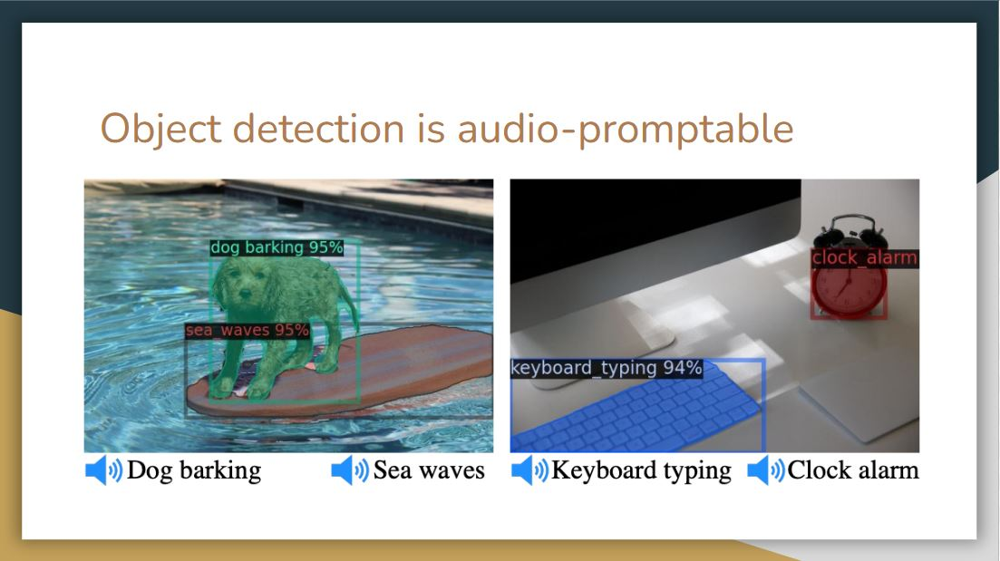</td>
</tr>
  <td colspan=1 align="center"><b></b></td>
</table>

By utilizing the audio embedding of Imagebind, it is possible to design an audio-based detector that can detect and segment objects based on audio prompts.

<table><tr>
  <td>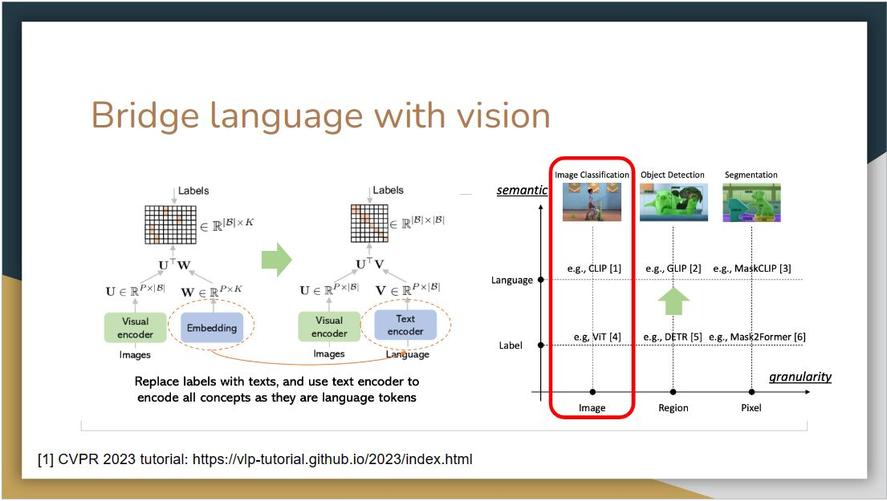</td>
</tr>
  <td colspan=1 align="center"><b></b></td>
</table>

As proposed in CLIP, replacing labels with textual descriptions and using a text encoder to encode them can feasibly convert closed-set problems to open-set ones. A number of works have been proposed to transform different computer vision tasks by replacing the label space with language space.

<table><tr>
  <td>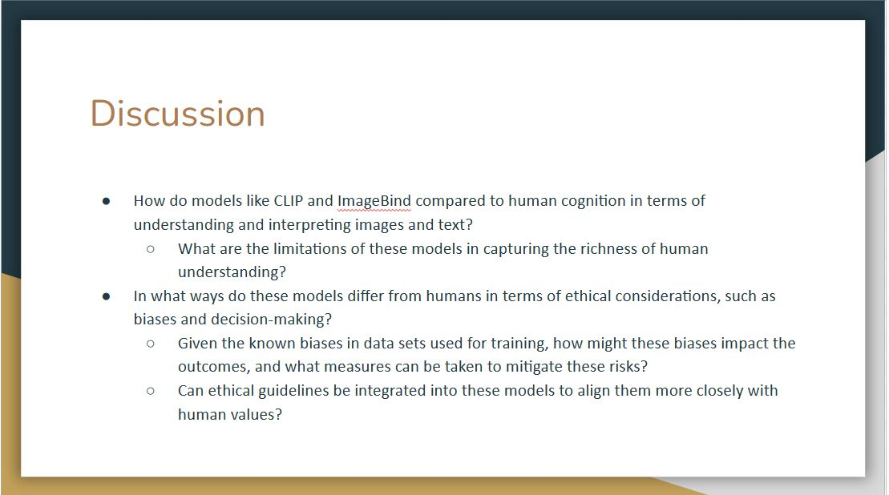</td>
</tr>
  <td colspan=1 align="center"><b></b></td>
</table>

For the first question, we believe there are several differences between humans and machines for cognition. Although these models will outperform humans on several specific tasks, they also have limitations. For example, humans will perceive an image as a whole, but machines perceive it pixel by pixel. This ensures humans are good at using context to interpret images and text. While these models can recognize patterns and correlations between words and images, they may not fully grasp the broader context as humans do.

For the second question, the presenter gave an example that there is a specific food in Wuhan called "hot dry noodles". When we give a picture of this kind of noodles with the caption "hot dry noodles in Wuhan", the multi-mode models will output how this food is popular in Wuhan. However, if we replace the caption as "hot dry noodles in Shandong", the model will still describe this noodles in Wuhan instead of Shandong. The presenter believes this is an example of bias because a lot of data on this noodles is associated with Wuhan. Thus, even though the caption of the image is changed, the model can not comprehend because the representation is fixed.

# Wednesday, November 15: Applications of LLM Agents

<table><tr>
  <td></td>
</tr>
  <td colspan=1 align="center"><b></b></td>
</table>

The experimental setup comprises two restaurants, serving as competitive agents, and fourteen customers, acting as judge agents. To confine the action space of the Large Language Model (LLM), a management system is employed. This system functions as a question provider, formulating precise inquiries for the LLM to ensure that its output remains within the defined action space. The customers exercise their judgment when evaluating offers from both restaurants, ultimately selecting based on their individual constraints and requirements.

<table><tr>
  <td></td>
</tr>
  <td colspan=1 align="center"><b></b></td>
</table>

<table><tr>
  <td></td>
  <td></td>
</tr>
  <td colspan=1 align="center"><b></b></td>
  <td colspan=1 align="center"><b></b></td>
</table>

**Data inputs**: Daybook provides data regarding the previous day's patronage, menu evaluation, and related insights. Likewise, Rival offers comparable information concerning the competitor's restaurant, encompassing visitor statistics and menu alterations. Customer feedback is used to make decisions about the next day.

<table><tr>
  <td></td>
</tr>
  <td colspan=1 align="center"><b></b></td>
</table>

**Discussion Notes:**
1. LLM scores can act as a baseline, but there is always a possibility of bias. For instance, changing the order of options presented to the model may sometimes result in a different score being outputted.
2. Designing a model based solely off of customer/restaurant data fails to capture other experiences of dining (i.e. customer service, environment/ambience, etc.) and thus indicates the simulation’s low fidelity. Capturing decision-making factors in customers is especially difficult, as they are difficult to define and quantify. The current simulation does not account for customers’ risk-aversion for trying new dishes, and it also does not consider the influence of star ratings or reviews on customers’ decisions to choose between the two restaurants. There may also be issues with prompt-based tasks, such as over-generalization. 
3. Utilizing simulations has the potential for real-world social trends and phenomena to be reproduced without requiring a large number of real people or complex variables; it is not necessary to recreate an entire town in order to gain insights into real-world trends.

<table><tr>
  <td></td>
  <td></td>
</tr>
  <td colspan=1 align="center"><b></b></td>
  <td colspan=1 align="center"><b></b></td>
</table>

Agents are able to learn from each other while maintaining differentiation. This is visible in two ways:
1. Agents **imitate** observed strategies that provide a high reward. For example, a restaurant may copy the popular dishes of another restaurant to compete for their clinetele.
2. Conversely, **differentiation** is used to attract patrons that the competing agents don't specifically cater to; one restaurant may provide inexpensive food for customers on a budget while another provides fine-dining options.

<!-- <table><tr>
  <td></td>
</tr>
  <td colspan=1 align="center"><b></b></td>
</table> -->

<table><tr>
  <td></td>
</tr>
  <td colspan=1 align="center"><b></b></td>
</table>

The agents are shown to adapt to various customer needs in an effort to retain or attract further patronage.

<!-- <table><tr>
  <td></td>
</tr>
  <td colspan=1 align="center"><b></b></td>
</table> -->

<!-- <table><tr>
  <td></td>
</tr>
  <td colspan=1 align="center"><b></b></td>
</table> -->

<!-- <table><tr>
  <td></td>
</tr>
  <td colspan=1 align="center"><b></b></td>
</table> -->

<table><tr>
  <td></td>
</tr>
  <td colspan=1 align="center"><b></b></td>
</table>

A number of sociological and economic princples were demonstrated in the experiment.

<table><tr>
  <td></td>
</tr>
  <td colspan=1 align="center"><b></b></td>
</table>

1. Is competition among agents the best mechanism to take advantage of their capabilities? What are the limitations of this approach?
2. What other interactions are feasible?
3. What are the benefits and risks and/or pros and cons of these interactions as compared to competition among agents?

**Collaborative Approach Limitations:** One potential drawback of adopting a collaborative approach is the propensity for bias in a single agent to propagate through multiple agents, thus amplifying its impact.

**Employing Negotiation-Based Tasks and Games:** In the context of collaborative endeavors, employing negotiation-based tasks and games is a valuable strategy. These involve the participation of diverse agents, such as a managerial figure, a chef, and a waiter, each representing distinct stakeholders. The amalgamation of their inputs contributes to a holistic decision-making process.

**The Feasibility of Restaurant Collaboration:** We explored the possibility of restaurants engaging in collaborative efforts, including the exchange of information regarding signature dishes, the potential collusion to elevate pricing structures collectively, and the coordination of operational hours. However, it is essential to consider potential drawbacks, particularly the willingness of competitors to engage in such cooperative ventures.

1. Limitations of having collaborative approach: bias in one agent might cascade into bias in multiple agents.
2. Discussed negotiation-based tasks and negotiation games to collaborate with each other. For instance, one could have an ensemble of different agents (i.e. manager agent makes final decision, chef has a say, waiter has a say, etc.)
Each agent represents different stakeholder
3. Discussed how restaurants could collaborate together, e.g. communicate signature dishes, collude to raise prices of everything, coordinate times they are open. Noted potential downsides, including willingess to collaborate and power dynamics between agents.

<table><tr>
  <td></td>
</tr>
  <td colspan=1 align="center"><b></b></td>
</table>

<table><tr>
  <td></td>
</tr>
  <td colspan=1 align="center"><b></b></td>
</table>

This work explored learning through collaboration via multiple types of interaction as shown in the next slide.

<table><tr>
  <td></td>
</tr>
  <td colspan=1 align="center"><b></b></td>
</table>

<table><tr>
  <td></td>
  <td></td>
  <td></td>
</tr>
  <td colspan=1 align="center"><b></b></td>
</table>

LTC Communication Patters:
1. **Monologue:** Letting an agent train by providing feedback to itself. The agent will play the role of the actor and the instructor.
2. **Dialogue:** As opposed to the previous approach, training is conducted with separate agents acting as the actor and the instructor.
3. **Analogue:** Similar to the former approach, but raining rewards and examples are provided by the instructor agent rather than by the environment.

<table><tr>
  <td></td>
</tr>
  <td colspan=1 align="center"><b></b></td>
</table>

The agent model is optimized with the trajectory data collected in the exploration phase. This relies on a multi-objective loss function composed of a standard loss function for unsupervised language model training and a reinforcement objective to maximize the expected reward from previous communication data. Beta acts as a balancing hyper-parameter.

<table><tr>
  <td></td>
</tr>
  <td colspan=1 align="center"><b></b></td>
</table>

# Readings and Discussion Questions

## Monday 13 November: Introduction to LLM Agents
### Readings
- **`Required`**: Timo Schick, Jane Dwivedi-Yu, Roberto Dessì, Roberta Raileanu, Maria Lomeli, Luke Zettlemoyer, Nicola Cancedda, Thomas Scialom. [Toolformer: Language Models Can Teach Themselves to Use Tools](https://arxiv.org/abs/2302.04761). arXiv 2023. [[PDF]](https://arxiv.org/pdf/2302.04761.pdf)
- **`Required`**: Subbarao Kambhampati. [Can LLMs Really Reason and Plan?](https://cacm.acm.org/blogs/blog-cacm/276268-can-llms-really-reason-and-plan/fulltext). Blog@CACM. 2023.
- **`Optional`**: Lilian Wang. [LLM Powered Autonomous Agents](https://lilianweng.github.io/posts/2023-06-23-agent/). Blog. 2023.
- **`Optional`**: Lei Wang, Chen Ma, Xueyang Feng, Zeyu Zhang, Hao Yang, Jingsen Zhang, Zhiyuan Chen, Jiakai Tang, Xu Chen, Yankai Lin, Wayne Xin Zhao, Zhewei Wei, Ji-Rong Wen. [A Survey on Large Language Model based Autonomous Agents](https://arxiv.org/abs/2308.11432). arXiv 2023. [[PDF]](https://arxiv.org/pdf/2308.11432.pdf)
- **`Optional`**: Karthik Valmeekam, Matthew Marquez, Sarath Sreedharan, Subbarao Kambhampati. [On the Planning Abilities of Large Language Models : A Critical Investigation](https://arxiv.org/abs/2305.15771). NeurIPS 2023. [[PDF]](https://arxiv.org/pdf/2305.15771.pdf)
- **`Optional`**: Lin Guan, Karthik Valmeekam, Sarath Sreedharan, Subbarao Kambhampati. [Leveraging Pre-trained Large Language Models to Construct and Utilize World Models for Model-based Task Planning](https://arxiv.org/abs/2305.14909). NeurIPS 2023. [[PDF]](https://arxiv.org/pdf/2305.14909.pdf)
### Questions
**(Post response by Sunday, 12 November)**

1. What are the key methodologies or techniques used in the Toolformer paper, and how does the tool use of LLM differ from the existing use of LLM, e.g., prompting, demonstration, etc.?
2. Which potential applications or industries could benefit (or suffer) the most from the LLM Agent concept? How might it revolutionize or impact these areas?
3. Regarding [Can LLMs Really Reason and Plan?](https://cacm.acm.org/blogs/blog-cacm/276268-can-llms-really-reason-and-plan/fulltext), do you agree with the opinion that what LLMs really do is a form of universal approximate retrieval, which was sometimes mistakenly interpreted as reasoning capabilities? What is your perspective on this question?

## Wednesday 15 November: Applications of LLM Agents
### Readings
- **`Required`**: Qinlin Zhao, Jindong Wang, Yixuan Zhang, Yiqiao Jin, Kaijie Zhu, Hao Chen, Xing Xie. [CompeteAI: Understanding the Competition Behaviors in Large Language Model-based Agents](https://arxiv.org/abs/2310.17512). arXiv 2023. [[PDF](https://arxiv.org/pdf/2310.17512.pdf)]
- **`Optional`**: Yilun Du, Shuang Li, Antonio Torralba, Joshua B. Tenenbaum, Igor Mordatch. [Improving Factuality and Reasoning in Language Models through Multiagent Debate](https://arxiv.org/abs/2305.14325). arXiv 2023. [[PDF](https://arxiv.org/pdf/2305.14325.pdf)]
- **`Optional`**: Kuan Wang, Yadong Lu, Michael Santacroce, Yeyun Gong, Chao Zhang, Yelong Shen. [Adapting LLM Agents Through Communication](https://arxiv.org/abs/2310.01444). arXiv 2023. [[PDF](https://arxiv.org/pdf/2310.01444.pdf)]
- **`Optional`**: Daniil A. Boiko, Robert MacKnight, Gabe Gomes. [Emergent autonomous scientific research capabilities of large language models](https://arxiv.org/abs/2304.05332). arXiv 2023. [[PDF](https://arxiv.org/pdf/2304.05332.pdf)]
- **`Optional`**: Yuzhuang Xu, Shuo Wang, Peng Li, Fuwen Luo, Xiaolong Wang, Weidong Liu, Yang Liu. [Exploring Large Language Models for Communication Games: An Empirical Study on Werewolf](https://arxiv.org/abs/2309.04658). arXiv 2023. [[PDF](https://arxiv.org/pdf/2309.04658.pdf)]
### Questions
**(Post response by Tuesday, 14 November)**

1. The [CompeteAI: Understanding the Competition Behaviors in Large Language Model-based Agents](https://arxiv.org/abs/2310.17512) paper shows that LLM agents can be used for simulating the competition environment. How might the competition behaviors observed in LLM-based agents translate to other real-world applications where strategic competition is critical? Essentially, are there specific characteristics unique to the restaurant setting that might not directly apply to other sectors?
2. What are some considerations (ethical or otherwise) that may arise as a result of programming LLMs to compete with each other, especially considering the possibility of this being implemented in real world scenarios? If there are valid concerns, how could the models be calibrated to ensure that the competition remains ethical, preventing the agents from learning and adopting potentially harmful or deceptive strategies?
3. Agents can be used in various ways. One way is to make them compete (like in the CompeteAI paper). Instead of competing, how can agents be used in other ways (e.g. by collaborating/communicating with each other), and how might this impact their behavior?
4. Given the adaptive nature of LLM-based agents in a competitive environment, how can we ensure transparency and interpretability in the decision-making processes of these agents, so that stakeholders can understand and trust the outcomes of such simulations?
