+++
date = "04 Dec 2023"
draft = false
title = "Week 14b: Ethical AI"
slug = "week14b"
+++

<author>Presenting Team: Aparna Kishore, Elena Long, Erzhen Hu, Jingping Wan</author>  
<author>Blogging Team: Haolin Liu, Haochen Liu, Ji Hyun Kim, Stephanie Schoch, Xueren Ge</author>

Note: since the topics were unrelated, Week 14 is split into two posts:
- [Monday, November 27: Multimodal Models](/week14a)
- [Wednesday, November 29: Ethical AI](/week14b)

# Wednesday, November 29: Ethical AI

<table><tr>
  <td>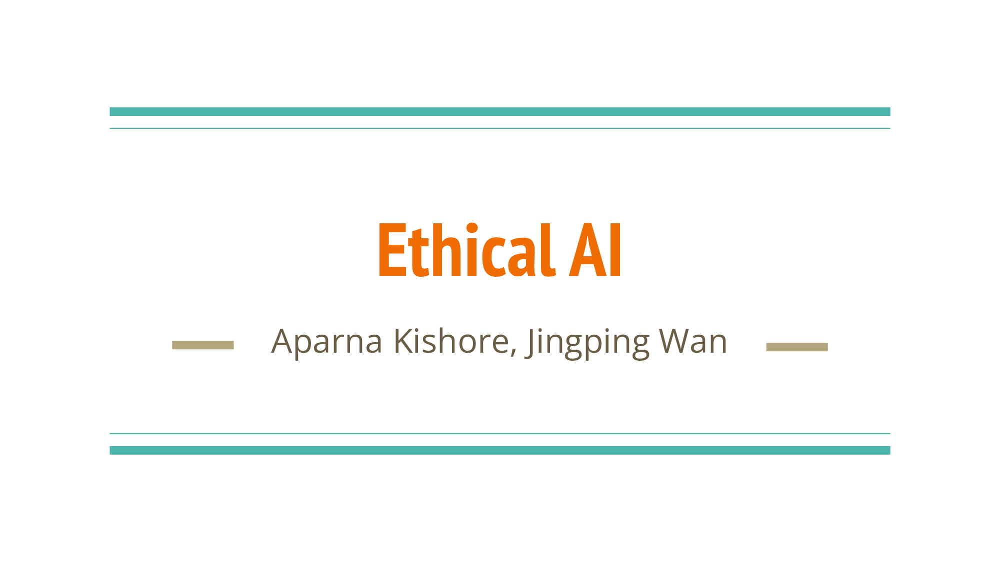</td>
</tr>
  <td colspan=1 align="center"><b></b></td>
</table>

> Ben Shneiderman. [_Bridging the Gap Between Ethics and Practice: Guidelines for Reliable, Safe, and Trustworthy Human-centered AI Systems_](https://dl.acm.org/doi/abs/10.1145/3419764). ACM Transactions on Interactive Intelligent Systems, October 2020. [PDF](https://dl.acm.org/doi/abs/10.1145/3419764)

<table><tr>
  <td>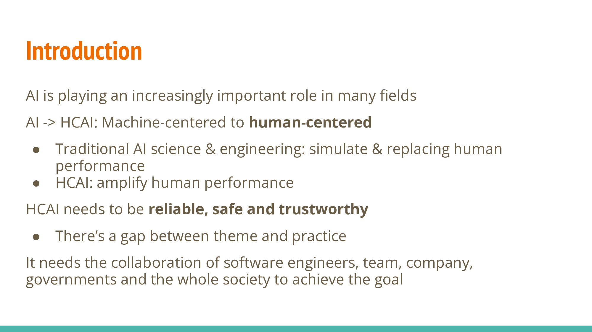</td>
</tr>
  <td colspan=1 align="center"><b></b></td>
</table>

Today’s topic is ethical AI, with a focus on human-centered AI (HCAI). From this perspective, AI is seen as amplifying the performance of humans.

Important to HCAI is the need for reliable, safe and trustworthy properties, through the collaboration of software engineers, companies, government, and society as a whole.

<table><tr>
  <td>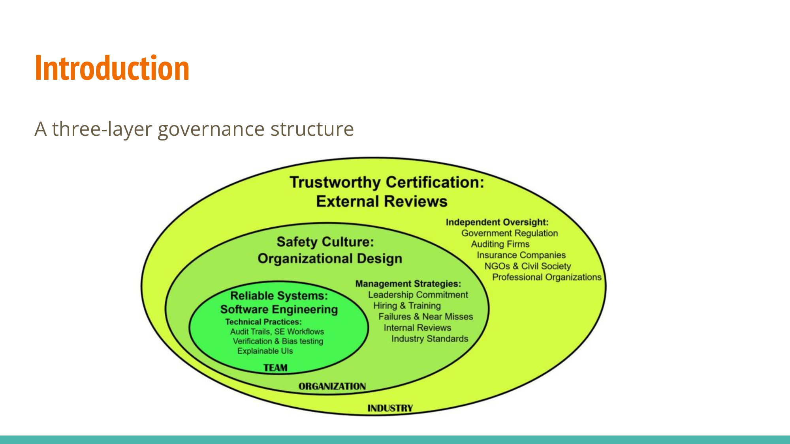</td>
</tr>
  <td colspan=1 align="center"><b></b></td>
</table>

1. Reliable Systems: Soft Engineering
2. Safety Culture: Organizational Design 
3. Trustworthy Certification: External Reviews

<table><tr>
  <td>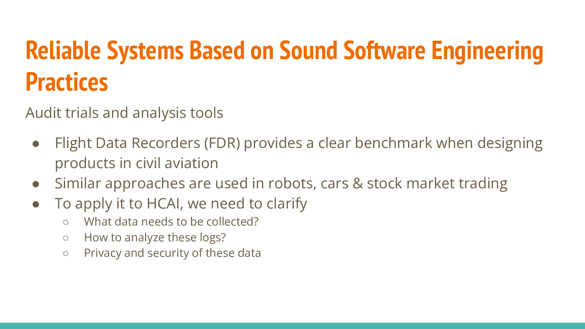</td>
</tr>
  <td colspan=1 align="center"><b></b></td>
</table>

Things that should be considered when developing ethical AI:
1. Data quality
2.  Training log analysis
3. Privacy and security of data
   
Example:FDR has quantitative benchmark to see if a plane is safe/stable, which can help in designing the next generation of products

Analogy of FDR to AI: We could get quantitative feedback of the product or strategy we want to test: What data do we need, how do we analyze log data (or select useful data from operation logs), how to protect data from being attacked, etc.

Through a similar approach, we can say that AI is safe through testing and logs, rather than just ‘take our word for it’

<table><tr>
  <td>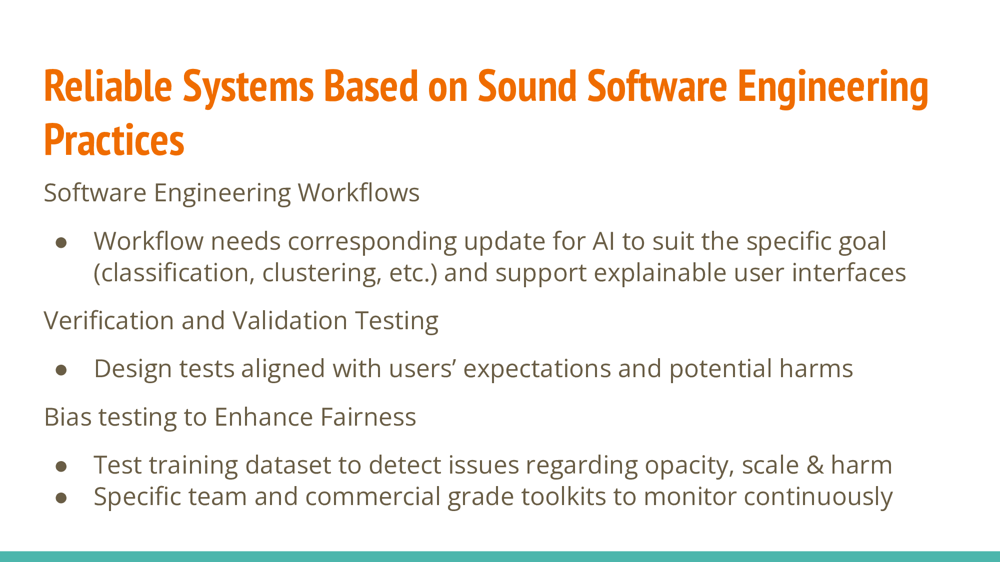</td>
</tr>
  <td colspan=1 align="center"><b></b></td>
</table>

Software Engineering workflows:  AI workflow requires _goal-aligned update_.

Verification and validation testing:
1. Design tests align with expectations, prevent harms
2. Goals of AI are more general or high-level than traditional software programs, so we need tests that are designed with user expectations rather than solely the technical details.
   
Bias testing to enhance fairness: 
1. Test training data for opacity, scale, harm.
2. Use specialized tools for continuous monitoring.
3. After we have a trained model, we still need testing to check the risk, and may need a specific team in the organization or external company to test safety of model (should be continuous).

<table><tr>
  <td>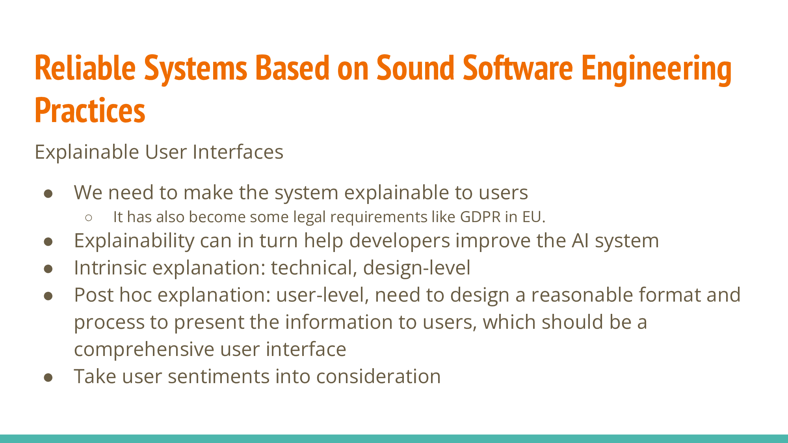</td>
</tr>
  <td colspan=1 align="center"><b></b></td>
</table>

Explainable user interfaces: 
1. Are difficult to achieve
2. Ensure system explainability for user understanding, meeting legal requirements
3. Intrinsic and post hoc explanations aid developer improvement. 
4. Design a comprehensive user interface, considering user sentiments
5. Post hoc: no information about the technical details of the model, but rather need a broad level idea of the system

<table><tr>
  <td>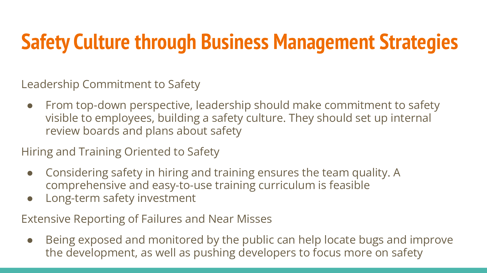</td>
</tr>
  <td colspan=1 align="center"><b></b></td>
</table>

There are five principles to build safety cultures, which are mostly top-down approaches (see slides).

Leadership: create a safe team, make commitment to safety that is visible to employees so they know leaders are committed to safety.

Long-term investment: need safe developers to develop safe models.

Public can help monitor and improve as it creates public/external pressure, so companies may work harder to eliminate issues.

<table><tr>
  <td>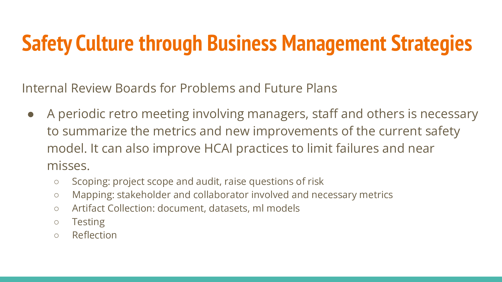</td>
</tr>
  <td colspan=1 align="center"><b></b></td>
</table>

Internal Review Boards engage stakeholders in setting benchmarks and to make improvements for problems and future planning.

<table><tr>
  <td>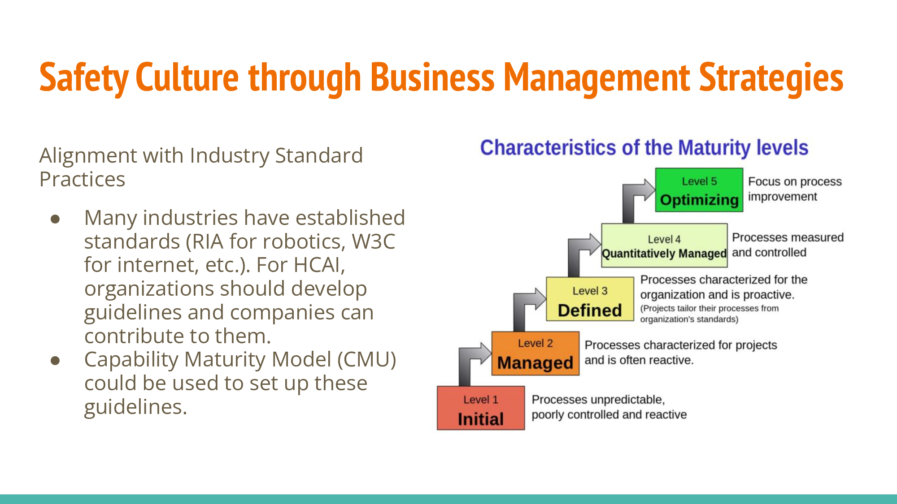</td>
</tr>
  <td colspan=1 align="center"><b></b></td>
</table>

<table><tr>
  <td>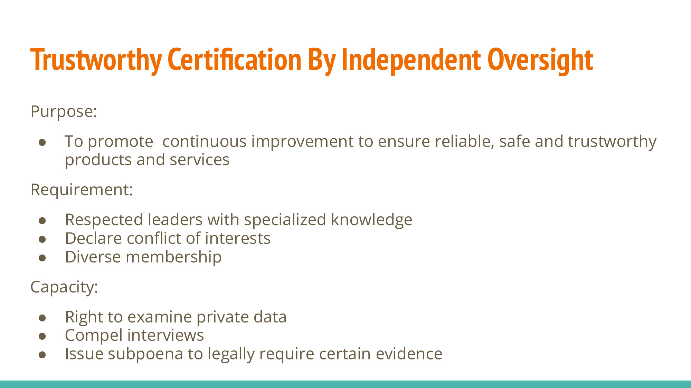</td>
</tr>
  <td colspan=1 align="center"><b></b></td>
</table>

Trustworthy certification by independent oversight:

- Purpose: Ensure continuous improvement for reliable, safe products. Helps to make a complete, trustworthy system. 

- Requirements: Respected leaders, conflict declaration, diverse membership.

- Capacity: Examine private data, conduct interviews, issue subpoenas for evidence.

<table><tr>
  <td>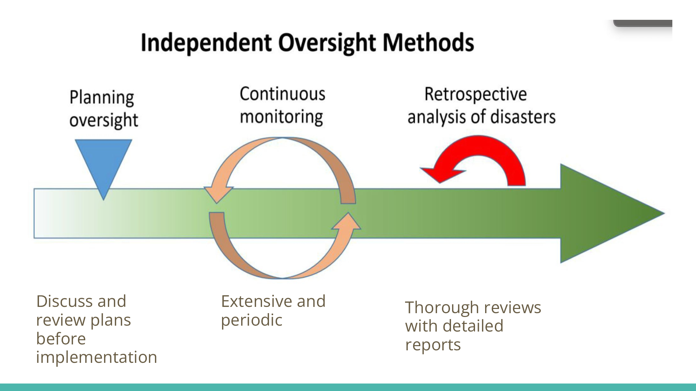</td>
</tr>
  <td colspan=1 align="center"><b></b></td>
</table>

Independent oversight is structured around three core methods: 
1. Planning 
2. Monitoring 
3. Conducting reviews or retrospectives

<table><tr>
  <td>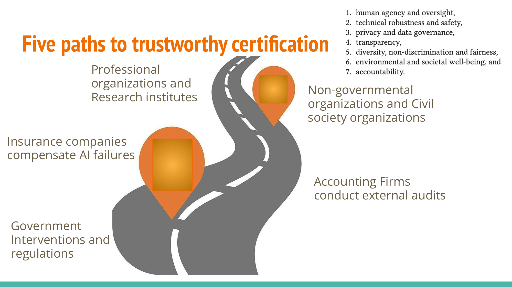</td>
</tr>
  <td colspan=1 align="center"><b></b></td>
</table>

There are five paths for Trustworthy certification
1. Government: Policy and Regulation, aligning with EU's seven key principles(list on the top right) for transparency, reliability, safety, privacy, and fairness

2. Accounting Firms: Beyond the internal audits mentioned previously, external bodies should audit the entire industry

3. Insurance Companies: Adapting policies for emerging technologies like self-driving cars (details on next slide)
4. Non-government organizations: prioritizing the public's interest
5. Professional organizations and research institutes

<table><tr>
  <td>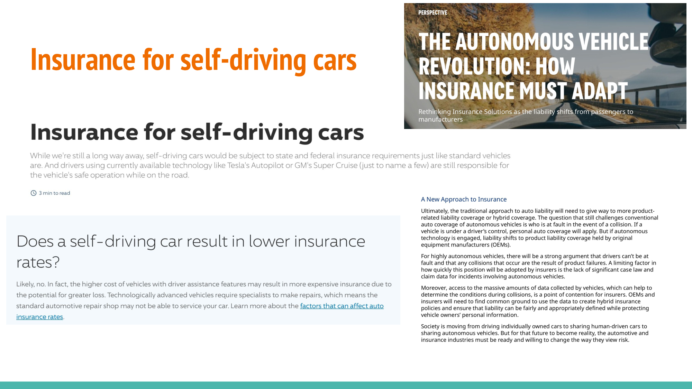</td>
</tr>
  <td colspan=1 align="center"><b></b></td>
</table>

<table><tr>
  <td>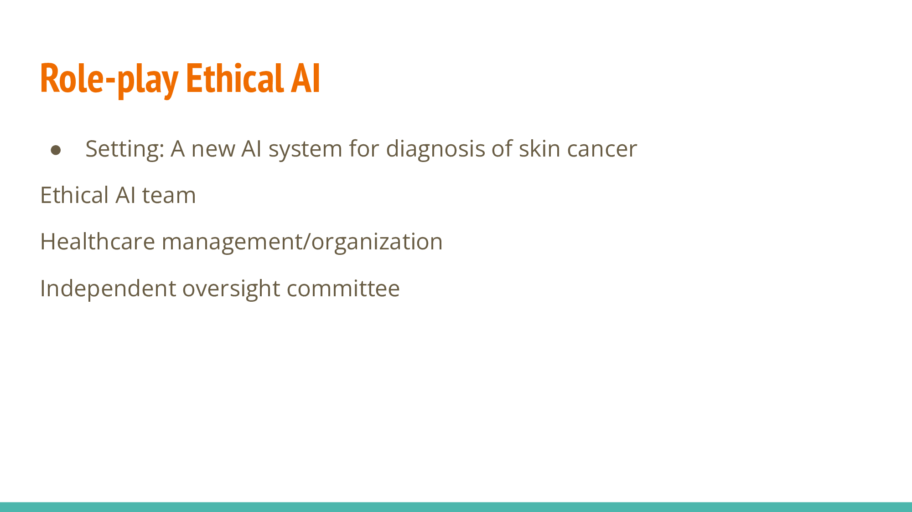</td>
</tr>
  <td colspan=1 align="center"><b></b></td>
</table>

As an activity, we tried role playing where each group will play different roles and think about following 15 principles in terms of “ethical AI”.

Ethical Team: 
1. Diagnosis for skin cancer, dataset quality is reliable (bias-skin color, state-laws passing for collecting data)
2. Various Metrics for evaluating AI
3. Come up an agreement with patients, doctors
   

Healthcare Management/Organization:
1. Reporting failures (missed diagnosis) for feedback
2. Data security, gathering FP, FN cases for further training
3. Educating staff
4. Establishing accuracy/certainty of threshold for AI diagnosing skin cancer, checking the standard of professional verification

Independent oversight committee：
1. Whether the dataset is not biased in every stage and is representing all race, gender, etc
2. Data source should be considered carefully (online, hospital)
3. Model explanation and transparency should be considered
4. Privacy of personal information of both the dataset and the users

<table><tr>
  <td>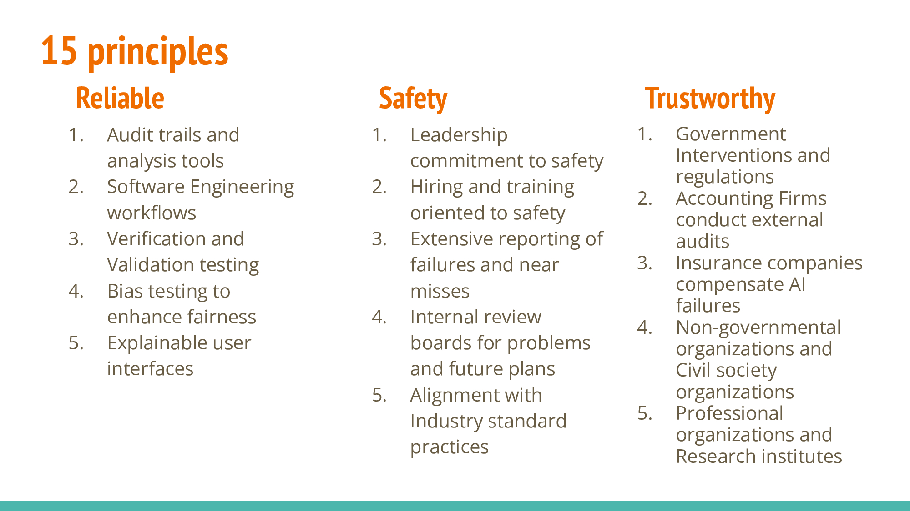</td>
</tr>
  <td colspan=1 align="center"><b></b></td>
</table>

There are 15 principles each group can take into consideration for the role-playing discussion.

<table><tr>
  <td>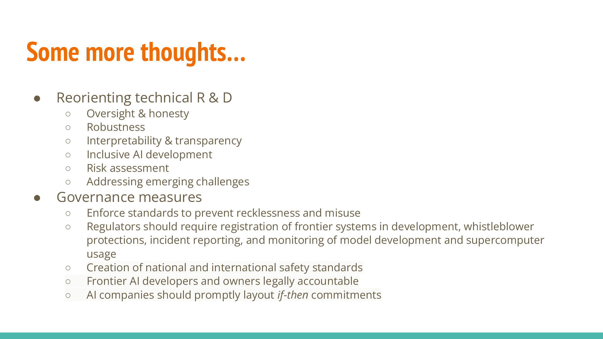</td>
</tr>
  <td colspan=1 align="center"><b></b></td>
</table>

Reorienting technical R&D emphasizes oversight, robustness, interpretability, inclusivity, risk assessment, and addressing emerging challenges. 

Proposed governance measures include enforcing standards to prevent misuse, requiring registration of frontier systems, implementing whistleblower protections, and creating national and international safety standards. Additionally, the accountability of frontier AI developers and owners, along with AI companies promptly disclosing if-then commitments, is highlighted.

<table><tr>
  <td>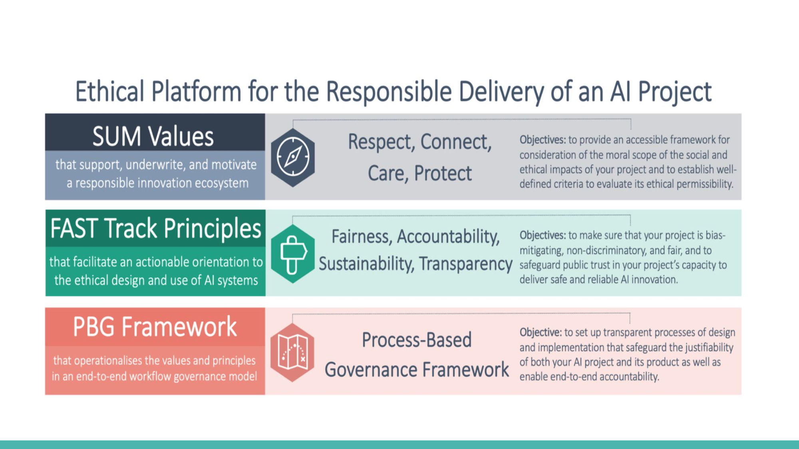</td>
</tr>
  <td colspan=1 align="center"><b></b></td>
</table>

There are some ethical platforms for developing responsible AI product
1. SUM Values: to provide a framework for moral scope of AI product 
2. FAST Track Principles: to make sure AI project is fair, bias-mitigating and reliable
3. PBG Framework: to set up transparent process of AI product

<table><tr>
  <td>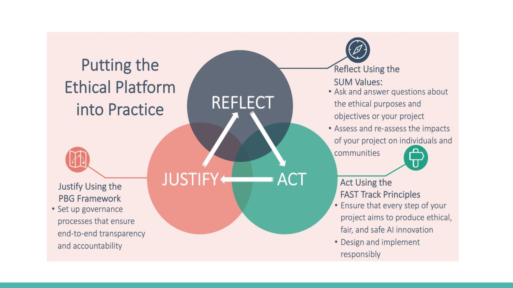</td>
</tr>
  <td colspan=1 align="center"><b></b></td>
</table>

Putting the Ethical Platform into Practice needs three key steps: reflect, act and justify:

1. Reflect using the SUM values: asking and answering questions about ethical purposes and assess the impacts of AI project
2. Act using FAST TRACK Principles: ensure every step of development produces safe, fair AI innovation
3. Justify Using the PBG Framework: set up governance process to ensure model transparency

<table><tr>
  <td>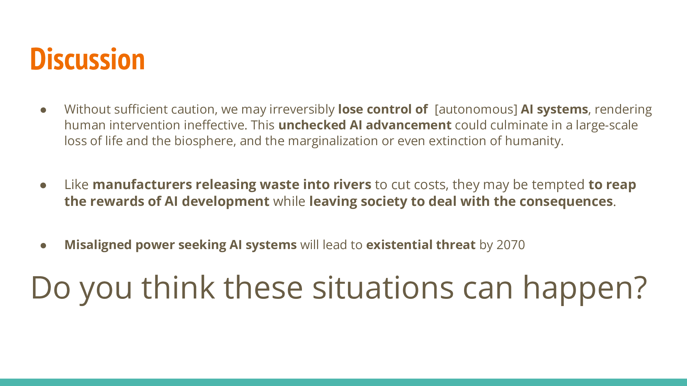</td>
</tr>
  <td colspan=1 align="center"><b></b></td>
</table>

#### Team 1
There are many trajectories that AI development could take, so it would be very difficult to completely discount something as a possibility. Related this to “Dark Matter” book by Blake Crouch.

Risk would primarily come from bad actors (specifically humans). Briefly touched on ‘what if the bad actor is the AI?’

#### Team 2
The potential downfall of humans would not be due to AI’s maliciousness.

In the post-autonomous era, concerns shift to the misuse of models for harmful purposes.

#### Team 3

The second question seems to be already happening.

Given the rapid technological progress in recent years, single prompt can result in losing control over AI models, and speculations around ‘Q*(Q-Star)’ suggest risk in losing control over AI models, however AI’s power-seeking behavior may still be overstated.

## Readings

- **`Required`**: Yoshua Bengio, Geoffrey Hinton, Andrew Yao, Dawn Song, Pieter Abbeel, Yuval Noah Harari, Ya-Qin Zhang, Lan Xue, Shai Shalev-Shwartz, Gillian Hadfield, Jeff Clune, Tegan Maharaj, Frank Hutter, Atılım Güneş Baydin, Sheila McIlraith, Qiqi Gao, Ashwin Acharya, David Krueger, Anca Dragan, Philip Torr, Stuart Russell, Daniel Kahneman, Jan Brauner, Sören Mindermann. [Managing AI Risks in an Era of Rapid Progress.](https://arxiv.org/abs/2310.17688) arXiv 2023. [PDF](https://arxiv.org/abs/2310.17688)
- **`Required`**: Ben Shneiderman. [Bridging the Gap Between Ethics and Practice: Guidelines for Reliable, Safe, and Trustworthy Human-centered AI Systems.](https://dl.acm.org/doi/abs/10.1145/3419764) ACM Transactions on Interactive Intelligent Systems, October 2020. [PDF](https://dl.acm.org/doi/abs/10.1145/3419764)
- **`Optional`**: David Leslie. [Understanding Artificial Intelligence Ethics And Safety.](https://arxiv.org/abs/1906.05684) arXiv 2019. [PDF](https://arxiv.org/abs/1906.05684)
- **`Optional`**: Joseph Carlsmith. [Is Power-Seeking AI an Existential Risk?.](https://arxiv.org/abs/2206.13353) arXiv 2022. [PDF](https://arxiv.org/abs/2206.13353)
- **`Optional`**: Alice Pavaloiu, Utku Kose. [Ethical Artificial Intelligence - An Open Question.](https://arxiv.org/abs/1706.03021) arXiv 2017. [PDF](https://arxiv.org/abs/1706.03021)
  
### Questions
**(Post response by Tuesday, 28 November)**

Paper 1: [Bridging the Gap Between Ethics and Practice](https://drive.google.com/file/d/1Ok16aNvNLbdkBexcmt9dyVGPEpKYGXbH/view)

1. The paper claims, “Human-centered Artificial Intelligence (HCAI) systems represent a second Copernican revolution that puts human performance and human experience at the center of design thinking." Do you agree with this quote?
2. Developers/teams, organizations, users and regulators often have different views on what constitutes reliability, safety, and trustworthiness in human-centered AI systems. What are the potential challenges and solutions for aligning them? Can you provide some specific examples where these views do not align?
   
Paper 2: [Managing AI Risks in an Era of Rapid Progress](https://arxiv.org/pdf/2310.17688.pdf)

3. Do you think AI systems can be regulated over an international governance organization or agreement like nuclear weapons?
4. Consider this quote from the paper: "Without sufficient caution, we may irreversibly lose control of autonomous AI systems, rendering human intervention ineffective. Large-scale cybercrime, social manipulation, and other highlighted harms could then escalate rapidly. This unchecked AI advancement could culminate in a large-scale loss of life and the biosphere, and the marginalization or even extinction of humanity." Do you agree with it? If so, do you think any of the measures proposed in the paper would be sufficient for managing such a risk? If not, what assumptions of the authors' that led to this conclusion do you think are invalid or unlikely?
