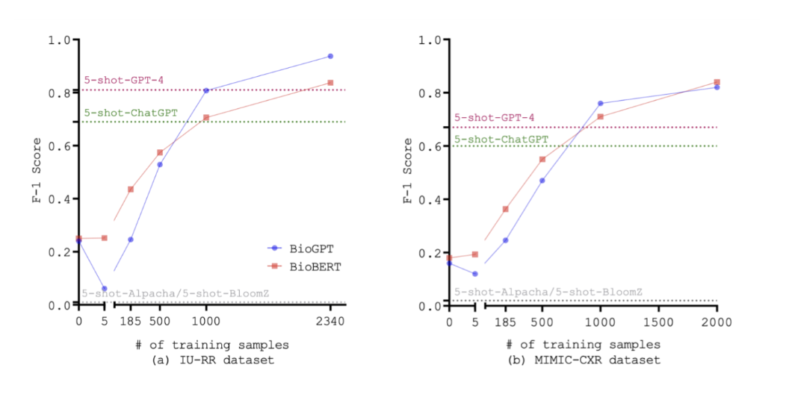

+++
date = "25 Sep 2023"
draft = true
title = "Week 4: Capabilities of LLMs"
slug = "week4"
+++

# Capabilities of LLMs (Week 4)

# Monday, September 18

This discussion was essential to highlight the distinction between large language models (LLMs) and fine-tuned models. The paper, Harnessing the Power of LLMs in Practice: A Survey on ChatGPT and Beyond[^1], defines LLMs as models trained on large amounts of data without a particular domain of application in mind and fine-tuned models as models trained on some general data in addition to data from a specific domain in which they will perform a particular task. They also highlighted a rule of thumb from the paper that LLMs typically have more than 20 billion parameters whereas fine-tuned models have fewer than 20 billion parameters.

The presenters then discussed how to go about choosing the model that is best for a task when there are so many available. They explored two ways of approaching this problem: one that considers the data, and another that considers the task.

The presenters highlighted three types of data to consider for a task: the pre-training data, the fine-tuning data, and the test data. They explained that if there is a model already pre-trained on data that is relevant to the task at hand, that model might be a good choice. In order for a dataset to be conducive to fine-tuning a model, the presenters explain that the data must be labeled and that there must be enough of it to sufficiently train the model. Otherwise, training an LLM would be better. The presenters noted, however, that fine-tuned models have been shown to perform better than LLMs on specific tasks when they have sufficient data to train on. The following Figure 1 shows that fine-tuned models performed better than LLMs after being trained on enough data:

<table><tr>
  <td></td>
</tr>
  <td colspan=1 align="center"> Figure 1 <b> <a href="https://arxiv.org/abs/2307.11346">(Image source)</a></b></td>
</table>

At this point, the professor prompted a discussion question asking whether wouldn’t it be better to do a more fair comparison by training on the same amount of data. The discussion went on and the presenters then continued talking about the practical guidelines from a task perspective.

The presenters explained that LLMs and fine-tuned models perform better on different tasks. According to a study from the paper Benchmarking Large Language Models for News Summarization [^6], LLMs perform better than fine-tuned models on text summarization according to the preferences of human raters. Additionally, LLMs perform better on tasks that require large amounts of knowledge from a variety of domains[^7]. In machine translation, however, fine-tuned models generally do better than LLMs, although they only do slightly better in low-resource settings[^7]. Additionally, the presenters explained that fine-tuned models and LLMs have similar performance when the task only requires very specific knowledge.

The presenters then posed the following question to the class: “How could we enhance LLM in the scenario where the required knowledge does not match their learned knowledge?” The class formed four groups to discuss the question. Each group then shared a summary of what they had discussed:

Group 1: Discussed enhancements in both training and testing. For testing, use intentional prompts to get the knowledge you want from the model. For training, adding more training data, using a knowledge graph to classify knowledge into different clusters for ease of search, and using a plug-in, as mentioned in the GitHub discussion.

Group 2: Advocated for enhancement through the model's ability to retrieve information from external sources and undergo fine-tuning.

Group 3: Emphasized the significance of using more extensive datasets and guiding models through example-based prompts to extract additional knowledge from the available data.

Group 4: Proposed refining model performance through fine-tuning and deliberately specifying the model's role within a chat setting to steer it toward specific tasks.

The presenters also mentioned that LLMs perform arithmetic better as they grow larger and that LLMs are better at commonsense reasoning than fine-tuned models[^2].

The presenters then moved to a discussion of Chat-GPT plug-ins. They established that LLMs are not able to keep up with current knowledge and facts and that they mainly handle text data as opposed to image data, audio, and other data formats. They also explained that while LLMs may be able to generate instructions for a human to follow to complete a task, they are often unable to follow those instructions and complete the tasks themselves. This is where plug-ins come in.

Plug-ins allow LLMs to access data outside of what they have already learned, for example, by searching the web. The presenters show two videos demonstrating the ability of plug-ins to search the web (https://openai.com/blog/chatgpt-plugins#browsing) and write code (https://openai.com/blog/chatgpt-plugins#code-interpreter). They also showed a video of how Chat-GPT can use plug-ins from outside OpenAI to complete tasks with specific instructions, namely, finding a restaurant, then a recipe, then calculating the number of calories in the recipe (https://openai.com/blog/chatgpt-plugins#third-party-plugins).

The class then formed groups and spent 25 minutes designing custom plug-ins. Each group then shared their plug-in with the class:

Group 1: Created a plug-in that allows a user to make DIY furniture or buy new furniture by submitting an image of something they would like to make from scratch or buy and returning either a link to a similar piece of furniture or a video/instructions on how to build a piece of furniture similar to the one in their image (Figure 2).

<table><tr>
  <td></td>
</tr>
  <td colspan=1 align="center"> Figure 2 <b>Group 1 Ideation </b></td>
</table>

Group 2: Suggested a plug-in that generates the profile of a fake person with a fake social media account. Essentially, it aimed to create a convincing online persona that would resemble a real person but was entirely fictional.

Group 3: Created a plug-in that uses a person’s portfolio/resume to match them with different jobs serving as an ultimate career support tool (Figure 3). It assisted users in job search by matching them with relevant job openings, provided tailored preparation materials for interviews, offered resume/portfolio editing guidance, and provided opportunities to expand their professional network. Essentially, it aimed to equip individuals with the tools and resources needed to enhance their career prospects.

<table><tr>
  <td></td>
</tr>
  <td colspan=1 align="center"> Figure 3 <b>Group 3 Ideation </b></td>
</table>

Group 4: Shared the concept of a plug-in that allows a user to find the taxonomy of a particular research paper, and place it in a research area. Moreover, it offered the valuable function of returning related papers, thus assisting users in discovering additional relevant research in their field of interest.

The discussion on Monday concluded with the class appreciating each other’s ideas on the possibilities of using plug-ins but also their limitations and associated risks. This exchange of perspectives and ideas highlighted the creative ways in which technology and AI-driven tools could be used to address various challenges and opportunities across different domains. 

[^1]: Jingfeng Yang, Hongye Jin, Ruixiang Tang, Xiaotian Han, Qizhang Feng, Haoming Jiang, Bing Yin, Xia Hu. Harnessing the Power of LLMs in Practice: A Survey on ChatGPT and Beyond. April 2023. https://arxiv.org/abs/2304.13712.
[^2]: OpenAI. GPT-4 Technical Report. March 2023. https://arxiv.org/abs/2303.08774
[^3]: Karan Singhal, Tao Tu, Juraj Gottweis, Rory Sayres, Ellery Wulczyn, Le Hou, Kevin Clark, Stephen Pfohl, Heather Cole-Lewis, Darlene Neal, Mike Schaekermann, Amy Wang, Mohamed Amin, Sami Lachgar, Philip Mansfield, Sushant Prakash, Bradley Green, Ewa Dominowska, Blaise Aguera y Arcas, Nenad Tomasev, Yun Liu, Renee Wong, Christopher Semturs, S. Sara Mahdavi, Joelle Barral, Dale Webster, Greg S. Corrado, Yossi Matias, Shekoofeh Azizi, Alan Karthikesalingam, Vivek Natarajan. Towards Expert-Level Medical Question Answering with Large Language Models https://arxiv.org/abs/2305.09617
[^4]: Harsha Nori, Nicholas King, Scott Mayer McKinney, Dean Carignan, Eric Horvitz. Capabilities of GPT-4 on Medical Challenge Problems. March 2023. https://arxiv.org/abs/2303.13375
[^5]: Travis Zack, Eric Lehman, Mirac Suzgun, Jorge A. Rodriguez, Leo Anthony Celi, Judy Gichoya, Dan Jurafsky, Peter Szolovits, David W. Bates, Raja-Elie E. Abdulnour, Atul J. Butte, Emily Alsentzer. Coding Inequity: Assessing GPT-4’s Potential for Perpetuating Racial and Gender Biases in Healthcare. July 2023. https://www.medrxiv.org/content/10.1101/2023.07.13.23292577 
[^6]: Tianyi Zhang, Faisal Ladhak, Esin Durmus, Percy Liang, Kathleen McKeown, and
Tatsunori B. Hashimoto. Benchmarking large language models for news summarization,
2023. https://arxiv.org/abs/2301.13848
[^7]: Aakanksha Chowdhery, Sharan Narang, Jacob Devlin, Maarten Bosma, Gaurav
Mishra, Adam Roberts, Paul Barham, Hyung Won Chung, Charles Sutton, Sebastian
Gehrmann, Parker Schuh, Kensen Shi, Sasha Tsvyashchenko, Joshua Maynez, Abhishek
Rao, Parker Barnes, Yi Tay, Noam Shazeer, Vinodkumar Prabhakaran, Emily Reif,
Nan Du, Ben Hutchinson, Reiner Pope, James Bradbury, Jacob Austin, Michael Isard,
Guy Gur-Ari, Pengcheng Yin, Toju Duke, Anselm Levskaya, Sanjay Ghemawat, Sunipa
Dev, Henryk Michalewski, Xavier Garcia, Vedant Misra, Kevin Robinson, Liam Fedus,
Denny Zhou, Daphne Ippolito, David Luan, Hyeontaek Lim, Barret Zoph, Alexan-
der Spiridonov, Ryan Sepassi, David Dohan, Shivani Agrawal, Mark Omernick, An-
drew M. Dai, Thanumalayan Sankaranarayana Pillai, Marie Pellat, Aitor Lewkowycz,
Erica Moreira, Rewon Child, Oleksandr Polozov, Katherine Lee, Zongwei Zhou, Xuezhi Wang, Brennan Saeta, Mark Diaz, Orhan Firat, Michele Catasta, Jason Wei, Kathy
Meier-Hellstern, Douglas Eck, Jeff Dean, Slav Petrov, and Noah Fiedel. Palm: Scaling
language modeling with pathways, 2022. https://arxiv.org/abs/2204.02311

