+++
date = "16 Oct 2023"
draft = true
title = "Week 7: GANs and DeepFakes"
slug = "week6"
+++

(see bottom for assigned readings and questions)

# GANS and DeepFakes (Week 7)

<author>Presenting Team: Aparna Kishore, Elena Long, Erzhen Hu, Jingping Wan </author>

<author>Blogging Team: Haochen Liu, Haolin Liu, Ji Hyun Kim, Stephanie Schoch, Xueren Ge </author>
# Monday, October 9th: Generative Adversarial Network and DeepFakes

  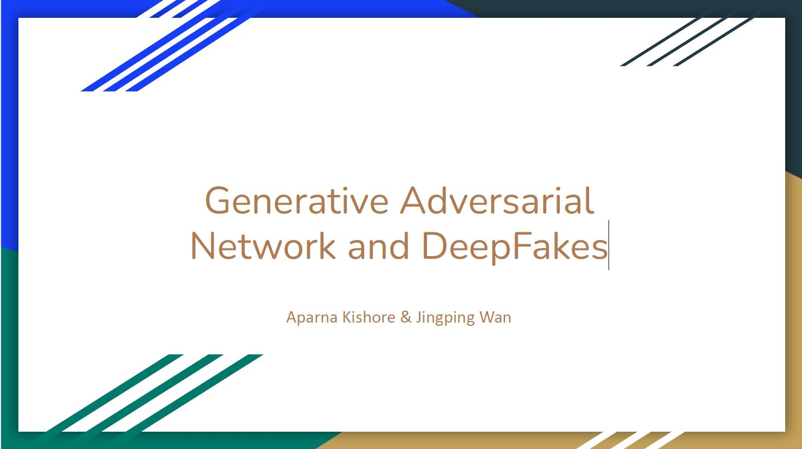
  
Today's topic is how to utilize generative adversarial networks to create fake images and how to identify the images generated by these models.

  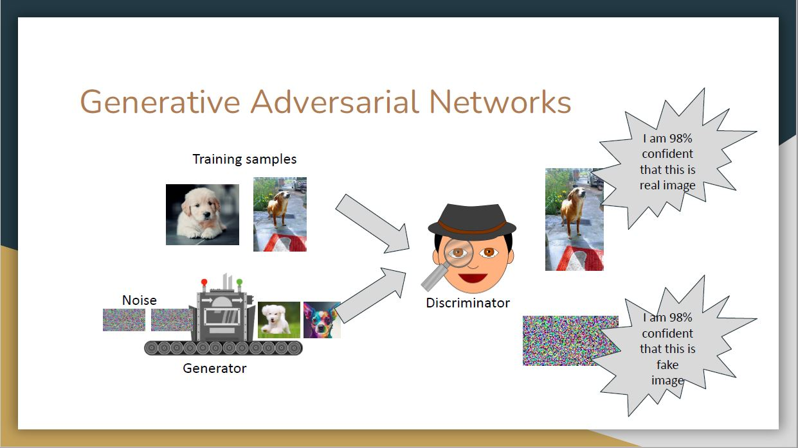
  
Generative Adversarial Network (GAN) is a revolutionary deep learning framework that pits two neural networks against each other in a creative showdown. One network, the generator, strives to produce realistic data, such as images or text, while the other, the discriminator, aims to differentiate between genuine and generated data. Through a continuous feedback loop, GANs refine their abilities, leading to the generation of increasingly convincing and high-quality content.

  
  
To ensure students have a better understanding of GANs. The leading team held a “GAN Auction Game” to simulate the generating and predicting process of the generator and discriminator in GAN. In this game, students are divided into two groups (Group 1 and Group 2). Group 1 will provide three items (e.g. the name of a place) while Group 2 tries to identify whether the items provided are real or fake. In that case, Group 1 plays as the generator while Group 2 serves as the discriminator. During the game, Group 2 will assign a price to each item Group 1 proposes. A correct assessment of an item's veracity earns the corresponding price, whereas a misjudgment causes a loss of the same amount. After two rounds, the groups exchange roles and play for two more rounds. The detailed process of the game is summarized in the following table.

  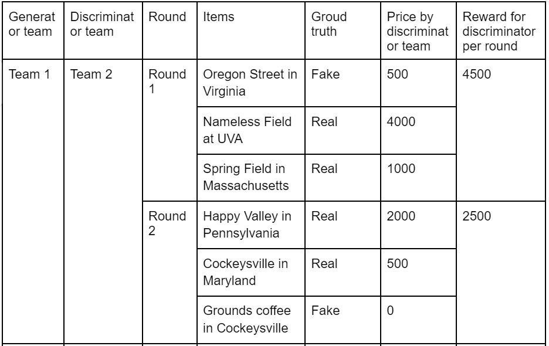
  

  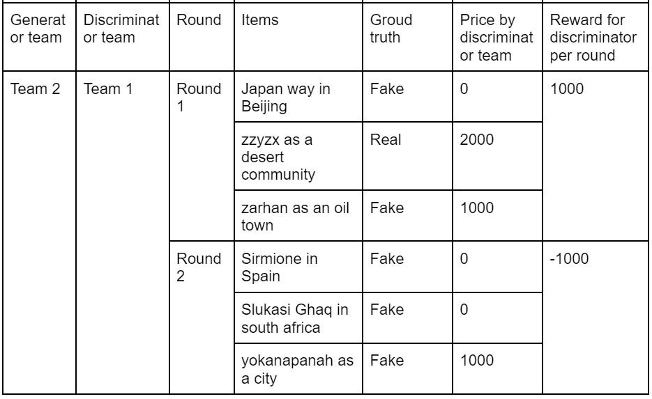
  
This game captures the training process of GANs where the generator first proposes certain contents (e.g. images or contexts) and the discriminator is trained to identify the real content. If the generator successfully creates contents that cheat the discriminator, it will receive a high reward for further tuning. On the other hand, if the discriminator correctly identifies the content created by the generator. It will also get a large reward (the price in this auction game).  This iterative training process can be explained by the figures below.

  
  

  
  

  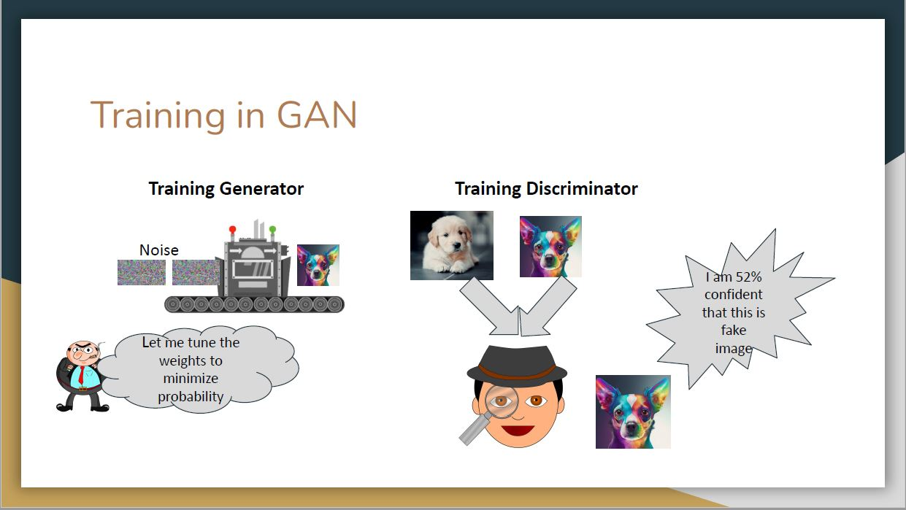
  

  
  
Formally, the training process can be modeled as a two-player zero-sum game by conducting min-max optimization on the objective function.A Nash equilibrium will be established between generator and discriminator.

  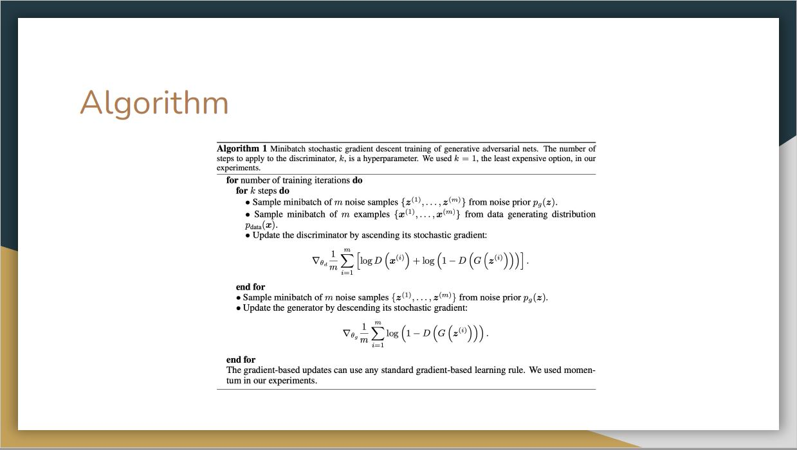
  
The detailed training algorithm is shown here, in which the discriminator and generator update iteratively.

  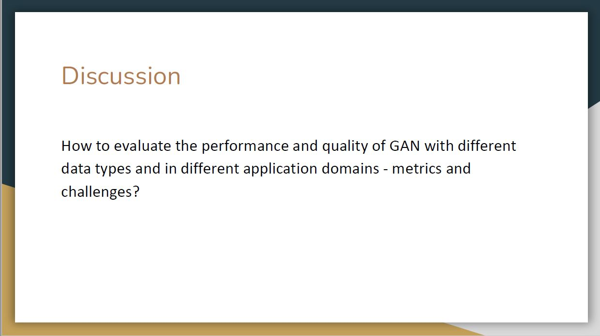
  
Generally speaking, for a system that only has generators and discriminators, it is hard to tell whether they are doing well because there are many bad local optima. Thus, one direct way is to introduce human feedback for evaluating. For example, we can borrow strategies from Large Language Models (LLMs), particularly employing Reinforcement Learning from Human Feedback (RLHF). In this method, experts would iteratively rank the generated samples, offering direct reinforcement signals to improve the generator's output. This approach could enhance the realism and semantic alignment of the content created by GANs. However, the RLHF method has its drawbacks, primarily the extensive need for expert involvement, raising concerns about its scalability in larger evaluations. An alternative could be the inclusion of non-expert users, offering a broader range of feedback. Crowdsourcing and user studies are suggested as methods to understand if the generated content meets the target audience's needs and preferences.

For images or tabular data, when the data distribution is roughly known, inception score serves as an useful metric. This score calculates the KL divergence between the conditional class distribution and the marginal class distribution of generated samples. A higher IS indicates clearer and more diverse images. However, it doesn't always correlate with human judgment.

  
  
Generative Adversarial Networks (GANs) also face crucial challenges:

<ol>
<li>
Vanishing/Exploding Gradient: During backpropagation, gradients can shrink (vanish) or grow excessively (explode), disrupting learning. Vanishing gradients stall the network's learning, as parameter updates become negligible. Exploding gradients cause extreme, destabilizing updates, hindering the model's convergence.

</li>
<li>
Mode Collapse: GANs can suffer from mode collapse, where the generator produces limited, similar samples, failing to represent the data's true diversity. This occurs when the generator exploits the discriminator's weaknesses, concentrating on certain data aspects and neglecting others. It compromises the GAN's objective of generating diverse, realistic samples, indicating a breakdown in adversarial learning.

</li>
</ol>

  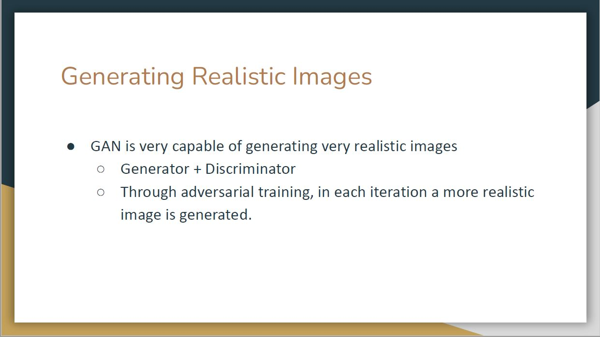
  
After the general introduction of GANs, the leading team then focuses on utilizing GANs to generate realistic images, which is regarded as one of the most important applications of GANs. GANs are very powerful to generate fake images.

  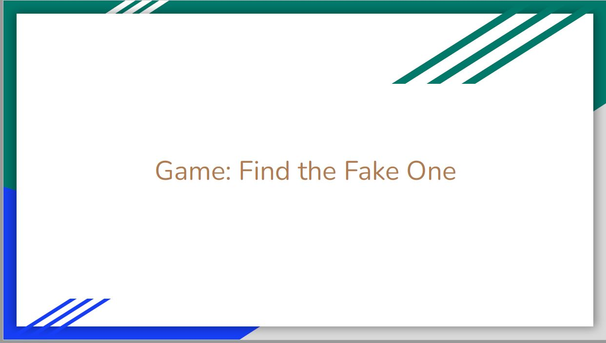
  
A warm-up game is to identify the fake person that is generated by GANs.

  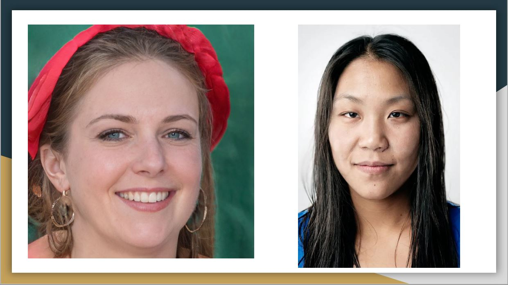
  
In the above figure, one of the two faces is fake but it is difficult to identify at first glance.

  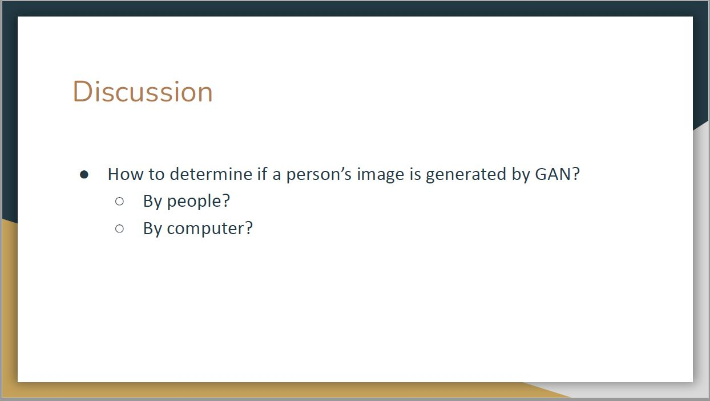
  
To successfully identify fake images, there are several methods that either use deep-learning-based models to learn to identify fake samples, or through direct observation by people. The leading team then introduces three interesting methods that enable us to tell the difference. We will revisit these two faces later and now focus on the detailed methods to do general identification.

  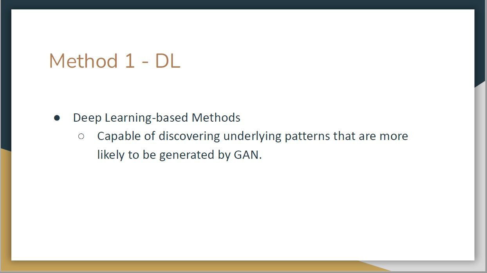
  
The first method is utilizing deep learning which discover underlying patterns that are more likely to be generated by GAN. 

  
  
For example, images generated by GANs tend to contain color artifacts or invisible artifacts that can be identified by deep learning models.

  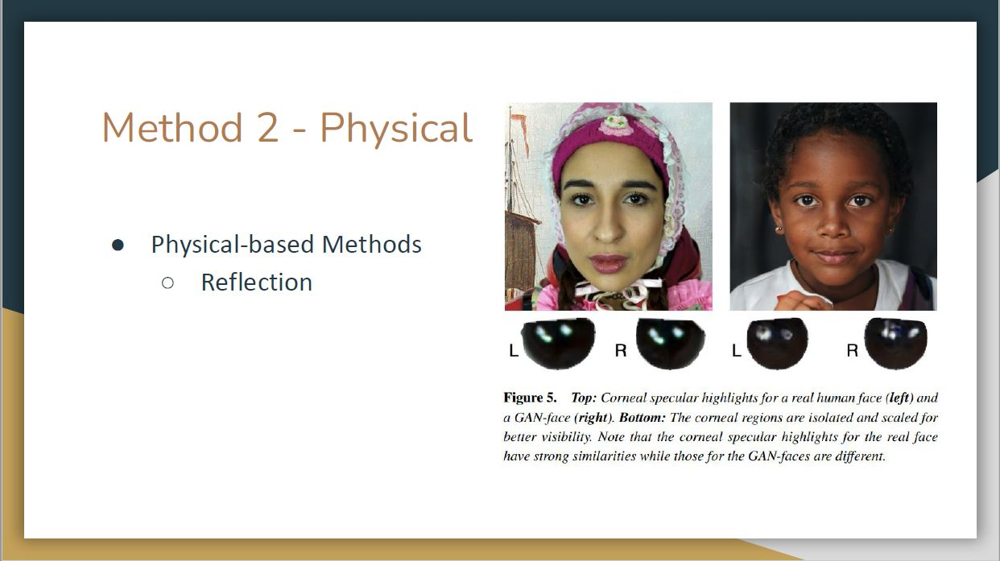
  
The second method is physical-based. Namely, the corneal specular highlights for the real face have strong similarities while those for the GAN-faces are different.

  
  
The third method is physiological-based. Specifically, the pupils for the real eyes have strong circular shapes while the GAN-generated pupils usually have irregular shapes.

  
  
With the help of these methods, we can say that the left woman in the figure we showed before is fake. This can be justified by color artifacts of GAN-image identified from deep learning and her irregular pupils.

  
  
The leading team also believes that these identification methods can be escaped by more advanced image-generating models but new methods will also be proposed accordingly to distinguish images generated by these advanced models. The generation and identification will evolve together.

  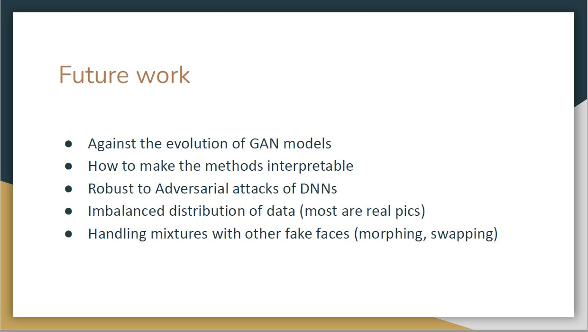
  
In summary, generative models such as GANs have fundamentally transformed people's lives, and there remains a substantial amount of future research and development ahead. Some future directions are listed above.

# Wednesday, October 11th: Creation and Detection of DeepFake Videos

  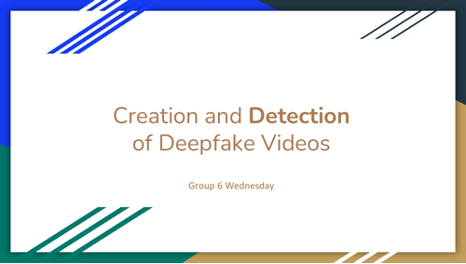
  
 Today’s topic is creation and detection of deepfake videos. 

  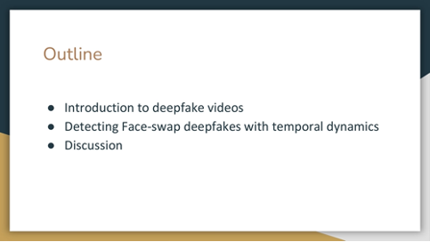
  
 There are three aspects to be covered:  
  <ol>
  <li>Introduction to deepfake videos</li>
  <li>Detecting Face-swap deepfakes with temporal dynamics</li>
  <li>Discussion</li>
  </ol>
  

  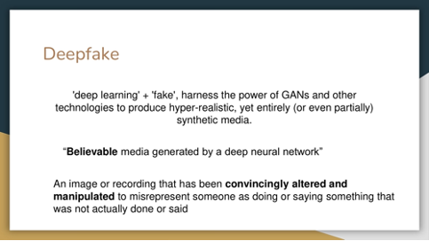
  
 Definition of a deepfake: A deceptive image or recording that distorts reality to deceive.
  

  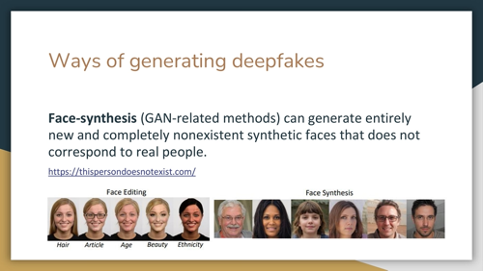
  
 Ways of generating deepfakes: Generative models (GANS, diffusion models, etc.)
  

  
  
 There are some side effects of face swap methods, including
  <ul>
  <li> Limited accuracy </li>
  <li> Concerns of how to protect privacy </li>
  </ul>
  

  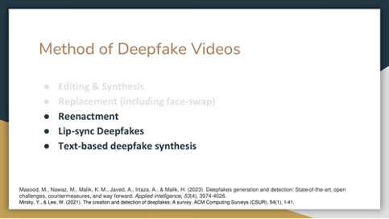
  
 The presenters introduce three different methods of generating deepfake videos:
  <ol>
  <li> Reenactment </li>
  <li> Lip-sync deepfakes </li>
  <li> Text-based deepfake synthesis </li>
  </ol>
  

  
  
 Reenactment: A deepfake reenacts using source images to manipulate the target.
  

  
  
 Example of a reenactment: the mouth movement in Trump's video is animated by a source actor.
  

  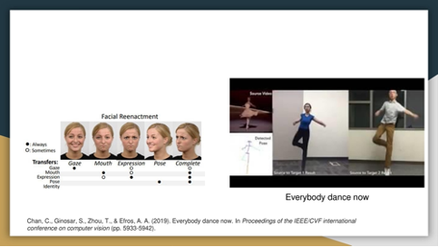
  
Here is another example of Reenactment, where the dancing in target video is animated by a source actor.

  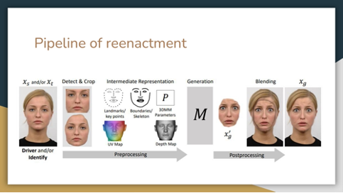
  
 Three main steps of reenactment:
  <ol>
  <li> The first step is tracking facial features in both source and target videos. </li>
  <li> A consistency measure aligns input video features with a 3D face model. </li>
  <li> Expressions are transferred from source to target with refinement for realism. </li>
  </ol>
  

  
  
 Difference between face swap and reenactment: 
  <ul>
  <li> Difference is about the target image. Face swap retains part of the source image, but reenactment does not retain the background source image</li>
  </ul>
  

  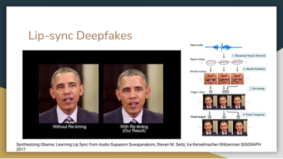
  
 Most methods use RGB images, while lip-sync relies on audio input.
  <ul>
  <li> Audio is transformed into a dynamic mouth shape. </li>
  <li> The mouth texture is matched with the target video for natural motion. </li>
  </ul>
  

  
  
 Text-based methods modify videos per word, **phonemes** and **visemes** are key for pronunciation and analysis. Text edits are matched with phoneme sequences in the source video. Parameters of the 3D head model are used to smooth lip motions.
  

  
  
 While previous works have done a lot, an overlooked aspect in the creation of these deep-fake videos is the human ear. Here is one recent work trying to tackle this problem from the aspect of ear.
  

  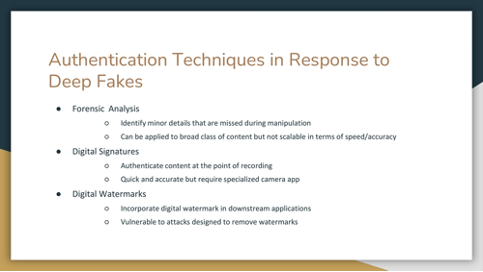
  
 In response to deepfake generally and manipulated content, roughly three types of authentication techniques are proposed:
  <ul>
  <li> Forensic  Analysis </li>
  <li> Digital Signatures </li>
  <li>Digital Watermarks </li>
  </ul>
  

  
  
 Today, our focus is on forensic methods to detect deep fakes. These methods can be categorized into low- and high-level approaches.
  

  
  
 The presenters asked the class to find criterias to identify an authentic picture of Tom Cruise. In the discussion, several factors were highlighted:
  <ul>
  <li> <i>Posture</i> of the third picture is unnatural.</li>
  <li><i>Foggy background</i> of first picture vs. <i>Realistic background</i> of the second picture</li>
  <li><i>Scale/ratio</i> of head and hand is odd in the third picture</li>
  </ul>
  During the class poll to determine which image appeared authentic, the majority of students voted for the second image, with a few supporting the first, and none voting for the third. Surprisingly, contrary to the class’s expectations, it was revealed that the first image was genuine, while the others were crafted by a TikTok user in creating deep fake content.
  

  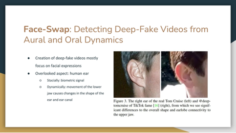
  
 Many deep fake videos emphasizing facial expressions often neglect the intricate movements of the human ear and the corresponding changes that occur in jaw movements.
  

  
  
 The aural dynamics system tracks and annotates ear landmarks, utilizing averaged local aural motion to simulate both horizontal and vertical movements, mirroring those of a real person.
  

  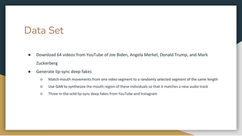
  
 With the videos of Joe Biden, Angela Merkel, Donald Trump, and Mark
Zuckerberg, they used GAN to synthesize the mouth region of individuals to match the new audio track and generate a lip-sync video.
  

  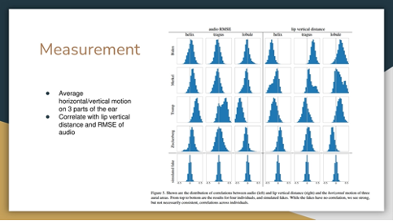
  
 The graphs are a distribution of the correlation of horizontal motion of three aural areas and audio (left) and lip vertical distance (right). 

  
Fake ones have no correlation, where individuals have strong correlation that are not necessarily consistent. 

  
  
 The horizontal movement of the tragus and lobule parts of Trump’s ears exhibited a positive correlation, distinguishing it as a distinctive personal trait, unlike the general pattern observed on others.
  

  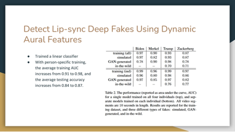
  
 The table shows the performance of each model. Models with person-specific training show a higher average testing accuracy.
  

  
  
 Question 1: Limitations of the proposed methods & possible improvements
  <ul>
  <li> Group 1: Poor evaluation on high-quality videos, their training dataset is low-quality. </li>
  <li> Group 2: Ear detection is only possible when ear is visible. </li>
  <li> Group 3: Dependent on visibility of ear and having a reference image; ability to generalize to other situations, i.e.: smaller sample sizes; you could find an actor whose biometric markers were more similar to the desired image. </li>
  </ul>
  

  
  
 As mentioned, there are drawbacks such as when hair is hiding the movement of ears, large head movement, and accurate ear tracking is difficult. Still, more facial and audio signals can be further studied.
  

  
  
 Question 2: Anomalies found from deep fake videos
  <ul>
  <li> Group 2: 
  <ul> 
  <li> <i>Shape of the mouth</i> is generally the same; it just expands and reduces in size to mimic mouth movements when speaking. Thus the bottom teeth is never shown. </li>
  <li><i>Light reflection on glasses</i> when reporters move their head is not generated. </li>
  <li><i>Lips not synced</i> properly (the word editing does not match).</li>
  </ul> 
  </li>
  <li> Group 3:
  <ul>
  <li> Fake video 1:
  <ul>
  <li>Lips seem constrained</li>
  <li>Eye blinking robotic, no change iin width</li>
  <li>Lack of nostril changes</li>
  </ul>
  </li>
  <li>Fake video 2:
  <ul>
  <li>Mouth/teeth</li>
  <li>Symmetry</li>
  </ul>
  </li>
  </ul>
  </li>
  </ul>
  

  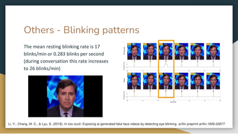
  
 The speaker of the first video does not blink for over 6 seconds, which is impossible. The average resting blinking rate should be 0.283 per second.
  

  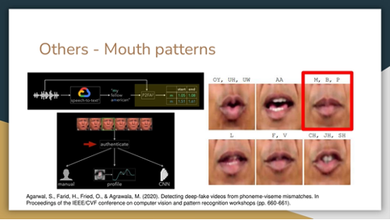
  
 The second speaker’s lips are not closing for ‘m,’ ‘b,’ and ‘p’ (Phonemes-Visemes).
  

  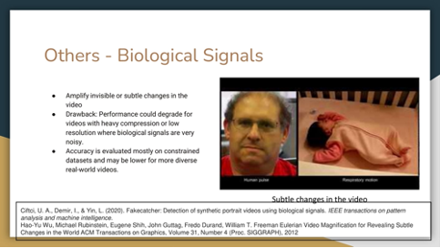
  
 Human pulse and respiratory motions are imperceptible to the human eye. Amplifying these factors could serve as a method for detecting generated videos.
  

  
 **Note:** Originally designed for medical purposes, aiming to identify potential health risks. 

  
  
 
  <ul> 
  <li> <i>Group 1:</i> The “arm-race” is win-win development for both groups. Generation and detection will learn from the feedback of each side. </li>
  <li><i>Group 2:</i> There always will be a case where humans get creative and find out ways to improve and get away with detection, as fraud detection does. Optimally, if people don’t use it in an unethical way, it can be useful in various ways like the film industry.</li>
  <li><i>Group 3:</i> What if big companies become attackers (even for research purposes)?</li>
  </ul>
  

  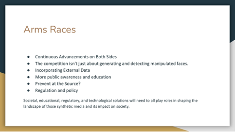
  
 Both the technology and ways to detect deep-fake videos will continue to advance.
However, it requires more than simply trying to generate and identify them.
By using watermarks, deep-fake videos can be distinguished from the source. Furthermore, public education on teaching importance on collecting information from the correct source and further government regulations can be considered.
  

# Readings

### For the first class (10/9)

- Ian J. Goodfellow, Jean Pouget-Abadie, Mehdi Mirza, Bing Xu, David Warde-Farley, Sherjil Ozair, Aaron Courville, Yoshua Bengio. [_Generative adversarial nets_](https://arxiv.org/abs/1406.2661). 2014.
- Xin Wang, Hui Guo, Shu Hu, Ming-Ching Chang, Siwei Lyu. [_GAN-generated Faces Detection: A survey and new perspectives_](https://arxiv.org/abs/2202.07145). 2022.

### For the second class (10/11)

- Shruti Agarwal and Hany Farid. [_Detecting deep-fake videos from aural and oral dynamics_](https://openaccess.thecvf.com/content/CVPR2021W/WMF/html/Agarwal_Detecting_Deep-Fake_Videos_From_Aural_and_Oral_Dynamics_CVPRW_2021_paper.html). CVPR 2023.

## Optional Additional Readings

- Dilrukshi Gamage, Piyush Ghasiya, Vamshi Krishna Bonagiri, Mark E Whiting, and Kazutoshi Sasahara. [_Are Deepfakes Concerning? Analyzing Conversations of Deepfakes on Reddit and Exploring Societal Implications_](https://dl.acm.org/doi/10.1145/3491102.3517446). In CHI Conference on Human Factors in Computing Systems (CHI ’22), April 29-May 5, 2022, New Orleans, LA, USA. ACM, New York, NY, USA, 19 pages.
- Sina Alemohammad, Josue Casco-Rodriguez, Lorenzo Luzi, Ahmed Imtiaz Humayun, Hossein Babaei, Daniel LeJeune, Ali Siahkoohi, Richard G. Baraniuk. [_Self-Consuming Generative Models Go MAD_](https://arxiv.org/abs/2307.01850).
- Momina Masood, Marriam Nawaz, Khalid Mahmood Malik, Ali Javed, Aun Irtaza. [_Deepfakes generation and detection: State-of-the-art, open challenges, countermeasures, and way forward_](https://arxiv.org/abs/2103.00484). Applied Intelligence, June 2022.

### On GAN Training

- Salimans, T., Goodfellow, I., Zaremba, W., Cheung, V., Radford, A., & Chen, X. (2016). [_Improved techniques for training gans_](https://papers.nips.cc/paper_files/paper/2016/file/8a3363abe792db2d8761d6403605aeb7-Paper.pdf)
- Arjovsky, M., & Bottou, L. (2017). [_Towards principled methods for training generative adversarial networks_](https://openreview.net/pdf?id=Hk4_qw5xe)
- Shumailov, I., Shumaylov, Z., Zhao, Y., Gal, Y., Papernot, N., & Anderson, R. (2023). [_The Curse of Recursion: Training on Generated Data Makes Models Forget_](https://arxiv.org/abs/2305.17493)

### Blogs and Tutorials

- [_How Generative Adversarial Network Works_](https://medium.datadriveninvestor.com/how-generative-adversial-network-works-3ddce0062b9)
- [_Increasing threat of deepfake identities_](https://www.dhs.gov/sites/default/files/publications/increasing_threats_of_deepfake_identities_0.pdf)

# Discussion Questions

**For Monday's class:** (as usual, post your response to at least one of these questions, or respond to someone else's response, or post anything you want that is interesting and relevant, before 8:29pm on Sunday, 8 October)

1. How might the application of GANs extend beyond image generation to other domains, such as text, finance, healthcare (or any other domain that you can think of) and what unique challenges might arise in these different domains? How can the GAN framework ensure fairness, accountability, and transparency in these applications?
2. Considering the challenges in evaluating the performance and quality of GANs, how might evaluation metrics or methods be developed to assess the quality, diversity, and realism of the samples generated by GANs in a more robust and reliable manner? Additionally, how might these evaluation methods account for different types of data (e.g., images, text, tabular
etc.) and various application domains?
3. The authors identify 2 methods of detecting GAN-based images: physical and physiological. Is it possible that we can train a new model to modify a GAN-based image to hide these seemingly obvious flaws, like the reflection and pupil shapes? Will this approach quickly invalidate these two methods?
4. Do you agree with the authors that deep-learning based methods lack interpretability? Is the visible or invisible patterns detected by DL models really not understandable or explainable?

**Questions for Wednesday's class:** (post response by 8:29pm on Tuesday, 10 October)

1. What are the potential applications for the techniques discussed in the Agarwal and Farid paper beyond deep-fake detection, such as in voice recognition or speaker authentication systems?
2. How robust are the proposed ear analysis methods to real-world conditions like different head poses, lighting, occlusion by hair?
3. What are your ideas for other ways to detect deepfakes?
4. Deepfake detection and generation seems similar to many other "arms races" between attackers and defenders. How do you see this arms race evolving? Will there be an endpoint with one side clearly winning?