+++
date = "22 Oct 2023"
draft = false
title = "Week 8: Machine Translation"
slug = "week8"
+++

(see bottom for assigned readings and questions)

# Machine Translation (Week 8)
<author>Presenting Team: Ajwa Shahid, Caroline Gihlstorf, Changhong Yang, Hyeongjin Kim, Sarah Boyce</author>

<author>Blogging Team: Xindi Guo, Mengxuan Hu, Tseganesh Beyene Kebede, Zihan Guan</author>

# Monday, 16 Oct: <br> A Deep Dive into the History and Survey of Machine Translation
Let's kick off this topic with an activity that involves translating an English sentence into a language of your choice and subsequently composing pseudocode to describe the process.

<div class="slide">
  
</div>

Here is an example of pseudocode from the activity:

```angular2html
Sentence = "The students like to read interesting books."
# The bilingual dictionary from English to Chinese: Eng_chinese_dict
Translation = []
for word in Sentence.split():
    if word in Eng_chinese_dict:
        Translation.append(Eng_chinese_dict[word])
    else:
        Translation.append(word)
Translated_sentence = " ".join(Translation)
```

After the activity discussion, here are the challenges encountered when translating from English to another language:
- Variations in Word Order: Different languages have varying word orders, affecting sentence structure.
- Idiomatic Expressions: Idioms and phrases may lack direct equivalents in other languages, requiring creative translation.
- Plurality and Gender: Managing plural forms and gender variations can be complex across languages.
- Verb Conjugations: Verbs change for different tenses and moods, complicating translation.
- Subject-Object-Verb Order: Sentence structure differences influence how subjects, objects, and verbs are translated.
- Verb Tense: Addressing past, present, and future tenses accurately in translation is crucial.

## The Early Days of Machine Translation
The birth of machine translation can be traced back to 1933 with the work of George Artsrouni and Petr Smirnov-Troyanskii. Artsrouni developed an automatic multilingual word lookup, which can be viewed as a precursor to the modern digital dictionary. On the other hand, Smirnov-Troyanskii conceptualized a machine translation process where humans and machines work together, with different steps encoded by humans and others by the machine.

## Different Generations of Machine Translation Approaches
Machine translation approaches can be categorized into three primary generations, each having its unique characteristics and methodologies.

### First Generation: Direct Translation
The MT system is designed in all details specifically for one particular pair of languages, e.g. Russian as the language of the original texts, the source language, and English as the language of the translated texts, the target language. Translation is direct from the source language (SL) text to the target language (TL) text;Typically, systems consist of a large bilingual dictionary and a single monolithic program for analyzing and generating texts; such 'direct translation' systems are necessarily bilingual and unidirectional.

<div class="slide">
  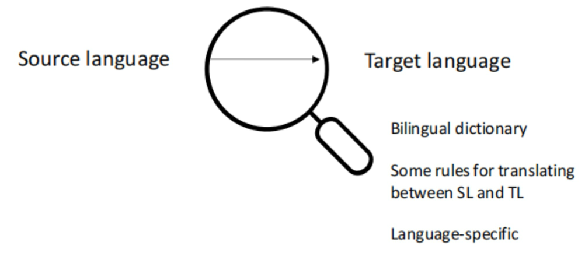
</div>

### Second Generation: Interlingua and Transfer Approach
The Interlingua approach proposed the use of a universal semantic representation, known as Interlingua, between the source and target languages. This approach offered the advantage of being multilingual, where it was easy to swap source languages, thus reducing the number of models needed.
In contrast, the Transfer approach utilized abstract representations of both the source and target languages. This approach required an extensive collection of dictionaries, grammar rules, and language structure rules, including syntax, morphology, and possibly semantics.


### Third Generation: Statistical Methods
The third generation of MT brought a significant shift by introducing statistical methods. This generation marked a transition from rule-based methods to learning-based methods, leveraging data and probability to guide translation.

<div class="slide">
  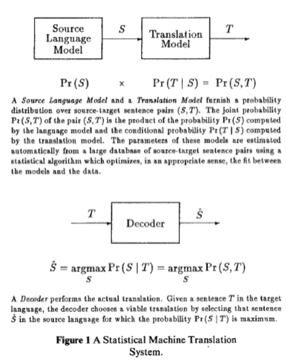
<p> Image Source: <a>https://aclanthology.org/J90-2002.pdf</a> </p>
</div>

## A Timeline of Machine Translation Evolution
<div class="slide">
  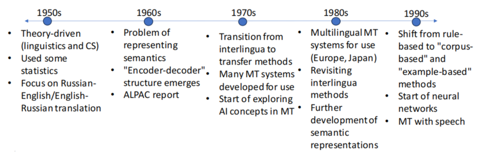
</div>

In the 1950s, theory-driven machine translation began, heavily influenced by linguistics and computer science, with a primary focus on Russian-English and English-Russian translation and the use of some statistical methods. The 1960s introduced challenges in representing semantics and the "encoder-decoder" structure, a foundational concept in modern neural machine translation. In the 1970s, the field transitioned from interlingua to transfer methods and explored AI concepts. The 1980s brought multilingual MT systems, revisiting interlingua methods and advancing semantic representations. The 1990s witnessed a significant shift from rule-based methods to "corpus-based" and "example-based" approaches, emphasizing data-driven methods in machine translation. It also marked the initial use of neural networks and the integration of machine translation with speech recognition, opening new horizons in the field.

## Neural Machine Translation
Neural Machine Translation (NMT) utilizes neural network models to develop a statistical model for machine translation. Unlike traditional phrase-based translation systems that comprise multiple small sub-components tuned separately, NMT attempts to build and train a singular, large neural network that reads a sentence and outputs the correct translation.

## Early Models
### Recurrent Neural Network (RNN)

<div class="slide">
  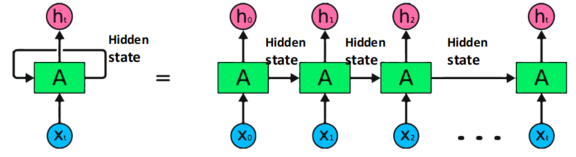
</div>

RNNs process sequential data one element at a time, maintaining a hidden state that captures information from previous elements to inform future predictions or classifications. In the image above, 'x' represents individual elements from sequential data, 'A' represents the Neural Network, and 'h' signifies the hidden layer. At each time step, it processes sequential data step-by-step.

<div class="slide">
  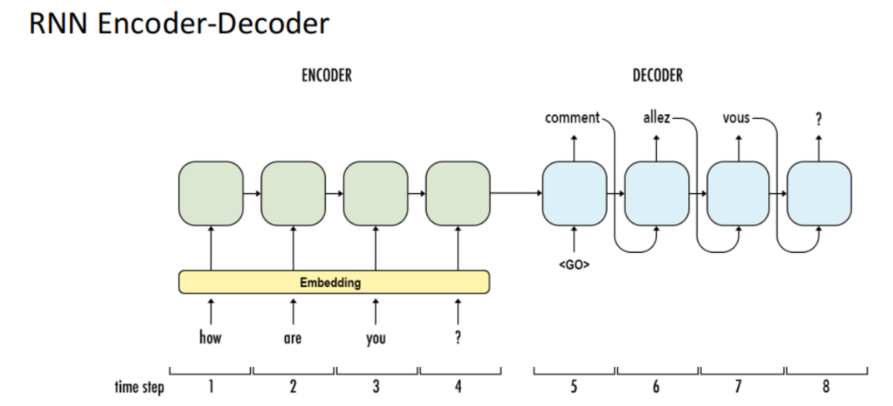
</div>

The image above illustrates how RNN works for language translation. To translate a sentence like 'How are you?' from English to French using an RNN Encoder-Decoder, the English input is initially encoded through an Encoder. Subsequently, the Decoder generates the French output word by word. This sequential process results in the French translation, such as 'Comment allez vous ?,' from the English input.

However, RNNs have a limitation in handling long-term dependencies. When dealing with a large amount of data, RNNs may struggle to memorize it all.

One solution to this limitation is Long Short Term Memory networks (LSTM), a specific type of RNN designed to capture long-term dependencies. LSTMs incorporate forget, input, and output gates that regulate the flow of information within the network:

- The forget gate determines whether to retain or discard certain information.
- The input gate quantifies the significance of new information introduced.
- The output gate determines what information should be produced.


<div class="slide">
  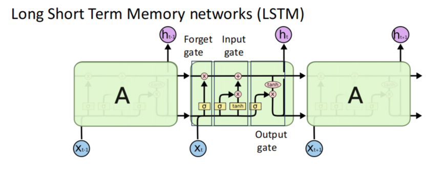
</div>

Simultaneously, the attention mechanism stands as a pivotal development in NMT. It grants the decoder access to all hidden states from the encoder, enabling the network to selectively focus on different segments of the input sequence during each step of output generation. This enhances the model's ability to handle long sentences and complex dependencies. The model gains access to all inputs through the use of bidirectional RNNs. Additionally, the prediction of the next word depends on the weighted combination of these hidden states.

<div class="slide">
  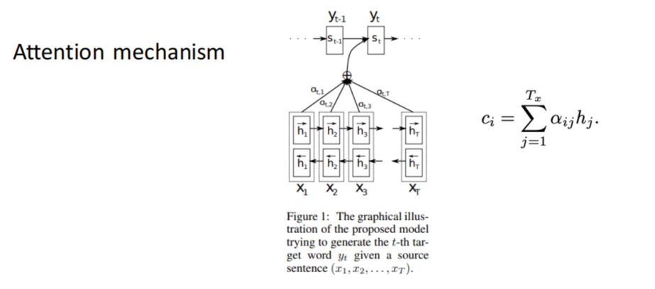
</div>

### Transformer Model

The Transformer model is a type of neural network architecture primarily used in the field of natural language processing.

**Advantage**
Unlike models that process sentences sequentially, the Transformer model processes the whole sentence at once, which can lead to faster computation and the ability to parallelize the process.

<div class="slide">
  
</div>

In the self-attention mechanism, a given batched input X is linearly projected into three distinct representations: Query (Q), Key (K), and Value (V). The attention score is computed using Q and K. If padding is applied, all padding positions are masked in the attention score.


**Multi-Head Attention**
In a Transformer model, Q, K, and V are divided into multiple splits, and each split is passed into a separate head, termed as a "multi-head" attention system. Each head computes its attention independently, and all attention results are then concatenated, effectively reversing the split operation.
The multi-head attention mechanism enables each head to learn different aspects of the meanings of each word in relation to other words in the sequence. This allows the Transformer model to capture richer interpretations of the sequence.

<div class="slide">
  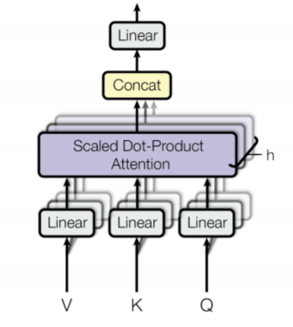
</div>

**Attention Examples**

<div class="slide">
  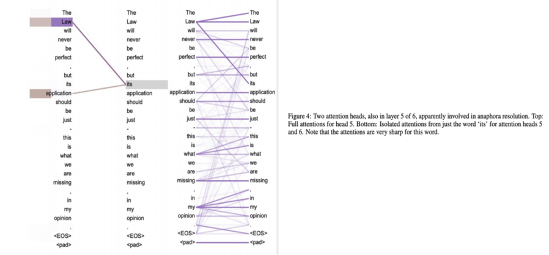
</div>

In conclusion, the field of Machine Translation has witnessed remarkable progress, with each new model or mechanism contributing to better language understanding and translation. Currently, Transformer models stand at the forefront of this field, but ongoing research promises further advancements.

# Wednesday, 18 Oct: <br> Challenges of MT and Method of Evaluation, Mitigation

## 6 Challenges of NMT

<div class="slide">
  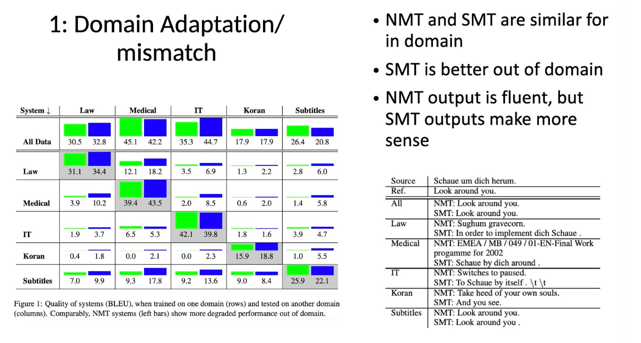
</div>

**Key Insights**:

**In-domain performance**: When trained and tested on the same domain, NMT and SMT systems generally perform well, with Medical and IT domains showing particularly high scores.

**Out-of-domain performance**: NMT systems tend to degrade more compared to SMT when applied to domains they were not trained on. For example, an NMT trained on Law performs relatively poorly in the Medical domain, while the SMT retains some effectiveness.

<div class="slide">
  
</div>

**Key Insights**:

**General Trend**: For all three models, as the amount of training data increases, the BLEU score (indicative of translation quality) also increases. This suggests that having more training data generally leads to better translation performance.

**Comparative Performance**: The Phrase-Based with Big LM model consistently outperforms the other two models across different corpus sizes. The Neural model (NMT) starts off better than the simple Phrase-Based model for smaller corpus sizes but tends to converge with the Phrase-Based model as the corpus size grows.

<div class="slide">
  
</div>

NMT provides superior performance when translating words that are infrequent (rarely used) or completely untrained (words not seen during the training process). This could suggest that NMT is more adaptable and flexible in handling diverse vocabulary than SMT.


<div class="slide">
  
</div>

The graph suggests that while NMT excels at translating shorter sentences, SMT becomes more effective for much longer sentences. This might indicate that the statistical approach of SMT is better equipped to handle the complexities and nuances of longer sentence structures.

<div class="slide">
  
</div>

From this data, it can be inferred that the choice of word alignment method can influence the accuracy and quality of translations. Different language pairs also exhibit varying levels of alignment match and probability, suggesting that the effectiveness of these methods can vary based on the languages in question.

<div class="slide">
  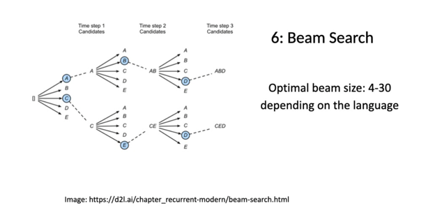
</div>

Beam search is a heuristic search strategy that systematically expands the most promising nodes in a tree-like structure to improve sequence prediction results. The visual representation effectively demonstrates the branching and exploration inherent in the beam search algorithm.

<div class="slide">
  
</div>

In my opinion, while all these issues are crucial, "Domain adaptation/mismatch" and "Amount of training data" might be the most pressing. As the digital world grows and diversifies, machine translation tools will be exposed to an ever-increasing array of content types. Ensuring that these tools can adapt to various domains and are trained on representative datasets will be key to their effectiveness and relevance.

<div class="slide">
  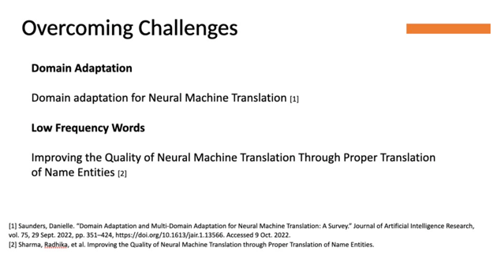
</div>

Domain adaptation in NMT focuses on ensuring translation accuracy for specialized content, like medical or legal texts, given the varied data distribution between training and target domains. Additionally, the infrequent occurrence of specific words, notably proper nouns, in training data can result in mistranslations. Overcoming these hurdles is crucial for enhancing NMT's accuracy and applicability in different contexts.


<div class="slide">
  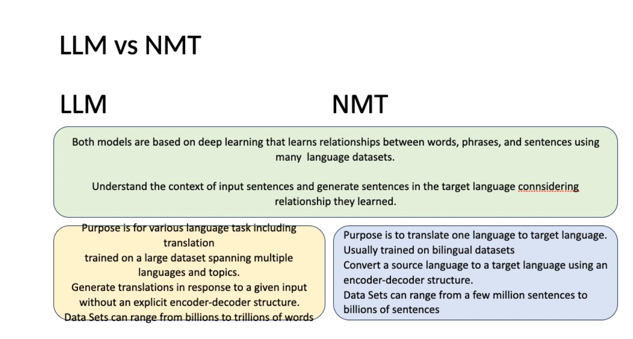
</div>

While both LLM and NMT are rooted in deep learning and can comprehend linguistic context, they differ in their primary objectives, training datasets, and architecture. LLMs are versatile and can handle diverse language tasks beyond just translation, while NMTs are specialized for translating between two languages.

<div class="slide">
  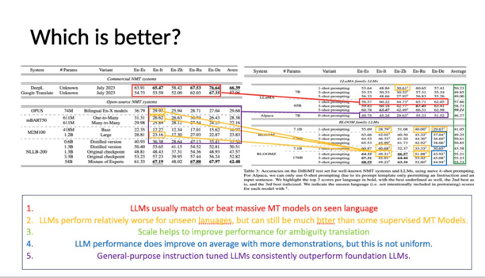
</div>

The comparison highlights the translation performance debate between LLMs and MT models. While both commercial and open-source MTs are valuable, LLMs fine-tuned with general-purpose instructions often excel. The data emphasizes the significance of scale and fine-tuning in LLM effectiveness.

<div class="slide">
  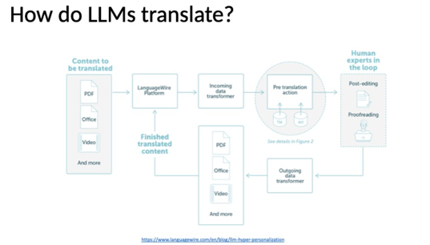
</div>

The diagrams depict the intricate processes by which Large Language Models (LLMs) engage in translation tasks:

**Content Source**:
The initial content that needs translation can come in various formats, including PDFs, Office documents, and even video.

**Automated TM Management**:
This is an automated system for managing 'Translation Memories' (TM). Translation memories store previously translated segments of text to ensure consistent translations and speed up the translation process in future tasks.

**Pre-translation**:
The untranslated content is matched against a Vector Database (DB) to identify similar contexts or content. The system then uses the K-nearest neighbours method to reference the closest matches.
Relevant training data is extracted to fine-tune the model for a specific task or context.
The model undergoes 'Prompt Engineering Fine-Tuning' (PEFT) using the LoRA method, enhancing its precision for specific tasks or contexts.

**Hyper-personalized MT engine**:
Specific prompts are crafted for the content and its context.
The model learns in the given prompt's context, further enhancing translation accuracy.
The LLM API allows other systems or processes to interact seamlessly with the LLM.
The LLM works in tandem with the LoRA module, adding an extra layer of functionality and precision to the translation process.

**Human Interaction**:
Even with advanced models, there's a phase where human experts intervene, either for post-editing or proofreading, ensuring the final content adheres to the highest standards.

**Top Quality MT Output**:
After all these stages, the translation process culminates in producing content of the highest caliber, ensuring accuracy and context preservation.

Both diagrams underscore a blend of automation, advanced modeling, and human expertise to achieve top-notch translations.

<div class="slide">
  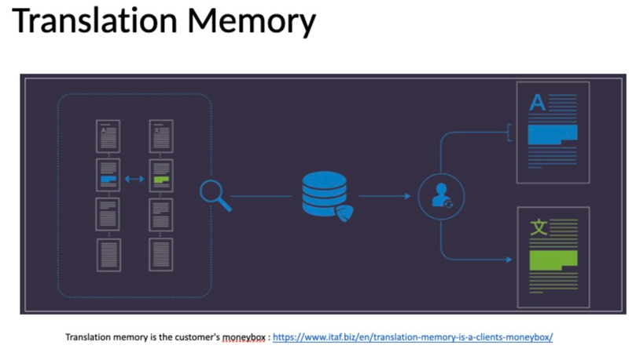
</div>

**Database of Translated Texts**: The cluster of pages symbolizes a collection of previously translated documents stored for reference.

**Database of Translated Texts**: The cluster of pages symbolizes a collection of previously translated documents stored for reference.

**Search Process**: The magnifying glass indicates the process of searching within the database to find a matching or similar translation.

**User Interaction**: The silhouette represents a user or translator interacting with the translation memory system.

**Original Content (A)**: The page with the letter "A" signifies source content awaiting translation. The highlighted segments on this page denote the parts of the text that have matching translations in the memory.

**Translated Content (X)**: The page with the symbol "X" showcases the result after using the translation memory. The highlighted segments indicate the portions of the content retrieved from the memory, ensuring consistency and saving time.

**Savings/Cost-Efficiency**: The stack of coins symbolizes the financial advantage or savings gained from using translation memory, reaffirming the caption that states "Translation memory is the customer's moneybox."

This visual displays how Translation Memory systems improve efficiency and consistency in translation tasks by reusing previously translated segments.

<div class="slide">
  
</div>

The diagram illustrates three fine-tuning methodologies for neural networks:

**Classic**: Involves iterative corrections based on errors.
**Freeze**: Retains the original weights and makes separate, task-specific adjustments.
**LoRA (Low Rank Adaptation)**: Directly integrates with pre-trained models for efficient task-specific adaptations without extensive error corrections.

In essence, while the classic method emphasizes error corrections, the freeze approach preserves foundational knowledge, and LoRA offers a streamlined adaptation process. The choice among them hinges on the task and desired model refinement.

<div class="slide">
  
</div>

Benefits related to machine translation include:
**Stylized**: LLMs can adapt to different translation styles, such as formal, informal, or even regional variations.
**Interactive**: They can provide real-time translations during interactive sessions, such as live chats.
**TM based**: LLMs can utilize Translation Memory to ensure consistency across large documents or series of documents, improving translation quality by leveraging prior translations.


<div class="slide">
  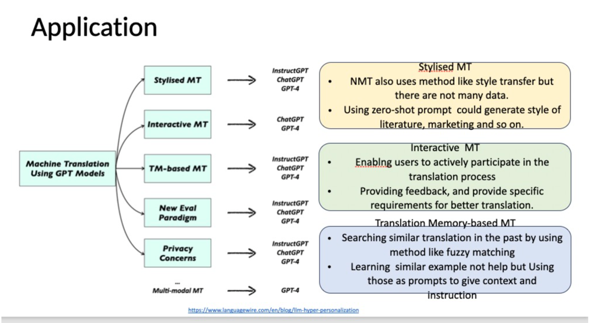
</div>


**Evolution of MT Techniques**:
Traditional Machine Translation has evolved to incorporate more sophisticated methods, with the advent of GPT models introducing new paradigms.

**Stylised MT**:
Goes beyond standard translation by adapting to specific styles or tones, like literature or marketing.
Despite Neural Machine Translation (NMT) having capabilities for style transfer, its potential is often limited by data availability. LLMs like GPT can overcome this using zero-shot prompts.

**Interactive MT**:
Represents a shift towards more user-centric translation methods.
By actively involving the user in the translation process and gathering their feedback, it ensures translations are more contextually accurate and meet specific requirements.

**Translation Memory-based MT**:
Aims to improve translation efficiency by referencing past translations.
LLMs bring an added advantage by using past translations not just for replication but as context-rich prompts to guide the current translation process.

**Emergence of New Paradigms & Concerns**:
The integration of LLMs in MT introduces new evaluation methodologies.
However, this also raises potential privacy concerns, emphasizing the importance of data ethics in AI-driven translation.

**Multi-modality in MT**:
Suggests a future direction where translations aren't just based on text but incorporate multiple forms of data, enriching the translation process.

**Dependency on LLMs**:
The consistent reference to GPT models across various MT applications indicates the growing influence and reliance on LLMs in modern translation efforts.

The transformative role of LLMs in reshaping machine translation, offering enhanced accuracy, versatility, and user engagement.

The activity showcases the challenges and complexities of machine translation. While tools like DeepL can offer rapid translations, they may sometimes miss cultural, contextual, or idiomatic nuances present in human translations. This is especially relevant for movie dialogues where context and tone play crucial roles.
**Can MT outperform human translation?**
MT can be faster and efficient for large-scale tasks, but human translation excels in capturing nuance, cultural context, and idiomatic expressions.

**What are other challenges that can't be solved by MT?**
MT struggles with cultural nuances, idioms, historical context, and emotional undertones which humans can naturally grasp.

**How can HT and MT interact for better Language Translation?**
A hybrid approach, combining MT's speed and efficiency with HT's contextual understanding, can lead to more accurate and nuanced translations.

# Readings

## Class 16, Oct
**Required readings**:

Shereen A. Mohamed, Ashraf A. Elsayed, Y. F. Hassan and Mohamed A. Abdou. Neural machine translation: past, present, and future.
Neural Computing and Applications, 2021. [[pdf]](https://link.springer.com/article/10.1007/s00521-021-06268-0)

**Optional readings**:

W. John Hutchins. Machine Translation: A Brief History. From Concise history of the language sciences: from the Sumerians to the cognitivists (edited by E. F. K. Koerner and R. E. Asher). Pergamon Press, 1995. [[PDF]](https://aymara.org/biblio/mtranslation.pdf)

Peter F. Brown, John Cocke, Stephen A. Della Pietra, Vincent J. Della Pietra, Fredrick Jelinek, John D. Lafferty, Robert L. Mercer, and Paul S. Roossin. A Statistical Approach to Machine Translation. Computational Linguistics 1990. [[PDF]](https://aclanthology.org/J90-2002.pdf)

Linfeng Song, Daniel Gildea, Yue Zhang, Zhiguo Wang, Jinsong Su. Semantic Neural Machine Translation Using AMR. [Transactions of the Association for Computational Linguistics, 2019. [[PDF]](https://aclanthology.org/Q19-1002/)

## Class 18, Oct
Required readings

Chenyang Lyu, Jitao Xu, Longyue Wang. New Trends in Machine Translation using Large Language Models : Case Examples with ChatGPT. [[pdf]](https://arxiv.org/abs/2305.01181)

Patrick Fernandes, Daniel Deutsch, Mara Finkelstein, Parker Riley, André F. T. Martins, Graham Neubig, Ankush Garg, Jonathan H. Clark, Markus Freitag, Orhan Firat. The Devil is in the Errors: Leveraging Large Language Models for Fine-grained Machine Translation Evaluation. [[PDF]](https://arxiv.org/abs/2308.07286)

Optional readings

Philipp Koehn and Rebecca Knowles. Six Challenges for Neural Machine Translation. First Workshop on Neural Machine Translation, 2017.

Vivek Iyer, Pinzhen Chen, Alexandra Birch. Towards Effective Disambiguation for Machine Translation with Large Language Models.

Danielle Saunders. Domain adaptation for Neural Machine Translation. PhD Dissertation, University of Cambridge, February 2021.

Radhika Sharma, Pragya Katyayan, Nisheeth Joshi. Improving the Quality of Neural Machine Translation Trough Proper Translation of Name Entities.

Verna Dankers, Christopher Lucas, Ivan Titov. Can Transformer be Too Compositional? Analysing Idiom Processing in Neural Machine Translation. ACL 2022.

Lesly Miculicich, Dhananjay Ram, Nikolaos Pappas, James Henderson. Document-Level Neural Machine Translation with Hierarchical Attention Networks. EMNLP 2018.

# Discussiong Questions

## Class 16, Oct

1. What are the limitations of the testing benchmarks used for machine translation (as described in Neural machine translation: past, present, and future) and how might these limitations impact model development?

2. The paper describes neural machine translation (NMT) models as simpler than previously utilized statistical machine translation (SMT) models, and lists a few ways in which this is the case. Are there any drawbacks to NMT models over SMT models, particularly when it comes to interpretability and assuring that essential linguistic knowledge is learned?

3. Why do most LLMs use decoder-only architecture? Why not encoder-decoder?

## Class 18, Oct
1. `Six Challenges for Neural Machine Translation` describes six neural machine translation challenges. Discuss how you have encountered these challenges in real-world translator use, the risks you anticipate, and how to mitigate them.

2. There have been many trials to evaluate the performance of Machine Translation. Do you agree with the evaluation method in the paper `The Devil is in the Errors: Leveraging Large Language Models for Fine-grained Machine Translation Evaluation`? What other factors that you think are important in how we evaluate?

