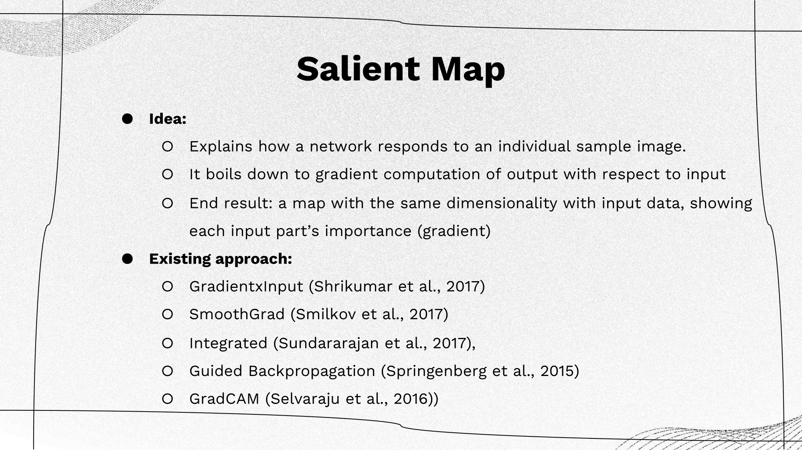
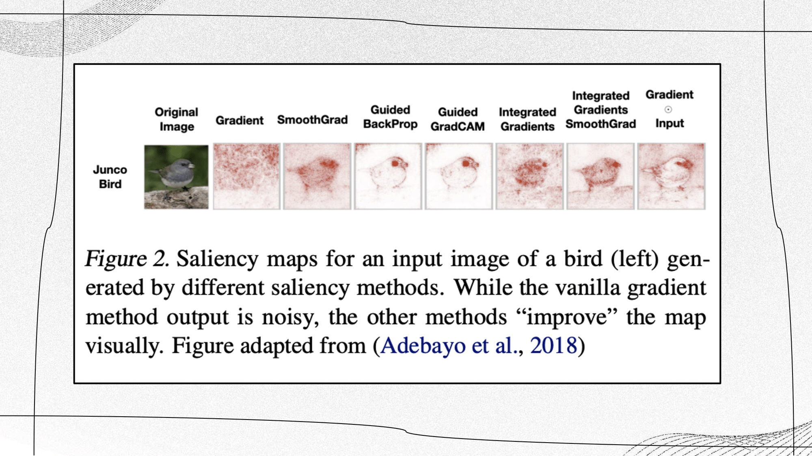
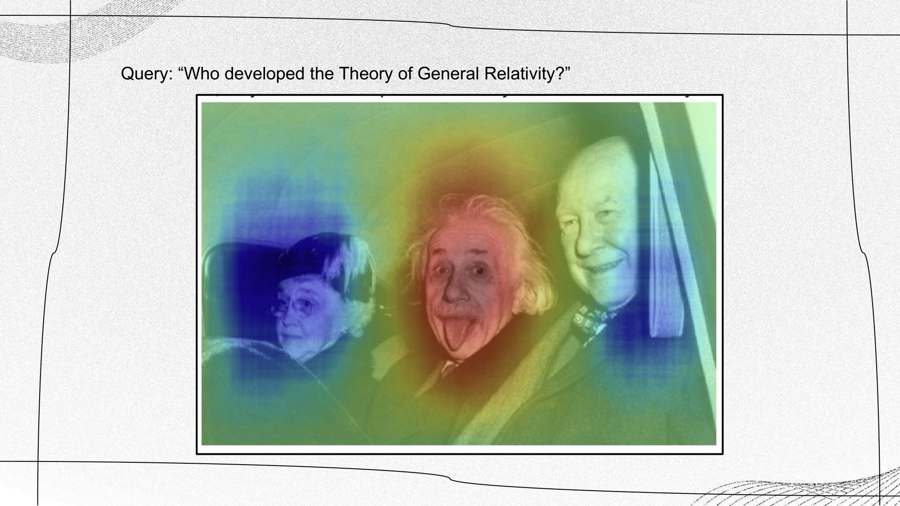
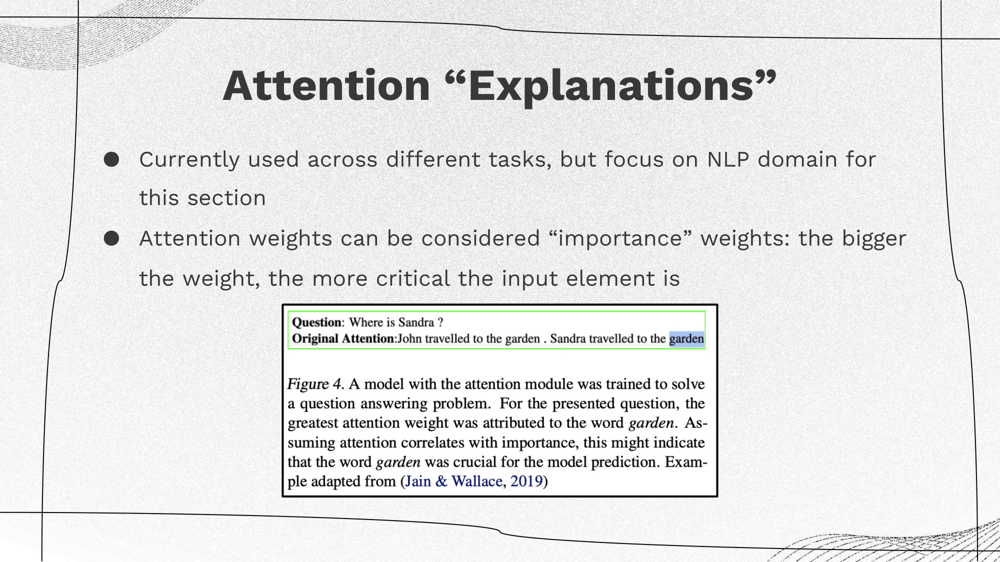
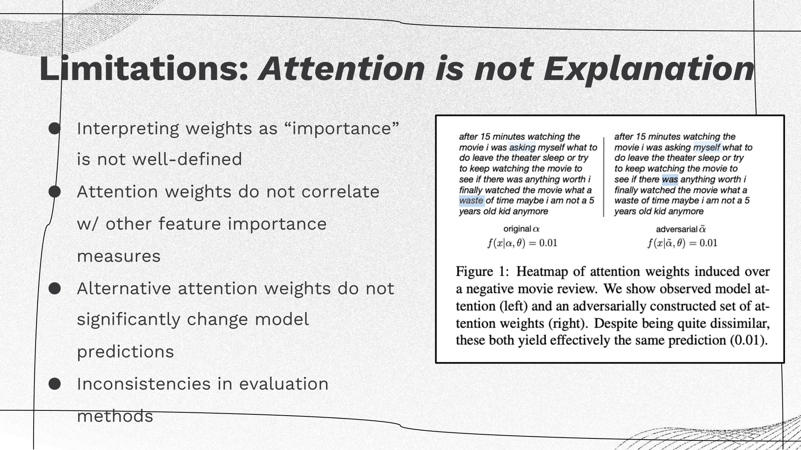
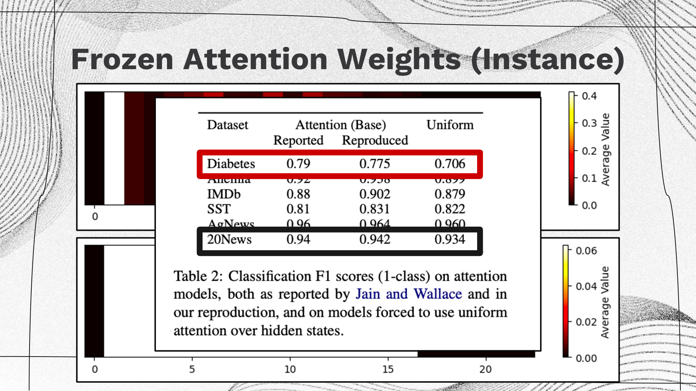
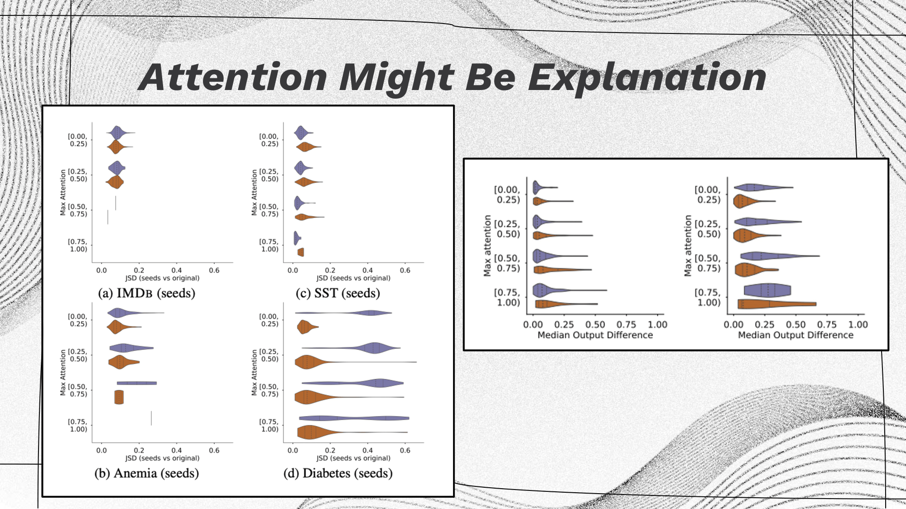

+++
date = "30 Oct 2023"
draft = false
title = "Week 9: Interpretability"
slug = "week9"
+++

(see bottom for assigned readings and questions)

<author>Presenting Team: Anshuman Suri, Jacob Christopher, Kasra Lekan, Kaylee Liu, My Dinh</author>

<author>Blogging Team: Hamza Khalid, Liu Zhe, Peng Wang, Sikun Guo, Yinhan He, Zhepei Wei</author>

# Monday, 23 October:   Interpretability: Overview, Limitations, & Challenges

## Introduction

### Definition of Interpretability

- Interpretability in the context of artificial intelligence (AI) and machine learning refers to the **extent to which a model's decisions, predictions, or internal workings can be understood and explained by humans**. It's the degree to which a model's behavior can be made transparent, comprehensible, and meaningful to users, stakeholders, or domain experts. 
- In concept-based interpretability, the focus is on **explaining the model's decisions in terms of high-level concepts or features** that make sense to humans. This approach seeks to relate model behavior to intuitive, domain-specific, or abstract concepts. For example, in a medical diagnosis model, concept-based interpretability might explain that a decision was made because certain symptoms or biomarkers were present.
- Mechanistic-based interpretability aims to provide a detailed understanding of how the model makes decisions. This approach delves into the **inner workings of the model**, explaining the role of individual features, weights, and computations. For instance, in a deep learning model, mechanistic interpretability might involve explaining the contributions of specific layers in the decision process.

### Why is interpretability important?
Interpretability is important because it builds trust, aids in debugging, and is essential in applications where the consequences of AI decisions are significant, for example:
1. Learn how the model make the decision.
2. Analyze whether there are biases and shortcuts that a model is taking during application.
3. When dealing with human-in-the-loop, interpretability enables humans to work collaboratively with AI, leveraging their complementary strengths to achieve better outcomes.

## Salient Explainers

<table>
    <tr>
        <td></td>
    </tr>
    <tr>
    <td colspan=1>
     
      
The main ideas of exsiting approaches are summarized as follows:
      <ul>
        <li><a href="https://dl.acm.org/doi/10.5555/3305890.3306006"><i>GradientxInput (Shrikumar et al., 2017):</i></a> Combining gradients with input data values</li>
        <li><a href="https://arxiv.org/abs/1706.03825"><i>SmoothGrad (Smilkov et al., 2017):</i></a> Smoothing gradients by adding noise and averaging</li>
        <li><a href="https://proceedings.mlr.press/v70/sundararajan17a/sundararajan17a.pdf"><i>GIntegrated (Sundararajan et al., 2017):</i></a> Integrating gradients over a path from a baseline image (e.g., a black image)</li>
        <li><a href="https://arxiv.org/abs/1412.6806"><i>Guided Backpropagation (Springenberg et al., 2015):</i></a> Zeroing out negative gradients while backpropagating</li>
        <li><a href="https://arxiv.org/abs/1610.02391"><i>GradCAM (Selvaraju et al., 2016):</i></a> Combining gradients and final convolutional layer feature maps</li>
      </ul>
</td> </table>

<table>
    <tr>
        <td></td>
    </tr>
    <tr>
    <td colspan=1 align="left">
    
 A salient map example by different methods (introduced above) of a bird. While the vanilla gradient method output is noisy, the other methods “improve” the map visually, and we can thus gradually see a ‘clearer’ pixel-level attribution influence which aligns with human understanding of the concept ‘bird’. It’s also important to note that none of these methods was evaluated in a quantitative way.

    </td>
</tr>
</table>

### Saliency Map Demo

<table>
    <tr>
        <td></td>
    </tr>
    <tr>
    <td colspan=1 align="center">
    
 Notebook <a href="https://github.com/openvinotoolkit/openvino_notebooks/blob/main/notebooks/232-clip-language-saliency-map/232-clip-language-saliency-map.ipynb">link</a> 

    </td>
</tr>
</table>

<table>
    <tr>
        <td></td>
    </tr>
    <tr>
    <td colspan=1 align="left">
    
Example: given an image and text prediction provided by the model, a saliency map highlights the most important features or regions within the image that the model uses to make decisions.

    
These maps are instrumental in helping users understand the model's decision-making process, particularly in applications such as medical imaging or self-driving cars. To create the saliency map, randomly crop the image and compute the similarity between the cropped images and text. If the similarity value is positive, indicating the crop is closer to the query, it should be represented as a red region on the saliency map. Conversely, if the value is negative, it should be depicted as a blue region.

    </td>
</tr>
</table>

### Limitations of Salient Explainers

### Combining Salient Explainers with Generative AI?

<table>
    <tr>
        <td></td>
    </tr>
    <tr>
    <td colspan=1>
     
      <ul>
        <li>Background: Diffusion models and Bayesian Flow Networks use gradient-based guidance to move generated images to the training distribution.</li>
        <li>Discussion: Salient explainers would help identify which characteristics of the training images are used, which helps better understanding of generative AI models (such as GAN and Diffusion Models). For example, understanding the score function that leads to the direction of pushing the noisy distribution to a real image. For GANs, discriminators can use it to capture the area. For diffusion models, it can help to explain why the image is generated towards some features to make it realistic.</li>
      </ul>
</td> </table>

## Attention Explainers

<table>
    <tr>
        <td></td>
    </tr>
    <tr>
    <td colspan=1 align="left">
    
Attention plays a pivotal role in numerous applications, particularly in Natural Language Processing (NLP). For instance, the choice of a specific word, along with the assigned weight, signifies a correlation between that weight and the decision made.

    
In NLP, understanding which words or elements are emphasized, and to what extent (indicated by their respective weights), is crucial. This emphasis often sheds light on the correlation between the input data and the model's decision-making process. Attention-based explainers serve as valuable tools in dissecting and interpreting these correlations, offering insights into how decisions are derived in NLP models.

    </td>
</tr>
</table>

### Limitations of Attention: Attention is not Explanation

<table>
    <tr>
        <td></td>
    </tr>
    <tr>
    <td colspan=1 align="left">
    
A recent <a href="https://arxiv.org/pdf/1902.10186.pdf">study</a> has cautioned against using attention weights to highlight input tokens “responsible for” model outputs and constructing just-so stories on this basis. The core argument of this work is that if alternative attention distributions exist that produce similar results to those obtained by the original model, then the original model’s attention scores cannot be reliably used to “faithfully” explain the model’s prediction.

    </td>
</tr>
</table>

### Further Discussion: Attention is not not Explanation

<table>
    <tr>
        <td></td>
    </tr>
    <tr>
    <td colspan=1 align="left">
    
Visualization of the heatmap of the attention weights at different index for 2 methods introduced by the Attention is not not Explanation paper. The upper one is related to model with trained attention weights and the lower one is related to model with uniform frozen attention weights.

    
 Both figures show the average attention weights over the whole dataset. Clearly, model with trained attention weights has a noisier heatmap which due to the difference in the text content and the model with uniform frozen attention weights has a clearer pattern which only related to the length of the text. 

    </td>
</tr>
</table>

<table>
    <tr>
        <td></td>
    </tr>
    <tr>
    <td colspan=1 align="left">
    
If attention was a necessary component for good performance, we would expect a large drop between the two rightmost columns (i.e. comparison of model with trained attention weights and frozen uniform attention weights). Somewhat surprisingly, for three of the classification tasks the attention layer appears to offer little to no improvement whatsoever. In these cases, the accuracies are near identical on 3 out of 5 datasets, and so attention plays no role in explanations if we don’t need it in our prediction.

    </td>
</tr>
</table>

<table>
    <tr>
        <td></td>
    </tr>
    <tr>
    <td colspan=1>
     
      
The above table presents several insightful findings: 

      <ul>
        <li>The baseline LSTM outperforms others, suggesting the significance of a particular set of attentions, underscoring their relevance in the process (these attentions are learned and preserved for the MLP model).</li>
        <li>The trained MLP exhibits competitive performance, hinting that while the specific attentions might not be as crucial, the model is still capable of learning close attention weights, signifying its adaptability in this context.</li>
        <li>Conversely, the Uniform model yields the poorest performance, emphasizing the substantial role of attention mechanisms in this scenario.</li>
      </ul>
      
The evaluation of these results highlights a crucial aspect: the definition of an explanation. Although these attention weights potentially hold utility (as observed in various settings), their direct interpretation is not always straightforward.

</td> </table>

<table>
    <tr>
        <td></td>
    </tr>
    <tr>
    <td colspan=1 align="left">
    
The initial hypothesis (on the right) proposed that fluctuating attention confidence minimally affected the output. However, after employing pretrained attentions (on the left), it became evident that higher attention weights corresponded to reduced variance. (In the visualization, the length of the bubble represents variance, with tighter bubbles indicating the ideal scenario. Additionally, colors denote positive/negative labels.)

    </td>
</tr>
</table>

### Discussion

Group 1: Human interpretability features are essential. For instance, in the application of AI in drug design, an AI model alters a molecule from a non-drug variant to its drug counterpart. Presently, the predominant approach involves creating a black-box model that transforms one molecule into its drug form, contributing to a lack of credibility in the process. For example, a doctor unfamiliar with deep learning cannot comprehend the inner workings of the model that facilitates the conversion of regular molecules into drugs, making it challenging to ensure the safety, efficacy, and trustworthiness of the AI-driven drug design without transparent and interpretable models.

Group 2: On one hand, a general observation we've noted is that the requirements or metrics for Explainable AI (XAI) significantly depend on the intended purpose of the tool. For instance, the explanations provided for AI researchers and end users are likely to differ due to their distinct focuses. On the other hand, there is a risk of amplifying confirmation bias if we anticipate XAI to explain phenomena in alignment with human beliefs. To truly understand why a model performs effectively, it might be necessary to set aside human biases and preconceived notions, enabling an unbiased exploration of how the model achieves its performance.

Group 3: Currently, there are still lots of difficulties and problems in using XAI tools in general. For example, methods such as LIME and SHAP always need a lot computation and don’t work well on complex large models. Besides, we lack ground-truth explanations and therefore, we don’t know whether the learned explanations are useful or not. Our suggestions for solving those problems and also issues mentioned by other groups are: 1) Approximating the complicate model to some simple model 2) Build self-explainable models 3) Combine different metrics and XAI tools.

## Towards Provably Useful XAI

<table>
    <tr>
        <td></td>
    </tr>
    <tr>
    <td colspan=1 align="left">
    
The critical point here underscores the necessity of task-specific techniques, which may seem self-explanatory—how can general principles apply without a specific context? Even then, this assumption is not necessarily guaranteed.

    
One of the primary challenges between the current state of eXplainable Artificial Intelligence (XAI) and potentially valuable XAI methods is the absence of a method-task link. Ensuring the usability and reliability of an explanation in a particular task requires a deeper connection. This could either involve anchoring explanations in theory directly aligned with the task's requirements or creating task-inspired explanations and subsequently empirically evaluating them within the targeted application.

    </td>
</tr>
</table>

# Wednesday, 25 October: Mechanistic interpretability

# Readings and Discussions

## Monday 23 October
### Required Reading

- Alicja Chaszczewicz. [_Is Task-Agnostic Explainable AI a Myth?_](https://arxiv.org/abs/2307.06963). arXiv, 2023. [https://arxiv.org/pdf/2307.06963.pdf](https://arxiv.org/pdf/2307.06963.pdf)

### Optional Readings

- Robert Geirhos, Roland S. Zimmermann, Blair Bilodeau, Wieland Brendel, Been Kim. [_Don't trust your eyes: on the (un)reliability of feature visualizations_](https://arxiv.org/abs/2306.04719). arXiv, 2023. [https://arxiv.org/pdf/2306.04719.pdf](https://arxiv.org/pdf/2306.04719.pdf)

- Sarah Wiegreffe, Yuval Pinter. [_Attention is not not Explanation_](https://arxiv.org/abs/1908.04626). EMNLP, 2019. [https://arxiv.org/pdf/1908.04626.pdf](https://arxiv.org/pdf/1908.04626.pdf) (This is a response to Jain and Wallace's [_Attention is not Explanation_](https://arxiv.org/abs/1902.10186), NAACL 2019 paper, which sadly is not a response to any paper titled Attention is Explanation, but perhaps that is waiting to be written?)

### Discussion Questions
1. [Chaszczewicz](https://arxiv.org/abs/2307.06963) highlights shared challenges in XAI development across different data types (i.e. image, textual, graph data) and explanation units (i.e. saliency, attention, graph-type explainers). What are some potential similarities or differences in addressing these issues?

2. In cases where models produce accurate results but lack transparency, should the lack of explainability be a significant concern? How should organizations/developers balance the tradeoffs between explainability and accuracy?

3. How can XAI tools could be used to improve adversarial attacks?

4. In [Attention is not not Explanation](https://arxiv.org/pdf/1908.04626.pdf), the authors dispute a [previous paper’s](https://arxiv.org/abs/1902.10186) definition of explanation. Whose view do you find most convincing and why?

## Wednesday 25 October

### Required Readings

- Nelson Elhage, Tristan Hume, Catherine Olsson, Neel Nanda, Tom Henighan, Scott Johnston, Sheer El Showk, Nicholas Joseph, Nova DasSarma, Ben Mann, and others (Anthropic AI). [_Softmax Linear Units_](https://transformer-circuits.pub/2022/solu/index.html). Transformers Circuit Thread, 2022. [https://transformer-circuits.pub/2022/solu/index.html](https://transformer-circuits.pub/2022/solu/index.html)
- Trenton Bricken, Adly Templeton, Joshua Batson, Brian Chen, Adam Jermyn, and others (Anthropic AI). [_Towards Monosemanticity: Decomposing Language Models With Dictionary Learning_](https://transformer-circuits.pub/2023/monosemantic-features/index.html). Transformers Circuit Thread, 2023. [https://transformer-circuits.pub/2023/monosemantic-features/index.html](https://transformer-circuits.pub/2023/monosemantic-features/index.html)

### Discussion Questions
1. (Softmax Linear Units) Elhage et al. present the Superposition Hypothesis which argues that networks attempt to learn more features than the number of neurons in the networks. By delegating multiple features to a single node, interpreting the significance of the node becomes challenging. Do you believe this hypothesis based upon their explanation, or do you suspect there is some separate obstacle here, such as the counter-argument that nodes could represent standalone features that are difficult to infer but often obvious once discovered?

2. (Softmax Linear Units) Do you see any difference between SLU and [ELU](https://pytorch.org/docs/stable/generated/torch.nn.ELU.html) coupled with batch-norm/layer-norm? How does this relate to the reasons the LLM community shifted from ReLU (or variants like ELU) to [GeLU](https://arxiv.org/abs/1606.08415)?

3. (Towards Monosemanticity) Could the identification of these “interpretable” features could enable training (via distillation, or other ways) smaller models that still preserve interpretability?

4. (Towards Monosemanticity) Toying around with [visualization](https://transformer-circuits.pub/2023/monosemantic-features/vis/a1.html?ordering=count) seems to show a good identification of relevant positive tokens for concepts, but negative concepts do not seem to be very insightful. Try the explorer out for a few concepts and see if these observations align with what you see. What do you think might be happening here? Can it possibly be solved by changing the auto-encoder training pipeline, or possibly by involving structural changes like SLU? Are there other interesting elements or patterns you see?

